# Centrality Sampling: Validation Report

Generated: 2026-01-17T22:32:08.779155

---

## Executive Summary

This analysis evaluates cityseer's sampling-based centrality approximation for both
**harmonic closeness** and **betweenness** centrality metrics:

1. **Correctness**: Target-based aggregation matches NetworkX within numerical precision.
2. **Statistics**: Empirical analysis across 1109 observations (2 metrics × configs).
3. **Guidance**: Recommendations based on observed RMSE by topology, metric, and reachability.

### Key Observations

**Effective reachability** (mean_reachability × sampling_probability) is the primary predictor of
sampling accuracy. Higher effective reachability means more source nodes contribute to each
target's estimate, which tends to reduce variance.

### Practical Consideration

Sampling tends to be more effective for larger networks:

- Large networks benefit most from sampling speedup
- Large networks typically have higher reachability
- Higher reachability is associated with lower sampling variance

---

## Chapter 1: Correctness Verification

Verified that target-based aggregation (using reversed Dijkstra) produces results
identical to standard NetworkX implementations.

| Test               | Max Difference | Status   |
| ------------------ | -------------- | -------- |
| Harmonic Closeness | 2.98e-08       | ✓ PASSED |
| Betweenness        | 0.0000         | ✓ PASSED |
| Total Farness      | 6.51e-08       | ✓ PASSED |

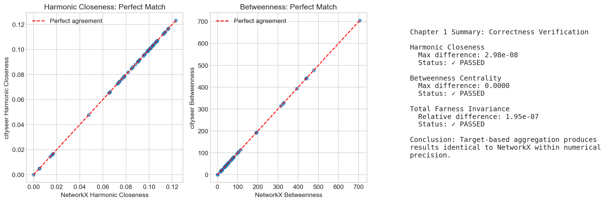

---

## Chapter 2: Statistical Properties

### Experimental Design

Error is measured by comparing **sampled** centrality estimates against **exact** (full) computations:

1. **Exact computation**: Use all nodes as sources to compute true centrality values
2. **Sampled computation**: Randomly select nodes with probability p as sources, scaling
   contributions by 1/p (Horvitz-Thompson weighting) to produce unbiased estimates
3. **Error calculation**: Compare sampled vs exact values at each node

Each configuration (network × distance × sampling rate) is run 25 times with different
random samples. For each run, we compute that run's RMSE across all nodes. We then report
the **mean ± standard deviation** of these per-run RMSE values. This follows standard Monte
Carlo methodology and tells practitioners what error to expect from a single sampling run.

### Metrics Analyzed

Both metrics are analyzed with identical experimental configurations:

- **Harmonic Closeness**: Sum of inverse distances to reachable nodes — measures accessibility
- **Betweenness**: Count of shortest paths passing through each node — measures intermediacy

### Network Topologies Tested

Three network types are used to represent the range of real-world urban morphologies:

- **Grid networks** (urban cores): Regular, well-connected street patterns with high reachability
- **Tree networks** (suburban/dendritic): Branching patterns with limited connectivity and lower reachability
- **Organic networks** (historical centres): Irregular patterns with variable reachability

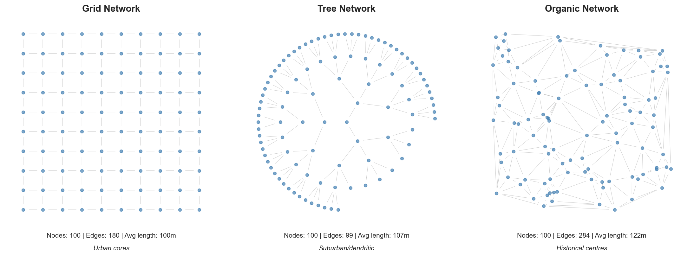

### Understanding the Metrics

**RMSE (Root Mean Square Error)** measures the typical magnitude of estimation error. An RMSE
of 10% means that sampled estimates typically differ from the true values by about 10%. Lower
is better—RMSE combines both random scatter and any systematic offset into a single number.

**Bias** measures systematic error: does sampling consistently over- or under-estimate? A bias
of 0% means no systematic error. Small bias with higher RMSE indicates random variation rather
than a fundamental flaw in the estimation approach.

**Effective reachability** is the key predictor of accuracy: `effective_n = mean_reachability × p`.
This represents how many source nodes, on average, contribute to each target's sampled estimate.
More contributors means more information, which means lower variance.

### Examining Bias

**How is bias measured?** For each experimental configuration, we compute the mean relative
error across all nodes: `bias = mean((sampled - exact) / exact)`. Positive bias indicates
overestimation; negative bias indicates underestimation.

**Bias by topology (Harmonic Closeness)**:

| Topology | Mean Bias | Std Bias |
| -------- | --------- | -------- |
| Grid     | -0.2%     | 1.1%     |
| Tree     | -0.4%     | 1.0%     |
| Organic  | -0.2%     | 1.1%     |

**Bias by topology (Betweenness)**:

| Topology | Mean Bias | Std Bias |
| -------- | --------- | -------- |
| Grid     | -0.6%     | 1.1%     |
| Tree     | -0.6%     | 1.4%     |
| Organic  | -0.7%     | 1.1%     |

**Observations:**

1. Mean bias tends to be low across configurations, though individual estimates may vary.
2. Standard deviation indicates the spread of bias across experimental runs.
3. Results should be interpreted alongside the RMSE values below.

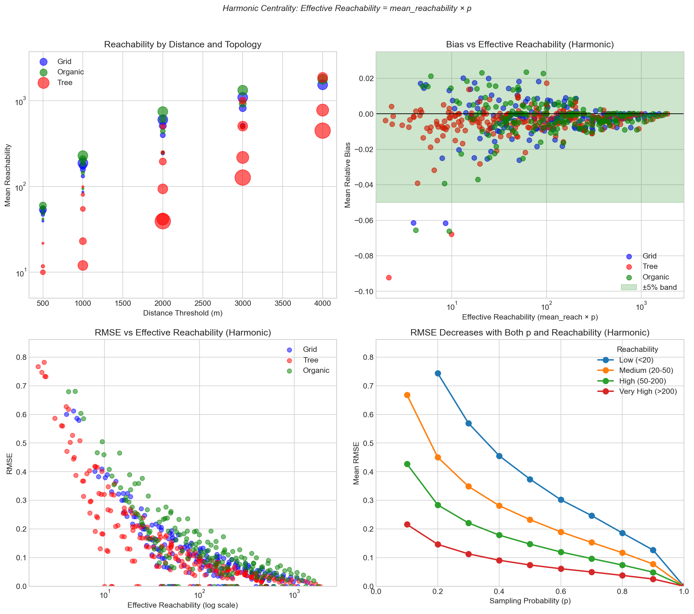

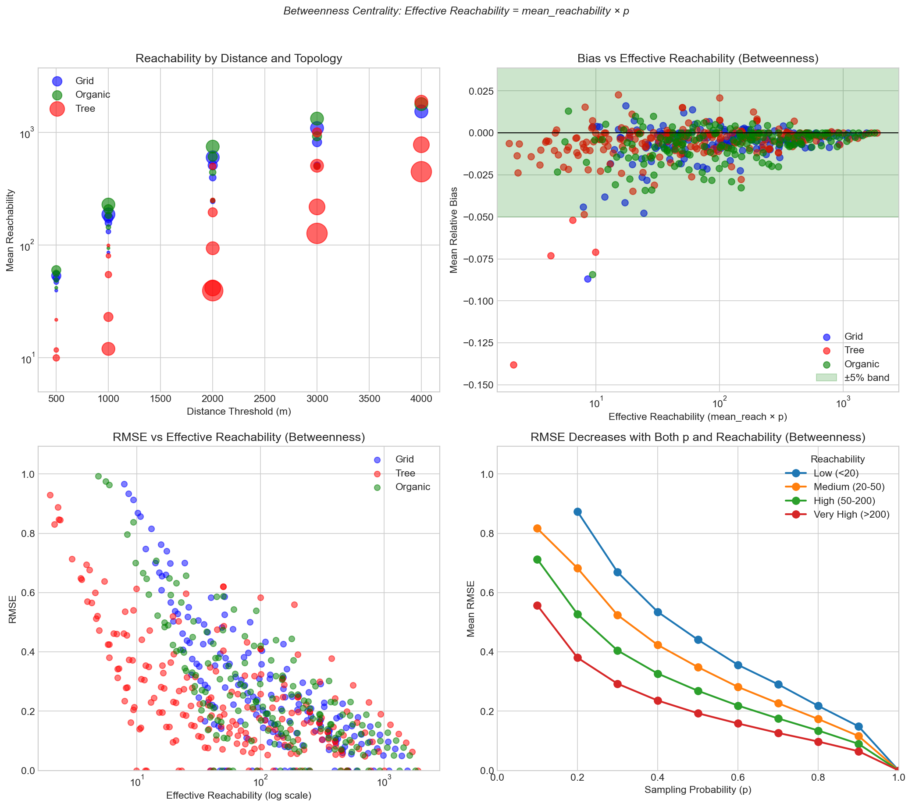

### Spatial Autocorrelation (Moran's I)

Moran's I measures spatial autocorrelation—how similar nearby nodes' centrality values are.
Higher I means values cluster spatially (similar values near each other).

| Topology | Moran's I |
| -------- | --------- |
| Grid     | 0.850     |
| Tree     | 0.807     |
| Organic  | 0.622     |

The observed Moran's I values indicate spatial autocorrelation in centrality measures—nearby
nodes tend to have similar values. Grid networks typically show higher autocorrelation due to
their regular structure.

### RMSE Prediction Formula

From statistical sampling theory, the variance of the Horvitz-Thompson estimator scales as
(1-p)/n. Taking the square root gives the expected RMSE scaling:

**RMSE = k × √((1-p) / effective_n)**

where effective_n = mean_reachability × p.

**Harmonic Closeness:**

| Fit                     | k     | R²     |
| ----------------------- | ----- | ------ |
| Global (all topologies) | 1.351 | 0.9629 |
| Grid                    | 1.376 | —      |
| Tree                    | 1.241 | —      |
| Organic                 | 1.646 | —      |

**Betweenness:**

| Fit                     | k     | R²     |
| ----------------------- | ----- | ------ |
| Global (all topologies) | 2.137 | 0.6075 |
| Grid                    | 3.294 | —      |
| Tree                    | 1.617 | —      |
| Organic                 | 2.827 | —      |

The formula fit varies by metric. Harmonic closeness typically shows a stronger fit (higher R²),
while betweenness may exhibit larger prediction residuals. The R² values above indicate how well
the theoretical formula matches empirical observations for each metric.

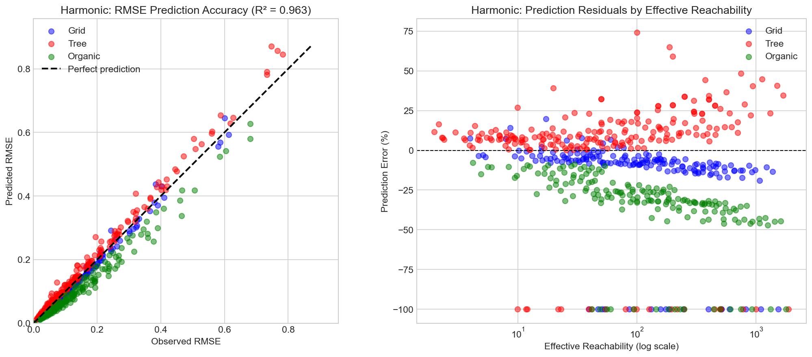

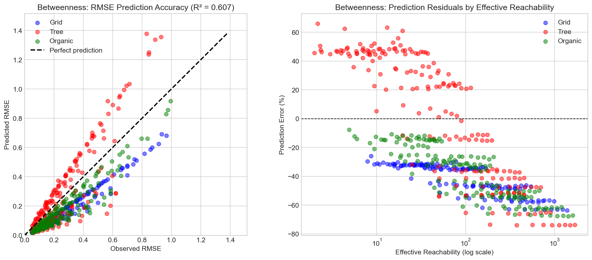

### Automatic Sampling Probability Selection

By inverting the RMSE formula, we can compute the minimum sampling probability needed
to achieve a target RMSE:

**p = k² / (RMSE² × mean_reach + k²)**

The table below uses a **conservative (worst-case) k = 2.137**, which is the
maximum k value observed across both metrics (harmonic k = 1.351, betweenness
k = 2.137). This means the recommended p values should achieve the target RMSE
for whichever metric has worse sampling characteristics:

| Mean Reach | 5% RMSE | 10% RMSE | 15% RMSE | 20% RMSE |
| ---------- | ------- | -------- | -------- | -------- |
| 25         | 99%     | 95%      | 89%      | 82%      |
| 50         | 97%     | 90%      | 80%      | 70%      |
| 100        | 95%     | 82%      | 67%      | 53%      |
| 200        | 90%     | 70%      | 50%      | 36%      |
| 500        | 79%     | 48%      | 29%      | 19%      |
| 1000       | 65%     | 31%      | 17%      | 10%      |

**Note**: Networks with high reachability (>200) may tolerate lower sampling rates while
maintaining acceptable RMSE. Networks with low reachability (<50) typically require higher
sampling rates for accurate results. Actual results depend on network characteristics and metric.

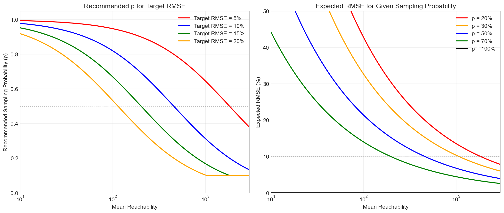

---

## Chapter 3: Practical Guidance

### RMSE by Topology

Different network topologies show different sampling accuracy. The figures below show
empirically observed RMSE for each topology at different reachability levels and sampling rates.

Results are aggregated across all graph sizes within each topology. The heatmaps below bin
results by mean reachability (which depends on both graph size and distance threshold).

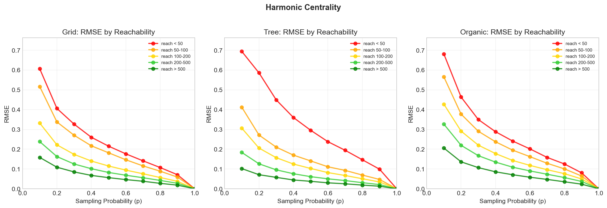

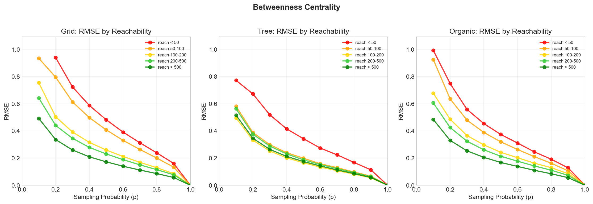

### Empirical RMSE Heatmaps

The heatmaps show observed RMSE (green = low/good, red = high/poor) across all tested configurations,
aggregated by reachability bin. Use these to select an appropriate sampling probability for your
network type and expected reachability.

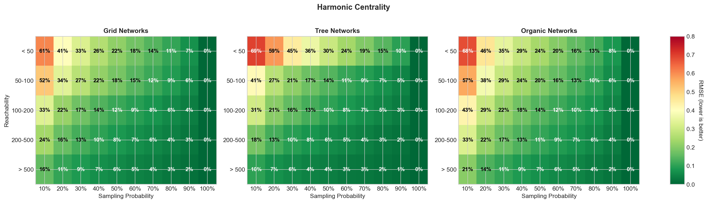

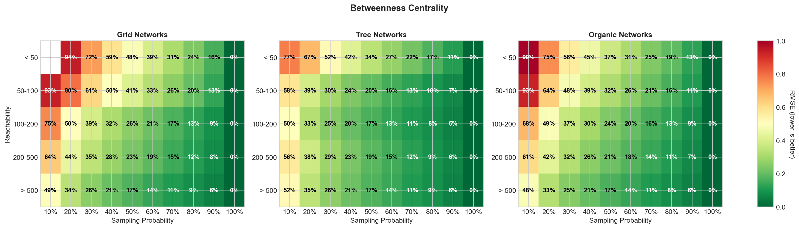

### Speedup vs Accuracy Tradeoff

Sampling at probability p provides an expected speedup of 1/p (e.g., p=0.5 gives ~2x speedup).
The figures below show how RMSE varies with sampling probability, **stratified by reachability**:

- **Low reachability (<50)**: Higher RMSE at all sampling rates; limited benefit from sampling
- **Medium reachability (50-150)**: Moderate RMSE; sampling viable at higher p values
- **High reachability (150-500)**: Lower RMSE; sampling becomes practical
- **Very high reachability (>500)**: Lowest RMSE; aggressive sampling may be acceptable

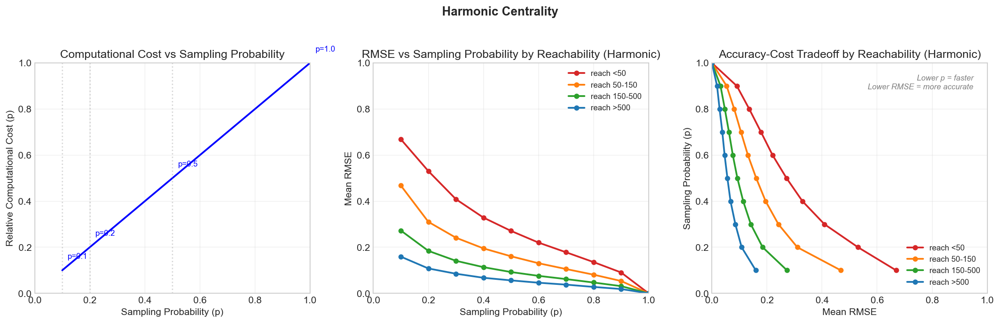

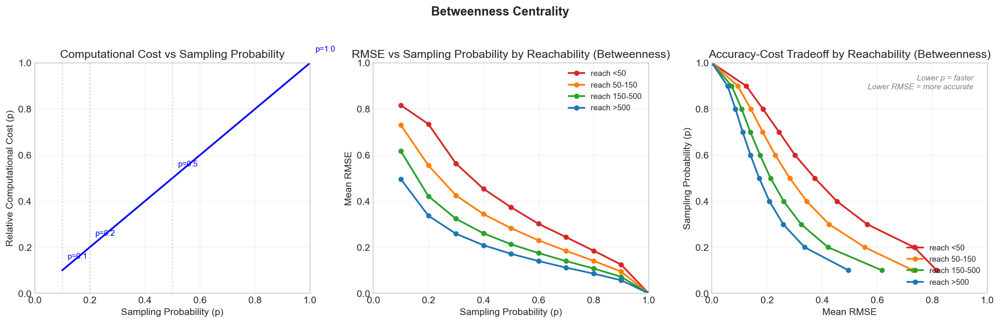

The stratification shows that reachability is the primary determinant of the speedup-accuracy
tradeoff. Networks with similar reachability will have similar tradeoff curves regardless of
topology.

---

## Discussion and Conclusions

1. **Algorithm correctness** — Matches NetworkX within numerical precision for both metrics
2. **Bias** — Mean bias is low, though individual run variance can be substantial
3. **Reachability and accuracy** — Effective_n is associated with RMSE, though fit quality varies by metric
4. **Metric differences** — Harmonic closeness shows stronger formula fit; betweenness has larger residuals
5. **Practical use** — Consult the heatmaps to select p based on expected reachability and acceptable error
6. **Limitations** — Results are from synthetic networks; real-world networks may differ

---

## References

1. Horvitz, D.G. and Thompson, D.J. (1952). "A Generalization of Sampling Without
   Replacement From a Finite Universe". _JASA_ 47(260):663-685.

2. Brandes, U. and Pich, C. (2007). "Centrality Estimation in Large Networks".
   _International Journal of Bifurcation and Chaos_ 17(07):2303-2318.

3. Riondato, M. and Kornaropoulos, E.M. (2014). "Fast approximation of betweenness
   centrality through sampling". _WSDM '14_:413-422.

4. Cohen, E., Delling, D., Pajor, T., and Werneck, R.F. (2014). "Computing Classic
   Closeness Centrality, at Scale". _COSN '14_:37-50.
