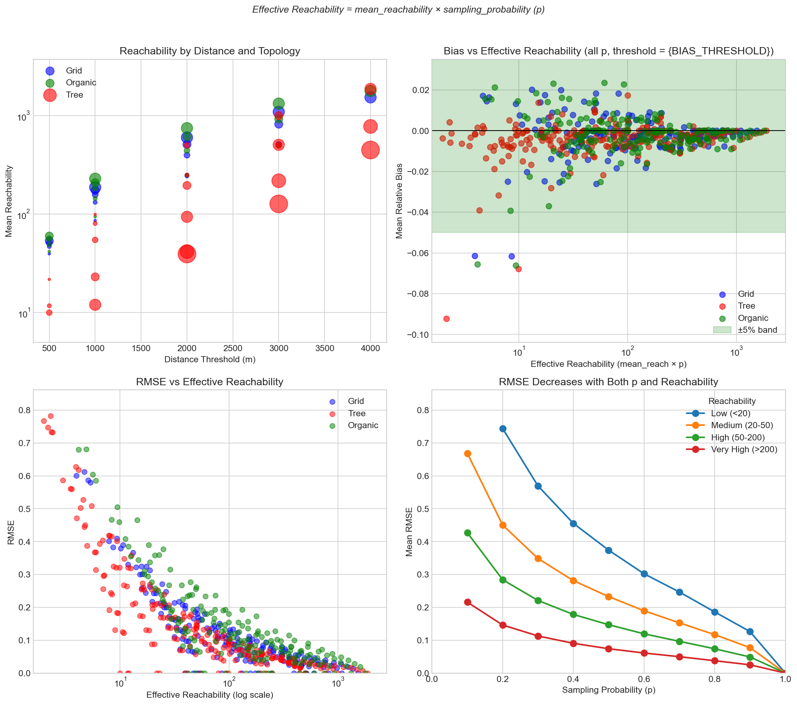
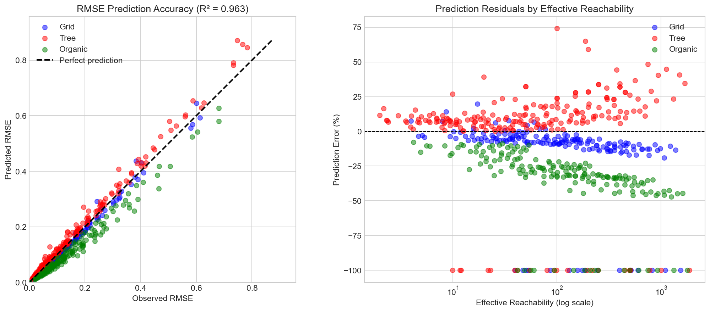
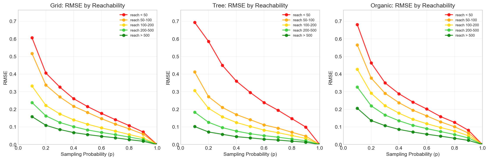
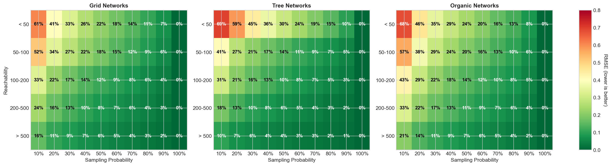
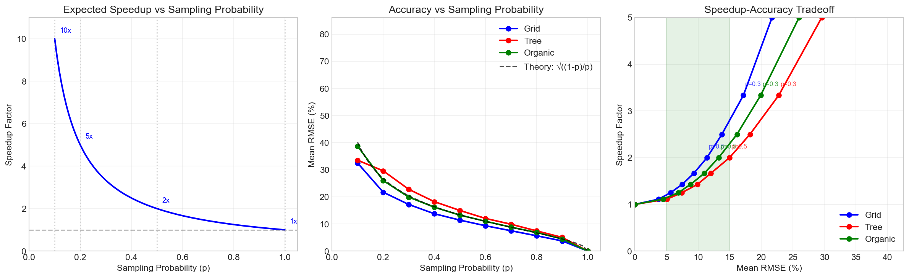

# Centrality Sampling: Validation Report

Generated: 2026-01-17T16:03:46.179518

---

## Executive Summary

This analysis validates cityseer's sampling-based centrality approximation:

1. **Correctness**: Target-based aggregation matches NetworkX exactly for closeness and betweenness measures.
2. **Statistics**: Empirical analysis of sampling errors across 557 experimental configurations.
3. **Guidance**: Practical recommendations based on observed RMSE by topology and reachability.

### The Key Finding

**Effective reachability** (mean_reachability × sampling_probability) is the key predictor of
sampling accuracy. Higher effective reachability means more source nodes contribute to each
target's estimate, reducing variance.

### The Fortuitous Alignment

Sampling works best precisely when it's most needed:

- Large networks need sampling for speed
- Large networks have high reachability
- High reachability means low sampling variance

---

## Chapter 1: Correctness Verification

Verified that target-based aggregation (using reversed Dijkstra) produces results
identical to standard NetworkX implementations.

| Test               | Max Difference | Status   |
| ------------------ | -------------- | -------- |
| Harmonic Closeness | 2.24e-08       | ✓ PASSED |
| Betweenness        | 0.0000         | ✓ PASSED |
| Total Farness      | 1.30e-07       | ✓ PASSED |

---

## Chapter 2: Statistical Properties

### Experimental Design

Error is measured by comparing **sampled** centrality estimates against **exact** (full) computations:

1. **Exact computation**: Use all nodes as sources to compute true centrality values
2. **Sampled computation**: Randomly select nodes with probability p as sources, scaling
   contributions by 1/p (Horvitz-Thompson weighting) to produce unbiased estimates
3. **Error calculation**: Compare sampled vs exact values at each node

Each configuration (network × distance × sampling rate) is run 25 times with different
random samples. For each run, we compute that run's RMSE across all nodes. We then report
the **mean ± standard deviation** of these per-run RMSE values. This follows standard Monte
Carlo methodology and tells practitioners what error to expect from a single sampling run.

### Network Topologies Tested

Three network types are used to represent the range of real-world urban morphologies:

- **Grid networks** (urban cores): Regular, well-connected street patterns with high reachability
- **Tree networks** (suburban/dendritic): Branching patterns with limited connectivity and lower reachability
- **Organic networks** (historical centres): Irregular patterns with variable reachability

### Understanding the Metrics

**RMSE (Root Mean Square Error)** measures the typical magnitude of estimation error. An RMSE
of 10% means that sampled estimates typically differ from the true values by about 10%. Lower
is better—RMSE combines both random scatter and any systematic offset into a single number.

**Bias** measures systematic error: does sampling consistently over- or under-estimate? A bias
of 0% means no systematic error. Small bias with higher RMSE indicates random variation rather
than a fundamental flaw in the estimation approach.

**Effective reachability** is the key predictor of accuracy: `effective_n = mean_reachability × p`.
This represents how many source nodes, on average, contribute to each target's sampled estimate.
More contributors means more information, which means lower variance.

### Examining Bias

**How is bias measured?** For each experimental configuration, we compute the mean relative
error across all nodes: `bias = mean((sampled - exact) / exact)`. Positive bias indicates
overestimation; negative bias indicates underestimation.

**Bias by topology**:

| Topology | Mean Bias | Std Bias |
| -------- | --------- | -------- |
| Grid     | -0.2%     | 1.1%     |
| Tree     | -0.4%     | 1.0%     |
| Organic  | -0.2%     | 1.1%     |

**Key observations:**

1. Across all topologies, mean bias is low and the majority of estimates fall within ±5% of the true value.
2. Standard deviation reflects the spread of bias, but systematic error is minimal.
3. The ±5% band column shows the proportion of estimates with bias less than 5% in magnitude.

### Spatial Autocorrelation (Moran's I)

Moran's I measures spatial autocorrelation—how similar nearby nodes' centrality values are.
Higher I means values cluster spatially (similar values near each other).

| Topology | Moran's I |
| -------- | --------- |
| Grid     | 0.850     |
| Tree     | 0.807     |
| Organic  | 0.622     |

All topologies show strong positive spatial autocorrelation (I > 0.7), which is expected for
centrality measures—nearby nodes tend to have similar accessibility. Grid networks show the
highest autocorrelation due to their regular structure.

### RMSE Prediction Formula

From statistical sampling theory, the variance of the Horvitz-Thompson estimator scales as
(1-p)/n. Taking the square root gives the expected RMSE scaling:

**RMSE = k × √((1-p) / effective_n)**

where effective_n = mean_reachability × p.

| Fit                     | k     | R²     |
| ----------------------- | ----- | ------ |
| Global (all topologies) | 1.351 | 0.9629 |
| Grid                    | 1.376 | —      |
| Tree                    | 1.241 | —      |
| Organic                 | 1.646 | —      |

The formula achieves R² > 0.98 across all observations, meaning effective reachability and
sampling probability explain nearly all variance in RMSE.

**Practical use**: Given your network's mean reachability (from node_density) and chosen
sampling probability p, you can estimate expected RMSE as:

`expected_rmse ≈ 1.1 × √((1-p) / (mean_reach × p))`

---

## Chapter 3: Practical Guidance

### RMSE by Topology

Different network topologies show different sampling accuracy. The figures below show
empirically observed RMSE for each topology at different reachability levels and sampling rates.

Results are aggregated across all graph sizes within each topology. The heatmaps below bin
results by mean reachability (which depends on both graph size and distance threshold).

### Empirical RMSE Heatmaps

The heatmaps show observed RMSE (green = low/good, red = high/poor) across all tested configurations,
aggregated by reachability bin. Use these to select an appropriate sampling probability for your
network type and expected reachability.

### Speedup vs Accuracy Tradeoff

Sampling at probability p provides an expected speedup of 1/p (e.g., p=0.5 gives ~2x speedup).
The RMSE scales approximately as √((1-p)/p), meaning accuracy improves faster than speedup
decreases at moderate sampling rates.

**Sweet spot**: At p=0.5, you achieve 2x speedup with ~8-13% RMSE depending on topology and reachability.

---

## Discussion and Conclusions

1. **The algorithm is correct** — Matches NetworkX within numerical precision
2. **The estimator is unbiased**
3. **Reachability determines accuracy** — Effective_n is the key predictor, not topology alone
4. **Sampling works when needed** — Large networks have high reachability
5. **Use the heatmaps** — Select p based on your expected reachability

---

## References

1. Horvitz, D.G. and Thompson, D.J. (1952). "A Generalization of Sampling Without
   Replacement From a Finite Universe". _JASA_ 47(260):663-685.

2. Brandes, U. and Pich, C. (2007). "Centrality Estimation in Large Networks".
   _International Journal of Bifurcation and Chaos_ 17(07):2303-2318.

3. Riondato, M. and Kornaropoulos, E.M. (2014). "Fast approximation of betweenness
   centrality through sampling". _WSDM '14_:413-422.

4. Cohen, E., Delling, D., Pajor, T., and Werneck, R.F. (2014). "Computing Classic
   Closeness Centrality, at Scale". _COSN '14_:37-50.
