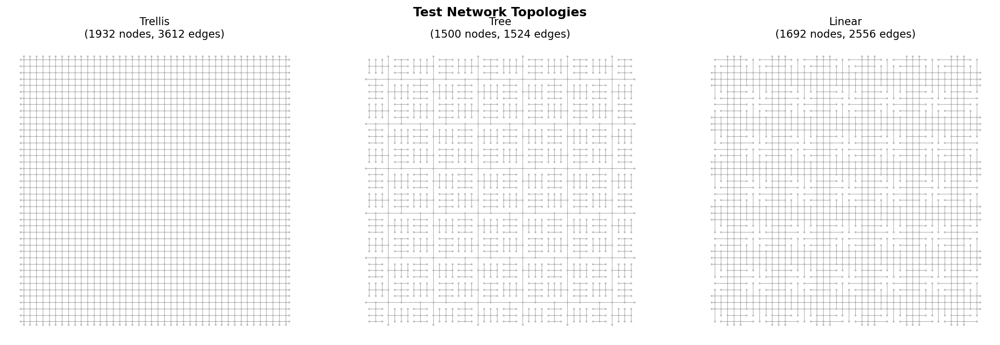
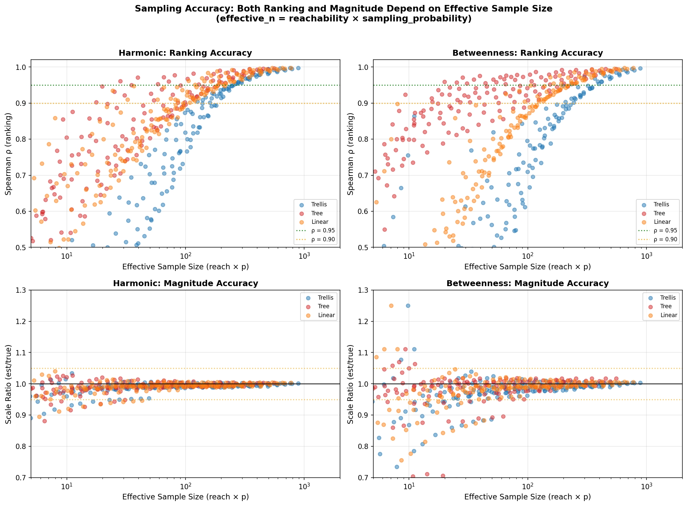
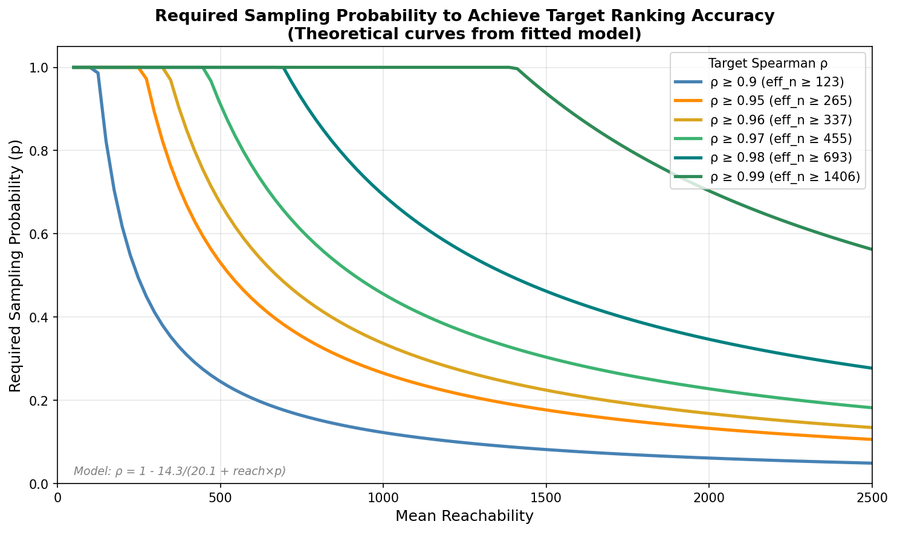
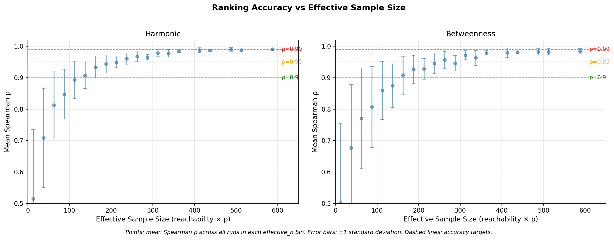

# Sampling Analysis: When Can You Trust Sampled Centrality?

Generated: 2026-01-18T19:52:10

This document summarises empirical observations on how sampling affects centrality
accuracy. Models fitted here are used by cityseer to provide runtime accuracy estimates.

---

## Summary

Based on experiments with three synthetic network topologies:

| Observed threshold | effective_n | Note |
|-------------------|-------------|------|
| Mean ρ ≈ 0.95 | ~265 | High variance at lower values |
| Mean ρ ≈ 0.90 | ~123 | Individual runs vary |

**Formula**: `effective_n = reachability × sampling_probability`

---

## Chapter 1: Correctness Verification

Before trusting sampled results, we verify that cityseer's centrality implementation
matches NetworkX (the reference implementation).

| Metric | Max Difference | Status |
|--------|----------------|--------|
| Harmonic Closeness | 3.47e-08 | PASSED |
| Node Density | 0.00e+00 | PASSED |
| Betweenness | 0.00e+00 | PASSED |

All metrics pass verification, confirming cityseer computes correct centrality values.

---

## Chapter 2: Test Network Topologies

Three synthetic network topologies are used for testing:



- **Trellis**: Dense grid-like networks (urban cores, high connectivity)
- **Tree**: Branching dendritic networks (suburban areas, hierarchical)
- **Linear**: Linear corridor networks (transit corridors, low connectivity)

These cover the range of real-world network structures.

---

## Chapter 3: Understanding Effective Sample Size

When using sampling to speed up centrality computation, accuracy depends on the
**effective sample size**:

```
effective_n = reachability × sampling_probability
```

Where:
- **reachability**: average number of nodes reachable within the distance threshold
- **sampling_probability (p)**: fraction of nodes used as sources (0 to 1)

### Concept

Each node's centrality value is computed from contributions by sampled source nodes.
The effective_n approximates how many sampled sources contribute to each node's estimate.

### Lookup Table: Effective Sample Size

| Reachability | p=10% | p=20% | p=30% | p=40% | p=50% |
|--------------|-------|-------|-------|-------|-------|
| 100 | 10 | 20 | 30 | 40 | 50 |
| 200 | 20 | 40 | 60 | 80 | 100 |
| 400 | 40 | 80 | 120 | 160 | 200 |
| 600 | 60 | 120 | 180 | 240 | 300 |
| 800 | 80 | 160 | 240 | 320 | 400 |
| 1000 | 100 | 200 | 300 | 400 | 500 |

---

## Chapter 4: Fitted Models

Empirical models fitted to the experimental data:

### Spearman ρ Model (Ranking Accuracy)

```
ρ = 1 - 14.27 / (20.10 + effective_n)
```

- Approaches 1.0 as effective_n increases
- RMSE of fit: 0.1312

### Standard Deviation Model (Uncertainty)

```
std = 0.806 / sqrt(8.31 + effective_n)
```

- Decreases as effective_n increases
- RMSE of fit: 0.0275

### Magnitude Bias Model

Observed tendency for magnitudes to be underestimated at low effective_n:

```
scale = 1 - 0.46 / (-0.13 + effective_n)
bias = 1 - scale
```

- RMSE of fit: 0.0672
- Note: Higher RMSE than ranking model; predictions less reliable

### Model Predictions

| effective_n | Expected ρ | Std Dev | Bias |
|-------------|------------|---------|------|
| 10 | 0.526 | 0.188 | 4.7% |
| 25 | 0.684 | 0.140 | 1.9% |
| 50 | 0.796 | 0.106 | 0.9% |
| 100 | 0.881 | 0.077 | 0.5% |
| 200 | 0.935 | 0.056 | 0.2% |
| 400 | 0.966 | 0.040 | 0.1% |

---

## Chapter 5: Results

### Figure 1: Accuracy vs Effective Sample Size



Scatter plots of observed ranking (top) and magnitude (bottom) accuracy across
all experimental configurations. Points are coloured by network topology.

### Figure 2a: Required Sampling Probability



Theoretical curves showing the sampling probability required to achieve each
target Spearman ρ, derived from the fitted model. The legend shows the
effective_n threshold needed for each accuracy level.

### Figure 2b: Expected Ranking Accuracy



Mean observed Spearman ρ binned by effective sample size. Error bars show
±1 standard deviation within each bin.

---

## Chapter 6: Considerations

### Factors Affecting Accuracy

The models above were fitted on three synthetic network topologies. Real-world networks
may behave differently. The relationship between effective_n and accuracy appears
consistent across the tested topologies, but extrapolation to other network types
should be done with caution.

### Limitations

- Models are fitted on synthetic networks; real networks may vary
- Low effective_n (< 25) shows high variance in observed accuracy
- The bias model has higher RMSE than the ranking model
- Individual runs at the same effective_n can vary substantially

---

## Experimental Details

### Parameters

- Distances: [100, 200, 300, 400, 500, 600, 700, 800, 900, 1000, 1200, 1400, 1600, 1800, 2000]
- Sampling probabilities: ['5%', '10%', '15%', '20%', '25%', '30%', '35%', '40%', '50%', '60%', '70%', '80%', '90%', '100%']
- Runs per configuration: 20 (for variance estimation)
- Network topologies: ['trellis', 'tree', 'linear']

### Metrics

- **Harmonic closeness**: Sum of inverse distances to all reachable nodes
- **Betweenness**: Count of shortest paths passing through each node

### Model Constants

These are exported to `sampling_model_constants.json` and synced to
`pysrc/cityseer/config.py` for runtime accuracy estimation:

```json
{
  "rho_model": {"A": 14.27, "B": 20.10},
  "std_model": {"C": 0.806, "D": 8.31},
  "bias_model": {"E": 0.46, "F": -0.13}
}
```

---

*Generated by `sampling_analysis.py` — Run `poe sync_sampling_constants` to update config.py*
