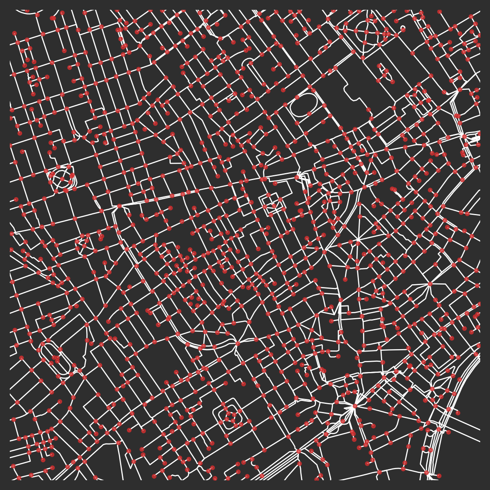
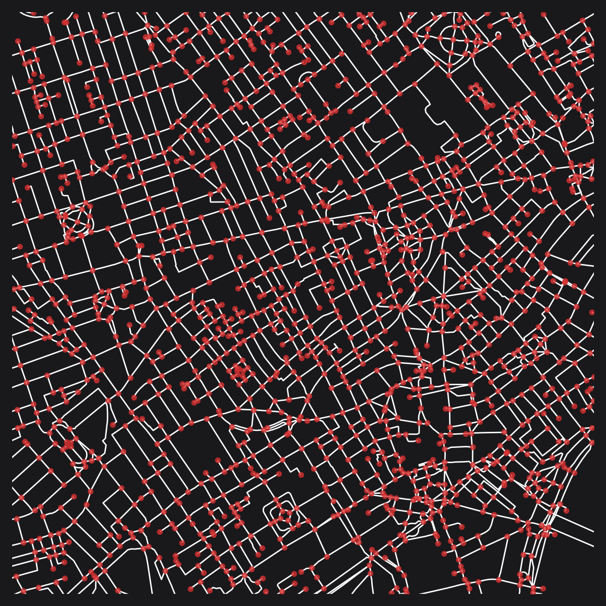

# Guide

## Motivation

The overarching motivation in the development of `cityseer` has been the quantification of urban characteristics in a manner that is as sensitive as possible to local particularities and variations. `cityseer` is designed for localised urban analysis at the pedestrian scale, meaning that observations are tailored towards pedestrian walking tolerances, commonly in the range of 400m to 800m, and infrequently exceeding 1,600m. In the case of certain land-use and mixed-use measures, it can be beneficial to work with weighted measures at distance thresholds as small as 100m or even 50m so that metrics are sufficiently precise to be pertinent to the day-to-day decisions made by architects and urban designers. These use-cases require information anchored to particular locations and measures must be adequately sensitive to reflect varying outcomes in response to different planned scenarios.

`cityseer` is developed from the ground-up to address a particular range of issues that are prevalent in pedestrian-scale urban analysis:

- It uses localised forms of network analysis (as opposed to global forms of analysis) based on network methods applied over the graph through means of a 'moving-window' methodology: the graph is isolated at a specified distance threshold for a currently selected node, and the process subsequently repeats for every other node in the network. These thresholds can be based on either crow-flies euclidean distances or true network distances: `cityseer` takes the position that true network distances are more representative when working at smaller pedestrian distance thresholds, particularly when applied to land-use accessibilities and mixed-use calculations;
- It is common to use either shortest-distance or simplest-path (shortest angular 'distance') impedance heuristics. When using simplest-path heuristics, it is necessary to modify the underlying shortest-path algorithms to prevent side-stepping of sharp angular turns, otherwise two smaller side-steps can be combined to 'short-cut' sharp corners. It is also common for methods to be applied to either primal graph representations (generally used with shortest-path methods such as those applied by _multiple centrality assessment_ analysis) or dual graph representations (typically used with simplest-path methods in the tradition of _space syntax_);
- There are a range of possible centrality and mixed-use methods, many of which can be weighted by distances or street lengths. These methods and their implications are explored in detail in the forthcoming _localised land-use diversity_ and _localised land-use diversity methods_ papers. Some conventional methods, even if widely used, have not necessarily proved suitable for localised urban analysis;
- Centrality methods are susceptible to topological distortions arising from 'messy' graph representations as well as due to the conflation of topological and geometrical properties of street networks. `cityseer` addresses these through the inclusion of graph cleaning functions; procedures for splitting geometrical properties from topological representations; and the inclusion of segmentised centrality measures, which are less susceptible to distortions introduced by varying intensities of nodes;
- Hyperlocal analysis requires approaches facilitating the evaluation of respective measures at finely-spaced intervals along streetfronts. Further, granular evaluation of land-use accessibilities and mixed-uses requires that landuses be assigned to the street network in a contextually precise manner. These are addressed in `cityseer` through application of network decomposition combined with algorithms allowing for bidirectional assignment of data points to network nodes based on the closest adjacent street edge.

The broader emphasis on localised methods and the manner in which `cityseer` addresses these is broached in the accompanying paper (link forthcoming). `cityseer` includes a variety of convenience methods for the general preparation of networks and for their conversion into (and out of) the lower-level data structures used by the underlying algorithms. These graph utility methods are designed to work with `NetworkX` to facilitate ease-of-use. A complement of code tests has been developed for maintaining the integrity of the code-base through general package maintenance and upgrade cycles. Shortest-path algorithms, harmonic closeness, and betweenness algorithms are tested against `NetworkX`. Mock data and test plots have been used to visually confirm the intended behaviour for divergent simplest and shortest-path heuristics, and for testing data assignment to network nodes given a variety of scenarios.

## Graph Cleaning

:::tip Comment
A notebook of this guide can be found at [google colaboratory](https://colab.research.google.com/github/cityseer/cityseer/blob/master/demo_notebooks/graph_cleaning.ipynb).
:::

Good sources of street network data, such as the Ordnance Survey's [OS Open Roads](https://www.ordnancesurvey.co.uk/business-and-government/products/os-open-roads.html), typically have two distinguishing characteristics:

- The network has been simplified to its essential structure: i.e. unnecessarily complex representations of intersections; on-ramps; split roadways; etc. have been reduced to a simpler representation concurring more readily with the core topological structure of street networks. This is in contrast to network representations focusing on completeness (e.g. for route way-finding, see [OS ITN Layer](https://www.ordnancesurvey.co.uk/business-and-government/help-and-support/products/itn-layer.html)): these introduce unnecessary complexity serving to hinder rather than help shortest-path algorithms in the sense used by pedestrian centrality measures.
- The topology of the network is kept distinct from the geometry of the streets. Oftentimes, as can be seen with [Open Street Map](https://www.openstreetmap.org), additional nodes are added to streets for the purpose of representing geometric twists and turns along a roadway. These additional nodes cause topological distortions that impact network centrality measures.

When a high-quality source is available, it may be best not to attempt additional cleanup unless there is a particular reason to do so. On the other-hand, many indispensable sources of network information, particularly Open Street Map data, can be messy for the purposes of network analysis. This section describes how such sources can be cleaned and prepared for subsequent analysis.

### Downloading data

This example will make use of OSM data downloaded from the [OSM API](https://wiki.openstreetmap.org/wiki/API). To keep things interesting, let's pick London Soho, which will be buffered and cleaned for a 1,250m radius.

```python
from shapely import geometry
import utm

from cityseer.tools import graphs, plot, mock

# Let's download data within a 1,250m buffer around London Soho:
lng, lat = -0.13396079424572427, 51.51371088849723
G_utm = mock.make_buffered_osm_graph(lng, lat, 1250)

# As an alternative, you can use osmnx to download data. Set simplify to False:
# e.g.: osmnx_multi_di_graph = ox.graph_from_point((lat, lng), dist=1250, simplify=False)
# Then convert to a cityseer compatible MultiGraph:
# e.g.: G_utm = graphs.nX_from_osmnx(osmnx_multi_di_graph, tolerance=10)

# select extents for plotting
easting, northing = utm.from_latlon(lat, lng)[:2]
# buffer
buff = geometry.Point(easting, northing).buffer(1000)
# extract extents
min_x, min_y, max_x, max_y = buff.bounds
# plot using the selected extents
plot.plot_nX(G_utm,
             labels=False,
             plot_geoms=False,
             x_lim=(min_x, max_x),
             y_lim=(min_y, max_y),
             figsize=(20, 20),
             dpi=200)
```


_The pre-consolidation OSM street network for Soho, London. © OpenStreetMap contributors._

### Deducing the network topology

Once OSM data has been converted to a `NetworkX` `MultiGraph`, the `tools.graphs` module can be used to clean the network.

> The convenience method used for this demonstration has already converted the graph from a geographic WGS to projected UTM coordinate system; however, if working with a graph which is otherwise in a WGS coordinate system then it must be converted to a projected coordinate system prior to further processing. This can be done with [`graphs.nX_wgs_to_utm`](/tools/graphs/#nx_wgs_to_utm).

Now that raw OSM data has been loaded into a NetworkX graph, the `cityseer.tools.graph` methods can be used to further clean and prepare the network prior to analysis.

At this stage, the raw OSM graph is going to look a bit messy. Note how that nodes have been used to represent the roadway geometry. These nodes need to be removed and will be abstracted into `shapely` `LineString` geometries assigned to the respective street edges. So doing, the geometric representation will be kept distinct from the network topology.

```py
# the raw osm nodes denote the road geometries by the placement of nodes
# the first step generates explicit LineStrings geometries for each street edge
G = graphs.nX_simple_geoms(G_utm)
# We'll now strip the "filler-nodes" from the graph
# the associated geometries will be welded into continuous LineStrings
# the new LineStrings will be assigned to the newly consolidated topological links
G = graphs.nX_remove_filler_nodes(G)
# and remove dangling nodes: short dead-end stubs
# these are often found at entrances to buildings or parking lots
# The removed_disconnected flag will removed isolated network components
# i.e. disconnected portions of network that are not joined to the main street network
G = graphs.nX_remove_dangling_nodes(G, despine=20, remove_disconnected=True)
# removing danglers can cause newly orphaned filler nodes, which we'll remove for good measure
G = graphs.nX_remove_filler_nodes(G)
plot.plot_nX(G,
             labels=False,
             plot_geoms=True,
             x_lim=(min_x, max_x),
             y_lim=(min_y, max_y),
             figsize=(20, 20),
             dpi=200)
```


_After removal of filler nodes, dangling nodes, and disconnected components._

### Refining the network

Things are already looked much better, but we still have areas with large concentrations of nodes at complex intersections and many parallel roadways, which will confound centrality methods. We'll now try to remove as much of this as possible. These steps involve the consolidation of nodes to clean-up extraneous nodes, which may otherwise exaggerate the intensity or complexity of the network in certain situations.

We'll do this in three steps:

Step 1: An initial pass to cleanup complex intersections will be performed with the [`graphs.nX_consolidate_nodes`](/tools/graphs/#nx_consolidate_nodes) function. The arguments passed to the parameters allow for several different strategies, and are explained more fully in the documentation.

```py
G1 = graphs.nX_consolidate_nodes(G, buffer_dist=10, min_node_group=3)
plot.plot_nX(G1,
             labels=False,
             plot_geoms=True,
             x_lim=(min_x, max_x),
             y_lim=(min_y, max_y),
             figsize=(20, 20),
             dpi=200)
```


_After an initial pass of node consolidation._

Complex intersections have now been simplified, for example, the intersection of Oxford and Regent has gone from 17 nodes to a single node.

In Step 2, we'll use [`graphs.nX_split_opposing_geoms`](/tools/graphs/#nx_split_opposing_geoms) to intentionally split longer edges at locations opposite nodes on a parallel roadway. This is going to help with a final pass of consolidation in Step 3.

```py
G2 = graphs.nX_split_opposing_geoms(G1, buffer_dist=15)
plot.plot_nX(G2,
             labels=False,
             plot_geoms=True,
             x_lim=(min_x, max_x),
             y_lim=(min_y, max_y),
             figsize=(20, 20),
             dpi=200)
```


_After "splitting opposing geoms" on longer parallel segments._

In the final step, we can now rerun the consolidation to clean up any remaining clusters of nodes:

```py
G3 = graphs.nX_consolidate_nodes(G2,
                                 buffer_dist=15,
                                 crawl=False,
                                 min_node_degree=2,
                                 cent_min_degree=4)
plot.plot_nX(G3,
             labels=False,
             plot_geoms=True,
             x_lim=(min_x, max_x),
             y_lim=(min_y, max_y),
             figsize=(20, 20),
             dpi=200)
```


_After the final step of node consolidation._

The above recipe should be enough to get you started, but manyfold other strategies may also work, and may further be necessitated by different network topologies.

## Comparison to other packages

### _osmnx_

As per the name, [`osmnx`](https://osmnx.readthedocs.io/) excels at workflows connecting the [Open Street Map](https://www.openstreetmap.org) (`OSM`) API to [`networkX`](https://networkx.github.io/) graphs, which can then be explored using a variety of underlying `networkX` algorithms while connecting to a broader ecosystem of geospatial python tools. `cityseer`, on the other-hand, emerged around the creation of abstract graphs (using [`numpy`](http://www.numpy.org/) arrays and [`numba`](https://numba.pydata.org/) data structures) allowing for the exploration of niche pedestrian-specific local network centrality and land-use measures that can efficiently scale to larger graphs. As such, in the first instance, `cityseer` is not about `networkX`, nor is it about `OSM`; rather, it is about graphs in a general sense and tailored forms of pedestrian-scale network and land-use analysis. Earlier versions of `cityseer` created the associated data structures (graphs) directly from `postGIS` (`postgres`) databases; however, to ease the use of these methods, and to lower the barrier to entry, these workflows were gradually abstracted to `networkX` based approaches to make it simpler to create the graphs and to apply methods such as "decomposition"; casting a graph to its "dual"; and subsequent conversion into `cityseer` data structures with the correct format of attributes for use by downstream `cityseer` algorithms. Later, some graph cleaning methods were added so that "messier" sources of graphs could be ingested to `cityseer` with an emphasis on cleaning the topology of the graph in such a manner as to reduce topological artefacts that might otherwise confound centrality measures e.g. by attempting to remove dual carriageways and by deriving topologies and geometrical forms of consolidation that are as 'neat' as possible so as not to complicate simplest path (angular) methods. (Post-simplification manual cleaning may still be required for these use-cases, though should generally be far easier post-simplification.)

A high-level overview of differences between the packages can help clarify whether and how the packages can be combined, with some examples provided in the code snippet that follows below:

- `cityseer` is not about connecting to `OSM` APIs or converting `OSM` graphs to `networkX` graphs. Some basic `OSM` ingestion and conversion functions are included in the [`tools.mock`](/tools/mock) module, but these are primarily intended for internal code development. These methods may provide a starting point for pedestrian-specific analysis but assume that the end-user will have some direct knowledge of how these APIs work and how the recipes and conversion functions can be manipulated for specific situations. i.e. these are not designed for general purpose set-and-forget high-level conversion from `OSM` to `networkX`.
- `osmnx` prepared graphs can be converted to `cityseer` compatible graphs by using the [`tools.graphs.nX_from_osmnx`](/tools/graphs/#nx_from_osmnx) method. In doing so, keep the following in mind:
  - `osmnx` uses `networkX` `multiDiGraph` graph structures which use directional edges. As such, it can be used for understanding vehicular routing, i.e. where one-way routes can have a major impact on the available shortest-routes. `cityseer` --- quite intentionally --- has no interest in `vehicular` networks and therefore makes use of `networkX` `MultiGraphs` on the premise that pedestrian routes are not ordinarily directional. When using the [`tools.graphs.nX_from_osmnx`](/tools/graphs/#nx_from_osmnx) method, be cognisant that all directional information will be discarded.
  - `cityseer` graph simplification will give different results to `osmnx` graph simplification. As such, it is better to use one or the other. If using `osmnx` to ingest networks from `OSM` but then using `cityseer` to simplify the network, set the `osmnx` `simplify` argument to `False` so that the network is not automatically simplified.
  - `cityseer` uses internal graph validation workflows to check that the geometries associated with an edge remain connected to the coordinates of the nodes on either side. If performing any graph manipulation outside of `cityseer` then the conversion function may complain of disconnected geometries. If so, you may need to relax the tolerance parameter which is used for error checking upon conversion to a `cityseer` `MultiGraph`. Geometries that are disconnected from their end-nodes (within the tolerance parameter) will be "snapped" to meet their endpoints as part of the conversion process.
- For graph cleaning and simplificaton: `cityseer` is oriented less towards ease-of-use and automation and more towards explicit and intentional use of potentially varied steps of processing. This involves a tradeoff, whereas some recipes are provided as a starting point (see [`Graph Cleaning`](/guide/#graph-cleaning)), you may find yourself doing more up-front experimentation and fine-tuning, but with the benefit of a degree of flexibility in how these methods are combined and fine-tuned for a given network topology: e.g. steps can be included or omitted, used in different sequences, or repeated. Some of these methods, particularly [`tools.graphs.nX_consolidate_nodes`](/tools/graphs/#nx_consolidate_nodes), may have severable tunable parameters which can have markedly different outcomes. This philosophy is by design, and if you want a simplified method you'll need to wrap your own sequence of steps in a simplified utility function.
- `osmnx` uses `networkX` under the hood for measures such as closeness or betweenness centralities. `cityseer` uses different forms of algorithms that behave differently from those in `networkX`: it uses localised instead of global forms of analysis and employs specific variants of centrality measures to handle cases such as simplest-path heuristics (no side-stepping), segmentised analysis, while extending these workflows to land-use accessibilities and mixed-uses.

```py
from cityseer import tools
import osmnx as ox
from shapely import geometry
import utm

# centre-point
lng, lat = -0.13396079424572427, 51.51371088849723

# select extents for plotting
easting, northing = utm.from_latlon(lat, lng)[:2]
buff = geometry.Point(easting, northing).buffer(1000)
min_x, min_y, max_x, max_y = buff.bounds

# Let's use osmnx to fetch an OSM graph
# We'll use the same raw network for both workflows (hence simplify=False)
multi_di_graph_raw = ox.graph_from_point((lat, lng),
                                         dist=1250,
                                         simplify=False)

# Workflow 1: Using osmnx for simplification
# ==========================================
# explicit simplification and consolidation via osmnx
multi_di_graph_utm = ox.project_graph(multi_di_graph_raw)
multi_di_graph_simpl = ox.simplify_graph(multi_di_graph_utm)
multi_di_graph_cons = ox.consolidate_intersections(multi_di_graph_simpl,
                                                   tolerance=50,
                                                   dead_ends=True)
# let's use the same plotting function for both scenarios to aid visual comparisons
multi_graph_cons = tools.graphs.nX_from_osmnx(multi_di_graph_cons, tolerance=10)
tools.plot.plot_nX(multi_graph_cons,
                   labels=False,
                   plot_geoms=True,
                   x_lim=(min_x, max_x),
                   y_lim=(min_y, max_y),
                   figsize=(20, 20),
                   dpi=200)

# WORKFLOW 2: Using cityseer for simplification
# =============================================
# let's convert the osmnx graph to a cityseer compatible `multiGraph`
G_raw = tools.graphs.nX_from_osmnx(multi_di_graph_raw)
# convert to UTM
G = tools.graphs.nX_wgs_to_utm(G_raw)
# infer geoms
G = tools.graphs.nX_simple_geoms(G)
# remove degree=2 nodes
G = tools.graphs.nX_remove_filler_nodes(G)
# remove dangling nodes
G = tools.graphs.nX_remove_dangling_nodes(G, despine=10)
# repeat degree=2 removal to remove orphaned nodes due to despining
G = tools.graphs.nX_remove_filler_nodes(G)
# let's consolidate the nodes
G1 = tools.graphs.nX_consolidate_nodes(G, buffer_dist=10, min_node_group=3)
# and we'll try to remove as many parallel carriageways as possible
G2 = tools.graphs.nX_split_opposing_geoms(G1, buffer_dist=15)
G3 = tools.graphs.nX_consolidate_nodes(G2,
                                 buffer_dist=15,
                                 crawl=False,
                                 min_node_degree=2,
                                 cent_min_degree=4)
tools.plot.plot_nX(G3,
                   labels=False,
                   plot_geoms=True,
                   x_lim=(min_x, max_x),
                   y_lim=(min_y, max_y),
                   figsize=(20, 20),
                   dpi=200)
```


_An example `osmnx` simplification and consolidation workflow._


_An example `osmnx` to `cityseer` conversion followed by simplification and consolidation workflow in `cityseer`._

### Optimised packages

Computational methods for network-based centrality and land-use analysis make extensive use of shortest-path algorithms: these present substantial computational complexity due to nested-loops. Centrality methods implemented in pure `python`, such as those contained in [`NetworkX`](https://networkx.github.io/), can be particularly slow and may hinder practical application to large urban street networks. Speed improvements are offered by adopting packages such as [`Graph-Tool`](https://graph-tool.skewed.de) or [`igraph`](https://igraph.org/python/#docs) which wrap underlying optimised `C` or `C++` code libraries. This is the approach that was adopted by the author prior to the development of `cityseer`, but whereas these performant packages offer tremendous utility for general-purpose network analysis they can remain cumbersome to piggy-back for more esoteric use-cases, some of which are briefly alluded to in the discussion on [motivation](/guide/#motivation). Doing so can lead to a degree of code complexity presenting a bottleneck to further experimentation and development, and it was this conundrum that kickstarted the development of the current codebase which became formalised as the `cityseer` package. The present approach leverages pure `python` and [`numpy`](http://www.numpy.org/), but with computationally intensive algorithms optimised through use of [`numba`](https://numba.pydata.org/) JIT compilation. This has allowed for wide-ranging experimentation with the underlying methodologies and algorithms, thereby provided the extensibility required for experimentation with different formulations of centrality, mixed-use, land-use accessibility, and statistical calculations specific to analytics from an urbanist's perspective.

Quite simply, if you're in need of general purpose network analysis methods that use conventional globalised forms of centralities then you'll want to use a package such as [`Graph-Tool`](https://graph-tool.skewed.de). If you're using localised forms of analysis taking into account factors such as localised threshold distances, shortest vs. simplest-path heuristics, land-use accessibilities and mixed-uses, etc., then you may want to take a closer look at `cityseer`. For emphasis, `cityseer` does not implement globalised forms of network analysis and currently has no intention of doing so because these are tricky to compare across locations.
