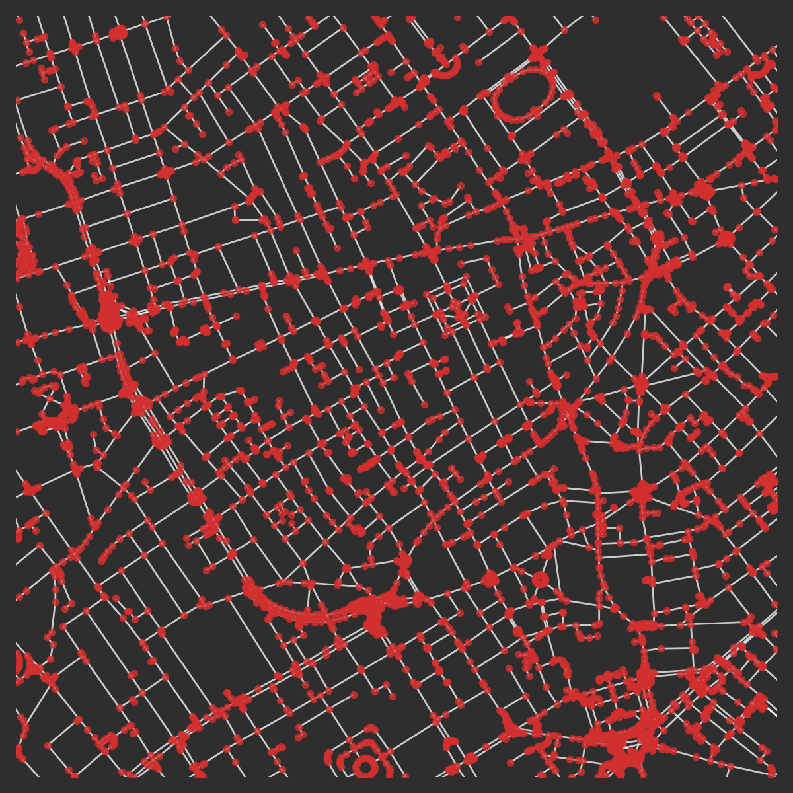
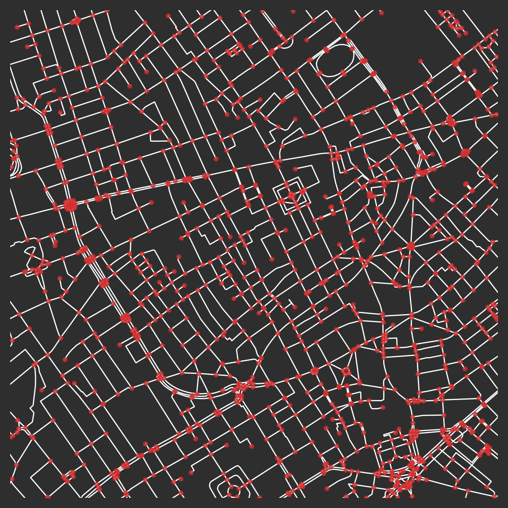
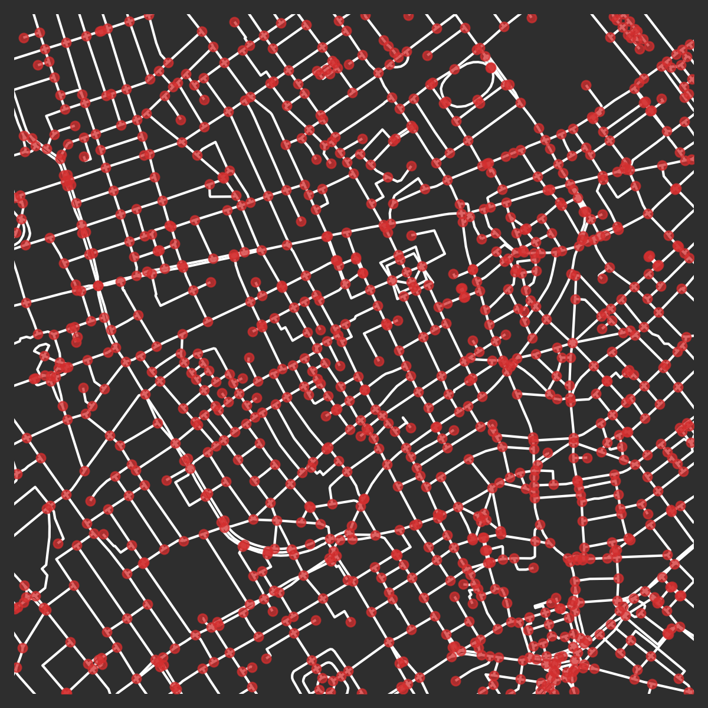
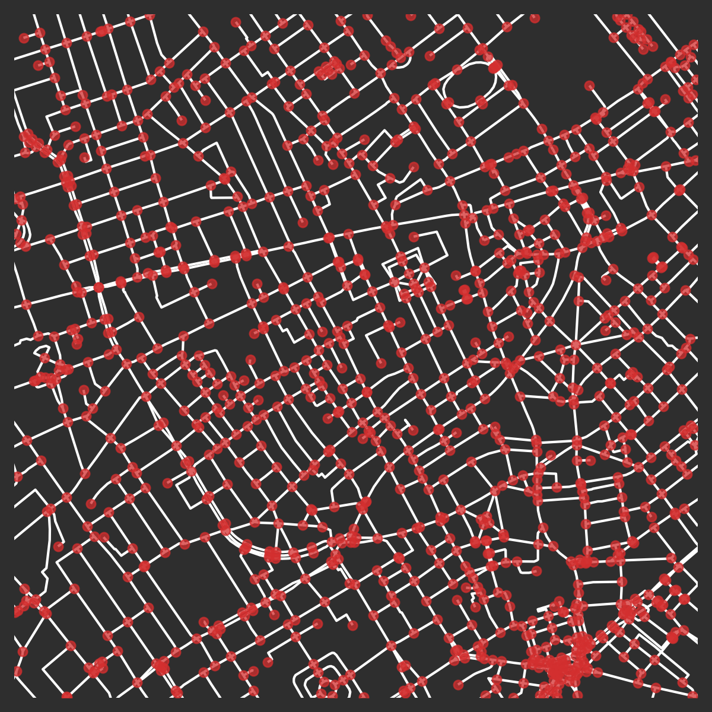
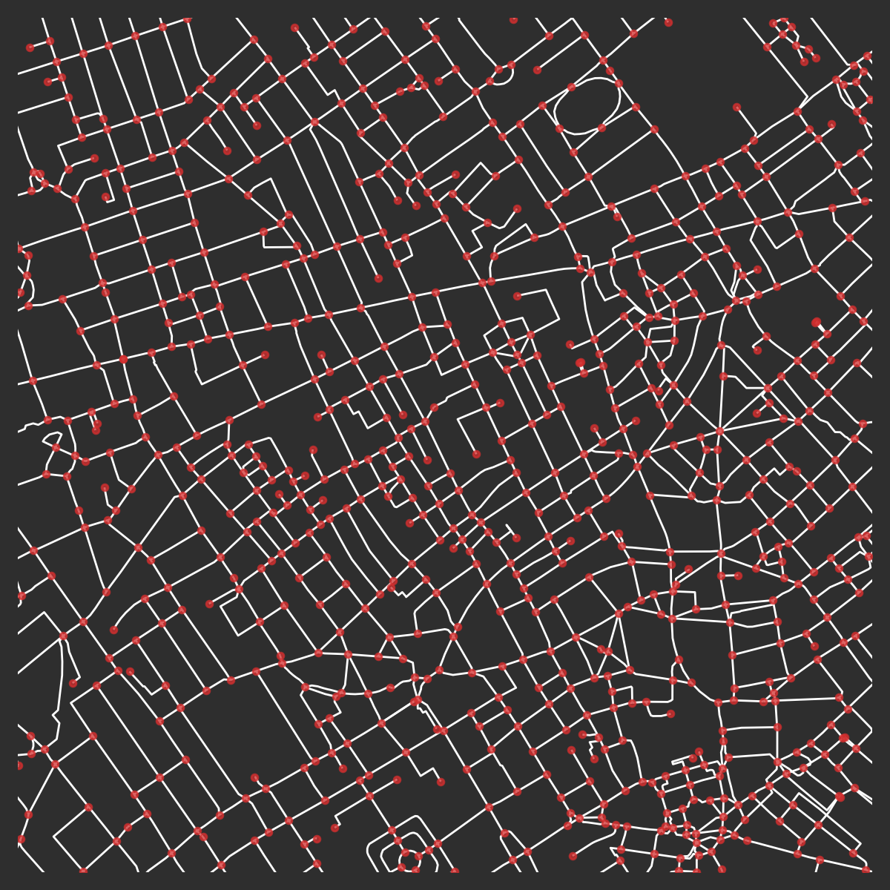

# Graph Cleaning

:::tip Comment
A notebook of this guide can be found at [google colaboratory](https://colab.research.google.com/github/cityseer/cityseer/blob/master/demo_notebooks/graph_cleaning.ipynb).
:::

Good sources of street network data, such as the Ordnance Survey's [OS Open Roads](https://www.ordnancesurvey.co.uk/business-and-government/products/os-open-roads.html), typically have two distinguishing characteristics:

- The network has been simplified to its essential structure: i.e. unnecessarily complex representations of intersections; on-ramps; split roadways; etc. have been reduced to a simpler representation concurring more readily with the core topological structure of street networks. This is in contrast to network representations focusing on completeness (e.g. for route way-finding, see [OS ITN Layer](https://www.ordnancesurvey.co.uk/business-and-government/help-and-support/products/itn-layer.html)): these introduce unnecessary complexity serving to hinder rather than help shortest-path algorithms in the sense used by pedestrian centrality measures.
- The topology of the network is kept distinct from the geometry of the streets. Oftentimes, as can be seen with [Open Street Map](https://www.openstreetmap.org), additional nodes are added to streets for the purpose of representing geometric twists and turns along a roadway. These additional nodes cause topological distortions that impact network centrality measures.

When a high-quality source is available, it may be best not to attempt additional cleanup unless there is a particular reason to do so. On the other-hand, many indispensable sources of network information, particularly Open Street Map data, can be messy for the purposes of network analysis. This section describes how such sources can be cleaned and prepared for subsequent analysis.

## Downloading data

This example will make use of OSM data downloaded from the [OSM API](https://wiki.openstreetmap.org/wiki/API). To keep things interesting, let's pick London Soho, which will be buffered and cleaned for a 1,250m radius.

```python
from shapely import geometry
import utm

from cityseer.tools import graphs, plot, mock

# Let's download data within a 1,250m buffer around London Soho:
lng, lat = -0.13396079424572427, 51.51371088849723
G_utm = mock.make_buffered_osm_graph(lng, lat, 1250)
# select extents for plotting
easting, northing = utm.from_latlon(lat, lng)[:2]
# buffer
buff = geometry.Point(easting, northing).buffer(1000)
# extract extents
min_x, min_y, max_x, max_y = buff.bounds
# plot
plot.plot_nX(G_utm,
             labels=False,
             plot_geoms=False,
             x_lim=(min_x, max_x),
             y_lim=(min_y, max_y),
             figsize=(20, 20),
             dpi=200)
```


_The pre-consolidation OSM street network for Soho, London. © OpenStreetMap contributors._

## Deducing the network topology

Once OSM data has been converted to a `NetworkX` `MultiGraph`, `cityseer.tools` can be used to clean the network.

> The convenience method used for this demonstration has already converted the graph from a geographic WGS to projected UTM coordinate system; however, if working with a graph which is otherwise in a WGS coordinate system then it must be converted to a projected coordinate system prior to further processing. This can be done with [`graphs.nX_wgs_to_utm`](/tools/graphs/#nx_wgs_to_utm).

Now that raw OSM data has been loaded into a NetworkX graph, the `cityseer.tools.graph` methods can be used to further clean and prepare the network prior to analysis.

At this stage, the raw OSM graph is going to look a bit messy. Note how that nodes have been used to represent the roadway geometry. These nodes need to be removed and will be abstracted into `shapely` `LineString` geometries assigned to the respective street edges. So doing, the geometric representation will be kept distinct from the network topology.

```py
# the raw osm nodes denote the road geometries by the placement of nodes
# the first step generates explicit LineStrings geometries for each street edge
G = graphs.nX_simple_geoms(G_utm)
# We'll now strip the "filler-nodes" from the graph
# the associated geometries will be welded into continuous LineStrings
# the new LineStrings will be assigned to the newly consolidated topological links
G = graphs.nX_remove_filler_nodes(G)
# and remove dangling nodes: short dead-end stubs
# these are often found at entrances to buildings or parking lots
# The removed_disconnected flag will removed isolated network components
# i.e. disconnected portions of network that are not joined to the main street network
G = graphs.nX_remove_dangling_nodes(G, despine=20, remove_disconnected=True)
# removing danglers can cause newly orphaned filler nodes, which we'll remove for good measure
G = graphs.nX_remove_filler_nodes(G)
plot.plot_nX(G,
             labels=False,
             plot_geoms=True,
             x_lim=(min_x, max_x),
             y_lim=(min_y, max_y),
             figsize=(20, 20),
             dpi=200)
```


_After removal of filler nodes, dangling nodes, and disconnected components._

## Refining the network

Things are already looked much better, but we still have areas with large concentrations of nodes at complex intersections and many parallel roadways, which will confound centrality methods. We'll now try to remove as much of this as possible. These steps involve the consolidation of nodes to clean-up extraneous nodes, which may otherwise exaggerate the intensity or complexity of the network in certain situations.

We'll do this in three steps:

Step 1: An initial pass to cleanup complex intersections will be performed with the [`graphs.nX_consolidate_nodes`](/tools/graphs/#nx_consolidate_nodes) function. The arguments passed to the parameters allow for several different strategies, and are explained more fully in the documentation.

```py
G1 = graphs.nX_consolidate_nodes(G,
                                 buffer_dist=10,
                                 min_node_group=3,
                                 min_node_degree=1,
                                 crawl=True,
                                 cent_min_degree=3,
                                 merge_edges_by_midline=True,
                                 multi_edge_len_factor=1.25,
                                 multi_edge_min_len=100)
plot.plot_nX(G1,
             labels=False,
             plot_geoms=True,
             x_lim=(min_x, max_x),
             y_lim=(min_y, max_y),
             figsize=(20, 20),
             dpi=200)
```


_After an initial pass of node consolidation._

Complex intersections have now been simplified, for example, the intersection of Oxford and Regent has gone from 17 nodes to a single node.

In Step 2, we'll use [`graphs.nX_split_opposing_geoms`](/tools/graphs/#nx_split_opposing_geoms) to intentionally split longer edges at locations opposite nodes on a parallel roadway. This is going to help with a final pass of consolidation in Step 3.

```py
G2 = graphs.nX_split_opposing_geoms(G1,
                                    buffer_dist=15,
                                    merge_edges_by_midline=True,
                                    multi_edge_len_factor=1.25,
                                    multi_edge_min_len=100)
plot.plot_nX(G2,
             labels=False,
             plot_geoms=True,
             x_lim=(min_x, max_x),
             y_lim=(min_y, max_y),
             figsize=(20, 20),
             dpi=200)
```


_After "splitting opposing geoms" on longer parallel segments._

In the final step, we can now rerun the consolidation to clean up any remaining clusters of nodes:

```py
G3 = graphs.nX_consolidate_nodes(G2,
                                 buffer_dist=15,
                                 crawl=True,
                                 merge_edges_by_midline=True,
                                 cent_min_degree=4,
                                 multi_edge_len_factor=1.25,
                                 multi_edge_min_len=100)

plot.plot_nX(G3,
             labels=False,
             plot_geoms=True,
             x_lim=(min_x, max_x),
             y_lim=(min_y, max_y),
             figsize=(20, 20),
             dpi=200)
```


_After the final step of node consolidation._

The above recipe should be enough to get you started, but manyfold other strategies may also work, and may further be necessitated by different network topologies.
