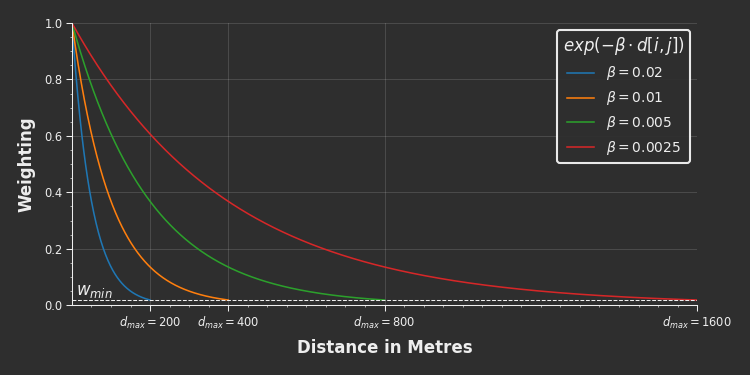
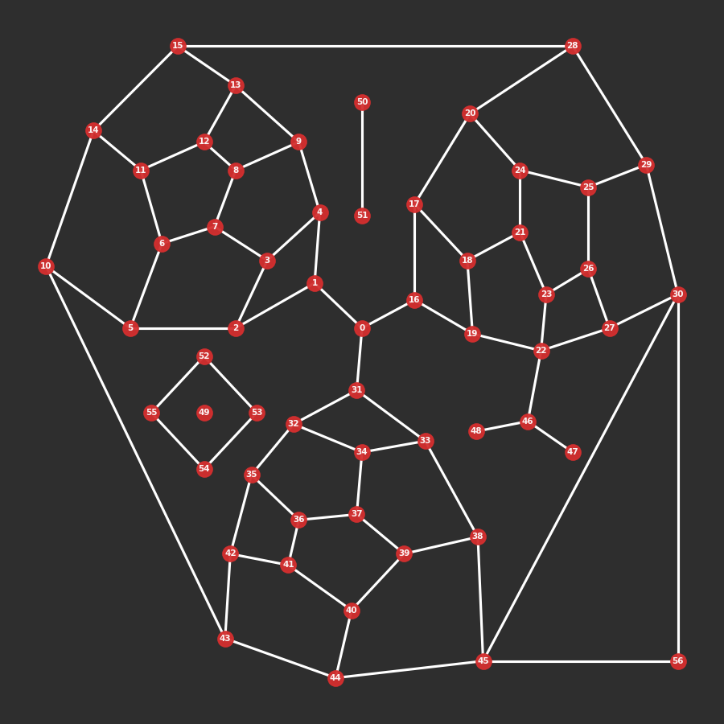

# cityseer.metrics.networks

Centrality methods

## distance\_from\_beta

<FuncSignature>
<pre>
distance_from_beta(beta,
                   min_threshold_wt=checks.def_min_thresh_wt)
                   -> np.ndarray
</pre>
</FuncSignature>

Maps decay parameters $\beta$ to equivalent distance thresholds $d_{max}$ at the specified cutoff weight $w_{min}$.

:::warning Comment

It is generally not necessary to utilise this function directly. It will be called internally, if necessary, when invoking [`NetworkLayer`](#class-networklayer) or [`NetworkLayerFromNX`](#class-networklayerfromnx).
:::

<FuncHeading>Parameters</FuncHeading>

<FuncElement name='beta' type='float | list | np.ndarray'>

$\beta$ value/s to convert to distance thresholds $d_{max}$.

</FuncElement>

<FuncElement name='min_threshold_wt' type='float'>

An optional cutoff weight $w_{min}$ at which to set the distance threshold $d_{max}$, default of 0.01831563888873418.

</FuncElement>

<FuncHeading>Returns</FuncHeading>

<FuncElement name='np.ndarray'>

A numpy array of distance thresholds $d_{max}$.

</FuncElement>

<FuncHeading>Notes</FuncHeading>

```python
from cityseer.metrics import networks
# a list of betas
betas = [0.01, 0.02]
# convert to distance thresholds
d_max = networks.distance_from_beta(betas)
print(d_max)
# prints: array([400., 200.])
```

Weighted measures such as the gravity index, weighted betweenness, and weighted land-use accessibilities are computed using a negative exponential decay function in the form of:

$$weight = exp(-\beta \cdot distance)$$

The strength of the decay is controlled by the $\beta$ parameter, which reflects a decreasing willingness to walk correspondingly farther distances. For example, if $\beta=0.005$ were to represent a person's willingness to walk to a bus stop, then a location 100m distant would be weighted at 60% and a location 400m away would be weighted at 13.5%. After an initially rapid decrease, the weightings decay ever more gradually in perpetuity; thus, once a sufficiently small weight is encountered it becomes computationally expensive to consider locations any farther away. The minimum weight at which this cutoff occurs is represented by $w_{min}$, and the corresponding maximum distance threshold by $d_{max}$.



[`NetworkLayer`](#class-networklayer) and [`NetworkLayerFromNX`](/metrics/networks/#class-networklayerfromnx) can be invoked with either `distances` or `betas` parameters, but not both. If using the `betas` parameter, then this function will be called in order to extrapolate the distance thresholds implicitly, using:

$$d_{max} = \frac{log(w_{min})}{-\beta}$$

The default `min_threshold_wt` of $w_{min}=0.01831563888873418$ yields conveniently rounded $d_{max}$ walking thresholds, for example:

| $\beta$ | $d_{max}$ |
|:-------:|:---------:|
| 0.02 | 200m |
| 0.01 | 400m |
| 0.005 | 800m |
| 0.0025 | 1600m |

Overriding the default $w_{min}$ will adjust the $d_{max}$ accordingly, for example:

| $\beta$ | $w_{min}$ | $d_{max}$ |
|:-------:|:---------:|:---------:|
| 0.02 | 0.01 | 230m |
| 0.01 | 0.01 | 461m |
| 0.005 | 0.01 | 921m |
| 0.0025 | 0.01 | 1842m |

## beta\_from\_distance

<FuncSignature>
<pre>
beta_from_distance(distance,
                   min_threshold_wt=checks.def_min_thresh_wt)
                   -> np.ndarray
</pre>
</FuncSignature>

Maps distance thresholds $d_{max}$ to equivalent decay parameters $\beta$ at the specified cutoff weight $w_{min}$. See [`distance_from_beta`](#distance_from_beta) for additional discussion.

:::warning Comment

It is generally not necessary to utilise this function directly. It will be called internally, if necessary, when invoking [`NetworkLayer`](#class-networklayer) or [`NetworkLayerFromNX`](#class-networklayerfromnx).
:::

<FuncHeading>Parameters</FuncHeading>

<FuncElement name='distance' type='float | list | np.ndarray'>

$d_{max}$ value/s to convert to decay parameters $\beta$.

</FuncElement>

<FuncElement name='min_threshold_wt' type='float'>

The cutoff weight $w_{min}$ on which to model the decay parameters $\beta$, default of 0.01831563888873418.

</FuncElement>

<FuncHeading>Returns</FuncHeading>

<FuncElement name='np.ndarray'>

A numpy array of decay parameters $\beta$.

</FuncElement>

<FuncHeading>Notes</FuncHeading>

```python
from cityseer.metrics import networks
# a list of betas
distances = [400, 200]
# convert to betas
betas = networks.beta_from_distance(distances)
print(betas)  # prints: array([0.01, 0.02])
```

[`NetworkLayer`](#class-networklayer) and [`NetworkLayerFromNX`](#class-networklayerfromnx) can be invoked with either `distances` or `betas` parameters, but not both. If using the `distances` parameter, then this function will be called in order to extrapolate the decay parameters implicitly, using:

$$\beta = -\frac{log(w_{min})}{d_{max}}$$

The default `min_threshold_wt` of $w_{min}=0.01831563888873418$ yields conveniently rounded $\beta$ parameters, for example:

| $d_{max}$ | $\beta$ |
|:---------:|:-------:|
| 200m | 0.02 |
| 400m | 0.01 |
| 800m | 0.005 |
| 1600m | 0.0025 |

## avg\_distance\_for\_beta

<FuncSignature>
<pre>
avg_distance_for_beta(beta,
                      min_threshold_wt=checks.def_min_thresh_wt)
                      -> float
</pre>
</FuncSignature>

<FuncHeading>Parameters</FuncHeading>

<FuncElement name='beta' type='float | list | np.ndarray'>

$\beta$ representing a spatial impedance / distance decay for which to compute the average walking distance.

</FuncElement>

<FuncElement name='min_threshold_wt' type='float'>

The cutoff weight $w_{min}$ on which to model the decay parameters $\beta$, default of 0.01831563888873418.

</FuncElement>

<FuncHeading>Returns</FuncHeading>

<FuncElement name='np.ndarray'>

The average walking distance for a given $\beta$.

</FuncElement>

<FuncHeading>Notes</FuncHeading>

```python
from cityseer.metrics import networks
import numpy as np

distances = np.array([100, 200, 400, 800, 1600])
print('distances', distances)
# distances [ 100  200  400  800 1600]

betas = networks.beta_from_distance(distances)
print('betas', betas)
# betas [0.04   0.02   0.01   0.005  0.0025]

print('avg', networks.avg_distance_for_beta(betas))
# avg [ 35.1194952   70.2389904  140.47798079 280.95596159 561.91192318]
```

## **class** NetworkLayer

Network layers are used for network centrality computations and provide the backbone for landuse and statistical aggregations. [`NetworkLayerFromNX`](#class-networklayerfromnx) should be used instead if converting from a `NetworkX` `MultiGraph` to a `NetworkLayer`.

A `NetworkLayer` requires either a set of distances $d_{max}$ or equivalent exponential decay parameters $\beta$, but not both. The unprovided parameter will be calculated implicitly in order to keep weighted and unweighted metrics in lockstep. The `min_threshold_wt` parameter can be used to generate custom mappings from one to the other: see [`distance_from_beta`](#distance_from_beta) for more information. These distances and betas are used for any subsequent centrality and land-use calculations.

```python
from cityseer.metrics import networks
from cityseer.tools import mock, graphs

# prepare a mock graph
G = mock.mock_graph()
G = graphs.nX_simple_geoms(G)

# if initialised with distances: 
# betas for weighted metrics will be generated implicitly
N = networks.NetworkLayerFromNX(G, distances=[200, 400, 800, 1600])
print(N.distances)  # prints: [200, 400, 800, 1600]
print(N.betas)  # prints: [0.02, 0.01, 0.005, 0.0025]

# if initialised with betas: 
# distances for non-weighted metrics will be generated implicitly
N = networks.NetworkLayerFromNX(G, betas=[0.02, 0.01, 0.005, 0.0025])
print(N.distances)  # prints: [200, 400, 800, 1600]
print(N.betas)  # prints: [0.02, 0.01, 0.005, 0.0025]
```

There are two network centrality methods available depending on whether you're using a node-based or segment-based approach:

- [`node_centrality`](#networklayernode_centrality)
- [`segment_centrality`](#networklayersegment_centrality)

These methods wrap the underlying `numba` optimised functions for computing centralities, and provides access to all of the underlying node-based or segment-based centrality methods. Multiple selected measures and distances are computed simultaneously to reduce the amount of time required for multi-variable and multi-scalar strategies.

See the accompanying paper on `arXiv` for additional information about methods for computing centrality measures.

import ArXivLink from '../../src/components/ArXivLink.vue'

<ArXivLink arXivLink='https://arxiv.org/abs/2106.14040'/>

:::tip Comment

The reasons for picking one approach over another are varied:

- Node based centralities compute the measures relative to each reachable node within the threshold distances. For this reason, they can be susceptible to distortions caused by messy graph topologies such redundant and varied concentrations of degree=2 nodes (e.g. to describe roadway geometry) or needlessly complex representations of street intersections. In these cases, the network should first be cleaned using methods such as those available in the [`graph`](/tools/graphs) module (see the [graph cleaning guide](/guide/#graph-cleaning) for examples). If a network topology has varied intensities of nodes but the street segments are less spurious, then segmentised methods can be preferable because they are based on segment distances: segment aggregations remain the same regardless of the number of intervening nodes, however, are not immune from situations such as needlessly complex representations of roadway intersections or a proliferation of walking paths in greenspaces;
- Node-based `harmonic` centrality can be problematic on graphs where nodes are erroneously placed too close together or where impedances otherwise approach zero, as may be the case for simplest-path measures or small distance thesholds. This happens because the outcome of the division step can balloon towards $\infty$ once impedances decrease below 1.
- Note that `cityseer`'s implementation of simplest (angular) measures work on both primal (node or segment based) and dual graphs (node only).
- Measures should only be directly compared on the same topology because different topologies can otherwise affect the expression of a measure. Accordingly, measures computed on dual graphs cannot be compared to measures computed on primal graphs because this does not account for the impact of differing topologies. Dual graph representations can have substantially greater numbers of nodes and edges for the same underlying street network; for example, a four-way intersection consisting of one node with four edges translates to four nodes and six edges on the dual. This effect is amplified for denser regions of the network.
- Segmentised versions of centrality measures should not be computed on dual graph topologies because street segment lengths would be duplicated for each permutation of dual edge spanning street intersections. By way of example, the contribution of a single edge segment at a four-way intersection would be duplicated three times.
- Global closeness is strongly discouraged because it does not behave suitably for localised graphs. Harmonic closeness or improved closeness should be used instead. Note that Global closeness ($\frac{nodes}{farness}$) and improved closeness ($\frac{nodes}{farness / nodes}$) can be recovered from the available metrics, if so desired, through additional (manual) steps.
- Network decomposition can be a useful strategy when working at small distance thresholds, and confers advantages such as more regularly spaced snapshots and fewer artefacts at small distance thresholds where street edges intersect distance thresholds. However, the regular spacing of the decomposed segments will introduce spikes in the distributions of node-based centrality measures when working at very small distance thresholds. Segmentised versions may therefore be preferable when working at small thresholds on decomposed networks.
:::

The computed metrics will be written to a dictionary available at the `NetworkLayer.metrics` property and will be categorised by the respective centrality and distance keys:

<small>`NetworkLayer.metrics['centrality'][<<measure key>>][<<distance key>>][<<node idx>>]`</small>

For example, if `node_density`, and `node_betweenness_beta` centrality keys are computed at 800m and 1600m, then the dictionary would assume the following structure:

```python
# example structure
NetworkLayer.metrics = {
    'centrality': {
        'node_density': {
            800: [<numpy array>],
            1600: [<numpy array>]
        },
        'node_betweenness_beta': {
            800: [<numpy array>],
            1600: [<numpy array>]
        }
    }
}
```

A worked example:

```python
from cityseer.metrics import networks
from cityseer.tools import mock, graphs

# prepare a mock graph
G = mock.mock_graph()
G = graphs.nX_simple_geoms(G)

# generate the network layer and compute some metrics
N = networks.NetworkLayerFromNX(G, distances=[200, 400, 800, 1600])
# compute a centrality measure
N.node_centrality(measures=['node_density', 'node_betweenness_beta'])

# fetch node density for 400m threshold for the first 5 nodes
print(N.metrics['centrality']['node_density'][400][:5])
# prints [15, 13, 10, 11, 12]

# fetch betweenness beta for 1600m threshold for the first 5 nodes
print(N.metrics['centrality']['node_betweenness_beta'][1600][:5])
# prints [76.01161, 45.261307, 6.805982, 11.478158, 33.74703]
```

The data can be handled using the underlying `numpy` arrays, and can also be unpacked to a dictionary using [`NetworkLayer.metrics_to_dict`](#networklayermetrics_to_dict) or transposed to a `networkX` graph using [`NetworkLayer.to_networkX`](#networklayerto_networkx).

## NetworkLayer

<FuncSignature>
<pre>
NetworkLayer(node_uids,
             node_data,
             edge_data,
             node_edge_map,
             distances=None,
             betas=None,
             min_threshold_wt=checks.def_min_thresh_wt)
</pre>
</FuncSignature>

<FuncHeading>Parameters</FuncHeading>

<FuncElement name='node_uids' type='list | tuple'>

A `list` or `tuple` of node identifiers corresponding to each node. This list must be in the same order and of the same length as the `node_data`.

</FuncElement>

<FuncElement name='node_data' type='np.ndarray'>

A 2d `numpy` array representing the graph's nodes. The indices of the second dimension correspond as follows:

| idx | property |
|-----|:---------|
| 0 | `x` coordinate |
| 1 | `y` coordinate |
| 2 | `bool` describing whether the node is `live`. Metrics are only computed for `live` nodes. |

The `x` and `y` node attributes determine the spatial coordinates of the node, and should be in a suitable projected (flat) coordinate reference system in metres. [`nX_wgs_to_utm`](/tools/graphs/#nx_wgs_to_utm) can be used for converting a `networkX` graph from WGS84 `lng`, `lat` geographic coordinates to the local UTM `x`, `y` projected coordinate system.

When calculating local network centralities or land-use accessibilities, it is best-practice to buffer the network by a distance equal to the maximum distance threshold to be considered. This prevents problematic results arising due to boundary roll-off effects.

The `live` node attribute identifies nodes falling within the areal boundary of interest as opposed to those that fall within the surrounding buffered area. Calculations are only performed for `live=True` nodes, thus reducing frivolous computation while also cleanly identifying which nodes are in the buffered roll-off area. If some other process will be used for filtering the nodes, or if boundary roll-off is not being considered, then set all nodes to `live=True`.

</FuncElement>

<FuncElement name='edge_data' type='np.ndarray'>

A 2d `numpy` array representing the graph's edges. Each edge will be described separately for each direction of travel. The indices of the second dimension correspond as follows:

| idx | property |
|-----|:---------|
| 0 | start node `idx` |
| 1 | end node `idx` |
| 2 | the segment length in metres |
| 3 | the sum of segment's angular change |
| 4 | an 'impedance factor' which can be applied to magnify or reduce the effect of the edge's impedance on shortest-path calculations. e.g. for gradients or other such considerations. Use with caution. |
| 5 | the edge's entry angular bearing |
| 6 | the edge's exit angular bearing |

The start and end edge `idx` attributes point to the corresponding node indices in the `node_data` array.

The `length` edge attribute (index 2) should always correspond to the edge lengths in metres. This is used when calculating the distances traversed by the shortest-path algorithm so that the respective $d_{max}$ maximum distance thresholds can be enforced: these distance thresholds are based on the actual network-paths traversed by the algorithm as opposed to crow-flies distances.

The `angle_sum` edge bearing (index 3) should correspond to the total angular change along the length of the segment. This is used when calculating angular impedances for simplest-path measures. The `start_bearing` (index 5) and `end_bearing` (index 6) attributes respectively represent the starting and ending bearing of the segment. This is also used when calculating simplest-path measures when the algorithm steps from one edge to another.

The `imp_factor` edge attribute (index 4) represents an impedance multiplier for increasing or diminishing the impedance of an edge. This is ordinarily set to 1, therefor not impacting calculations. By setting this to greater or less than 1, the edge will have a correspondingly higher or lower impedance. This can be used to take considerations such as street gradients into account, but should be used with caution.

</FuncElement>

<FuncElement name='node_edge_map' type='Dict'>

A `numba` `Dict` with `node_data` indices as keys and `numba` `List` types as values containing the out-edge indices for each node.

</FuncElement>

<FuncElement name='distances' type='list | tuple | np.ndarray'>

A distance, or `list`, `tuple`, or `numpy` array of distances corresponding to the local $d_{max}$ thresholds to be used for centrality (and land-use) calculations. The $\beta$ parameters (for distance-weighted metrics) will be determined implicitly. If the `distances` parameter is not provided, then the `beta` parameter must be provided instead. Use a distance of `np.inf` where no distance threshold should be enforced.

</FuncElement>

<FuncElement name='betas' type='list | tuple | np.ndarray'>

A $\beta$, or `list`, `tuple`, or `numpy` array of $\beta$ to be used for the exponential decay function for weighted metrics. The `distance` parameters for unweighted metrics will be determined implicitly. If the `betas` parameter is not provided, then the `distance` parameter must be provided instead.

</FuncElement>

<FuncElement name='min_threshold_wt' type='float'>

The default `min_threshold_wt` parameter can be overridden to generate custom mappings between the `distance` and `beta` parameters. See [`distance_from_beta`](#distance_from_beta) for more information.

</FuncElement>

<FuncHeading>Returns</FuncHeading>

<FuncElement name='NetworkLayer'>

A `NetworkLayer`.

</FuncElement>

<FuncHeading>Notes</FuncHeading>

:::tip Comment

It is possible to represent unlimited $d_{max}$ distance thresholds by setting one of the specified `distance` parameter values to `np.inf`. Note that this may substantially increase the computational time required for the completion of the algorithms on large networks.
:::

<FuncHeading>Properties</FuncHeading>

#### NetworkLayer.uids

Unique ids corresponding to each node in the graph's node_map.

#### NetworkLayer.distances

The distance threshold/s at which the class has been initialised.

#### NetworkLayer.betas

The distance decay $\beta$ thresholds (spatial impedance) at which the class is initialised.

#### NetworkLayer.node\_x\_arr

#### NetworkLayer.node\_y\_arr

#### NetworkLayer.node\_live\_arr

#### NetworkLayer.edge\_lengths\_arr

#### NetworkLayer.edge\_angles\_arr

#### NetworkLayer.edge\_impedance\_factors\_arr

#### NetworkLayer.edge\_in\_bearings\_arr

#### NetworkLayer.edge\_out\_bearings\_arr

#### NetworkLayer.networkX\_multigraph

If initialised with `NetworkLayerFromNX`, the `networkX` `MultiGraph` from which the graph is derived.

## NetworkLayer.metrics\_to\_dict

<FuncSignature>
<pre>
NetworkLayer.metrics_to_dict()
</pre>
</FuncSignature>

Unpacks all calculated metrics from the `NetworkLayer.metrics` property into a `python` dictionary. The dictionary `keys` will correspond to the node `uids`.

<FuncHeading>Notes</FuncHeading>

```python
from cityseer.metrics import networks
from cityseer.tools import mock, graphs

# prepare a mock graph
G = mock.mock_graph()
G = graphs.nX_simple_geoms(G)

# generate the network layer and compute some metrics
N = networks.NetworkLayerFromNX(G, distances=[200, 400, 800, 1600])
N.node_centrality(measures=['node_harmonic'])

# let's select a random node id
random_idx = 6
random_uid = N.uids[random_idx]

# the data is directly available at N.metrics
# in this case the data is stored in arrays corresponding to the node indices
print(N.metrics['centrality']['node_harmonic'][200][random_idx])
# prints: 0.023120252

# let's convert the data to a dictionary
# the unpacked data is now stored by the uid of the node identifier
data_dict = N.metrics_to_dict()
print(data_dict[random_uid]['centrality']['node_harmonic'][200])
# prints: 0.023120252
```

## NetworkLayer.to\_networkX

<FuncSignature>
<pre>
NetworkLayer.to_networkX()
                         -> nx.MultiGraph
</pre>
</FuncSignature>

Transposes a `NetworkLayer` into a `networkX` `MultiGraph`. This method calls [`nX_from_graph_maps`](/tools/graphs/#nx_from_graph_maps) internally.

<FuncHeading>Returns</FuncHeading>

<FuncElement name='nx.MultiGraph'>

A `networkX` `MultiGraph`.

`x`, `y`, and `live` node attributes will be copied from `node_data` to the `MultiGraph` nodes. `length`, `angle_sum`, `imp_factor`, `start_bearing`, and `end_bearing` attributes will be copied from the `edge_data` to the `MultiGraph` edges.

If a `metrics_dict` is provided, all derived data will be copied to the `MultiGraph` nodes based on matching node identifiers.

</FuncElement>

<FuncHeading>Notes</FuncHeading>

```python
from cityseer.metrics import networks
from cityseer.tools import mock, graphs

# prepare a mock graph
G = mock.mock_graph()
G = graphs.nX_simple_geoms(G)

# generate the network layer and compute some metrics
N = networks.NetworkLayerFromNX(G, distances=[200, 400, 800, 1600])
# compute some-or-other metrics
N.node_centrality(measures=['node_harmonic'])
# convert back to networkX
G_post = N.to_networkX()

# let's select a random node id
random_idx = 6
random_uid = N.uids[random_idx]

print(N.metrics['centrality']['node_harmonic'][200][random_idx])
# prints: 0.023120252

# the metrics have been copied to the new networkX graph
print(G_post.nodes[random_uid]['metrics']['centrality']['node_harmonic'][200])
# prints: 0.023120252
```


_A `networkX` graph before conversion to a `NetworkLayer`._

_A graph after conversion back to `networkX`._

## NetworkLayer.compute\_centrality

<FuncSignature>
<pre>
NetworkLayer.compute_centrality(kwargs)
</pre>
</FuncSignature>

This method is deprecated and, if invoked, will raise a DeprecationWarning. Please use [`node_centrality`](#networklayernode_centrality) or [`segment_centrality`](#networklayersegment_centrality) instead.

## NetworkLayer.node\_centrality

<FuncSignature>
<pre>
NetworkLayer.node_centrality(measures=None,
                             jitter_scale=0.0,
                             angular=False)
</pre>
</FuncSignature>

<FuncHeading>Parameters</FuncHeading>

<FuncElement name='measures' type='list | tuple'>

A list or tuple of strings, containing any combination of the following `key` values, computed within the respective distance thresholds of $d_{max}$.

</FuncElement>

<FuncElement name='jitter_scale' type='float'>

The scale of random jitter to add to shortest path calculations, useful for situations with highly rectilinear grids. `jitter_scale` is passed to the `scale` parameter of `np.random.normal`. Default of zero.

</FuncElement>

<FuncElement name='angular' type='bool'>

A boolean indicating whether to use shortest or simplest path heuristics, by default False

</FuncElement>

<FuncHeading>Notes</FuncHeading>

The following keys use the shortest-path heuristic, and are available when the `angular` parameter is set to the default value of `False`:

| key                   | formula | notes |
| ----------------------| :------:| ----- |
| node_density          | $\scriptstyle\sum_{j\neq{i}}^{n}1$ | A summation of nodes. |
| node_farness          | $\scriptstyle\sum_{j\neq{i}}^{n}d_{(i,j)}$ | A summation of distances in metres. |
| node_cycles           | $\scriptstyle\sum_{j\neq{i}j=cycle}^{n}1$ | A summation of network cycles. |
| node_harmonic         | $\scriptstyle\sum_{j\neq{i}}^{n}\frac{1}{Z_{(i,j)}}$ | Harmonic closeness is an appropriate form of closeness centrality for localised implementations constrained by the threshold $d_{max}$. |
| node_beta             | $\scriptstyle\sum_{j\neq{i}}^{n}\\exp(-\beta\cdot d[i,j])$ | Also known as the '_gravity index_'. This is a spatial impedance metric differentiated from other closeness centralities by the use of an explicit $\beta$ parameter, which can be used to model the decay in walking tolerance as distances increase. |
| node_betweenness      | $\scriptstyle\sum_{j\neq{i}}^{n}\sum_{k\neq{j}\neq{i}}^{n}1$ | Betweenness centrality summing all shortest-paths traversing each node $i$. |
| node_betweenness_beta | $\scriptstyle\sum_{j\neq{i}}^{n}\sum_{k\neq{j}\neq{i}}^{n}\\exp(-\beta\cdot d[j,k])$ | Applies a spatial impedance decay function to betweenness centrality. $d$ represents the full distance from any $j$ to $k$ node pair passing through node $i$. |

The following keys use the simplest-path (shortest-angular-path) heuristic, and are available when the `angular` parameter is explicitly set to `True`:

| key                      | formula | notes |
| ------------------------ | :-----: | ----- |
| node_harmonic_angular    | $\scriptstyle\sum_{j\neq{i}}^{n}\frac{1}{Z_{(i,j)}}$ | The simplest-path implementation of harmonic closeness uses angular-distances for the impedance parameter. Angular-distances are normalised by 180 and added to 1 to avoid division by zero: $\scriptstyle{Z = 1 + (angularchange/180)}$. |
| node_betweenness_angular | $\scriptstyle\sum_{j\neq{i}}^{n}\sum_{k\neq{j}\neq{i}}^{n}1$ | The simplest-path version of betweenness centrality. This is distinguished from the shortest-path version by use of a simplest-path heuristic (shortest angular distance). |

## NetworkLayer.segment\_centrality

<FuncSignature>
<pre>
NetworkLayer.segment_centrality(measures=None,
                                jitter_scale=0.0,
                                angular=False)
</pre>
</FuncSignature>

A list or tuple of strings, containing any combination of the following `key` values, computed within the respective distance thresholds of $d_{max}$.

<FuncHeading>Parameters</FuncHeading>

<FuncElement name='measures' type='list | tuple'>

A list or tuple of strings, containing any combination of the following `key` values, computed within the respective distance thresholds of $d_{max}$.

</FuncElement>

<FuncElement name='jitter_scale' type='float'>

The scale of random jitter to add to shortest path calculations, useful for situations with highly rectilinear grids. `jitter_scale` is passed to the `scale` parameter of `np.random.normal`. Default of zero.

</FuncElement>

<FuncElement name='angular' type='bool'>

A boolean indicating whether to use shortest or simplest path heuristics, by default False

</FuncElement>

<FuncHeading>Notes</FuncHeading>

The following keys use the shortest-path heuristic, and are available when the `angular` parameter is set to the default value of `False`:

| key                 | formula | notes |
| ------------------- | :-----: |------ |
| segment_density     | $\scriptstyle\sum_{(a, b)}^{edges}d_{b} - d_{a}$ | A summation of edge lengths. |
| segment_harmonic    | $\scriptstyle\sum_{(a, b)}^{edges}\int_{a}^{b}\ln(b) -\ln(a)$ | A continuous form of harmonic closeness centrality applied to edge lengths. |
| segment_beta        | $\scriptstyle\sum_{(a, b)}^{edges}\int_{a}^{b}\frac{\exp(-\beta\cdot b) -\exp(-\beta\cdot a)}{-\beta}$ | A continuous form of beta-weighted (gravity index) centrality applied to edge lengths. |
| segment_betweenness | | A continuous form of betweenness: Resembles `segment_beta` applied to edges situated on shortest paths between all nodes $j$ and $k$ passing through $i$. |

The following keys use the simplest-path (shortest-angular-path) heuristic, and are available when the `angular` parameter is explicitly set to `True`.

| key                       | formula | notes |
| ------------------------- | :-----: | ----- |
| segment_harmonic_hybrid   | $\scriptstyle\sum_{(a, b)}^{edges}\frac{d_{b} - d_{a}}{Z}$ | Weights angular harmonic centrality by the lengths of the edges. See `node_harmonic_angular`. |
| segment_betweeness_hybrid | | A continuous form of angular betweenness: Resembles `segment_harmonic_hybrid` applied to edges situated on shortest paths between all nodes $j$ and $k$ passing through $i$. |

## **class** NetworkLayerFromNX

## NetworkLayerFromNX

<FuncSignature>
<pre>
NetworkLayerFromNX(networkX_multigraph,
                   distances=None,
                   betas=None,
                   min_threshold_wt=checks.def_min_thresh_wt)
                   -> NetworkLayer
</pre>
</FuncSignature>

Directly transposes a `networkX` `MultiGraph` into a `NetworkLayer`. This `class` simplifies the conversion of a `NetworkX` `MultiGraph` by calling [`graph_maps_from_nX`](/tools/graphs/#graph_maps_from_nx) internally. Methods and properties are inherited from the parent [`NetworkLayer`](#class-networklayer) class.

<FuncHeading>Parameters</FuncHeading>

<FuncElement name='networkX_multigraph' type='nx.MultiGraph'>

A `networkX` `MultiGraph`.

`x` and `y` node attributes are required. The `live` node attribute is optional, but recommended. See [`NetworkLayer`](#class-networklayer) for more information about what these attributes represent.

</FuncElement>

<FuncElement name='distances' type='list | tuple | np.ndarray'>

See [`NetworkLayer`](#networklayer).

</FuncElement>

<FuncElement name='betas' type='list | tuple | np.ndarray'>

See [`NetworkLayer`](#networklayer).

</FuncElement>

<FuncElement name='min_threshold_wt' type='float'>

See [`NetworkLayer`](#networklayer).

</FuncElement>

<FuncHeading>Returns</FuncHeading>

<FuncElement name='NetworkLayer'>

A `NetworkLayer`.

</FuncElement>
