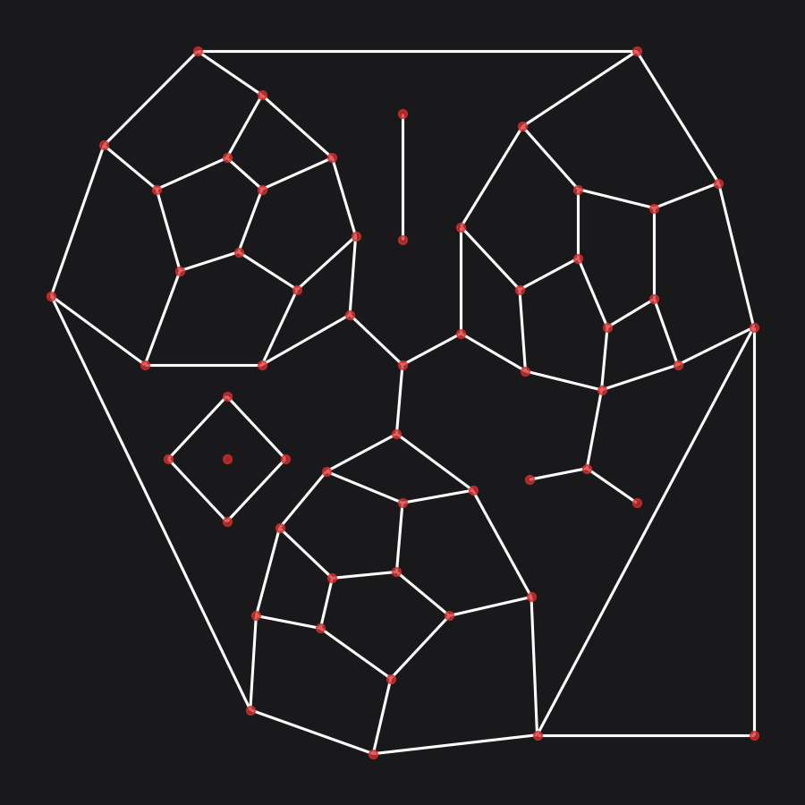
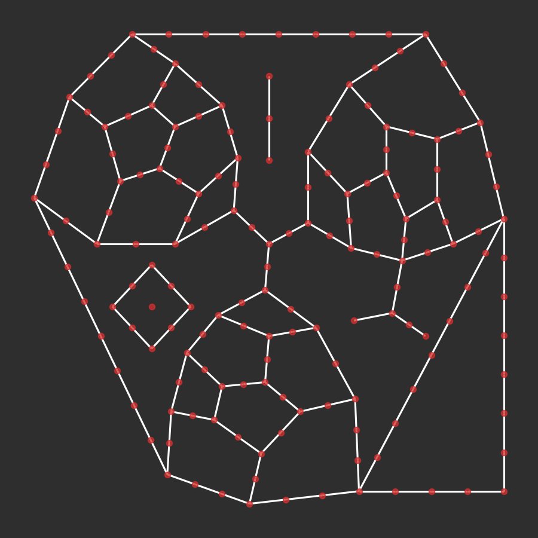
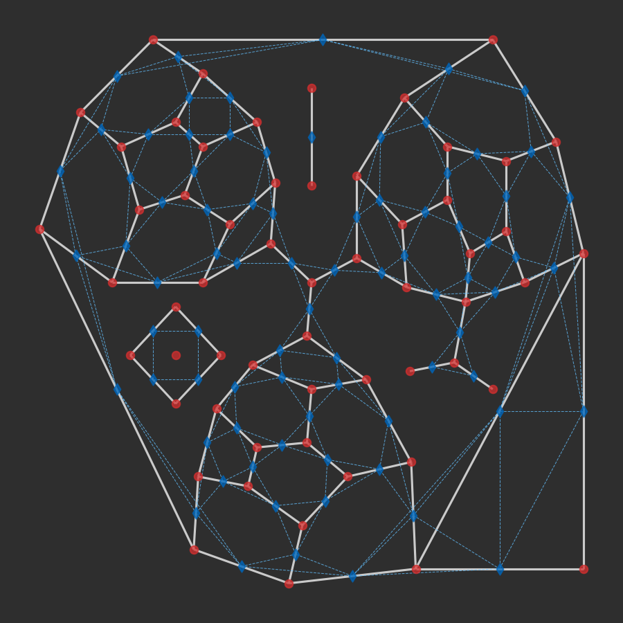

# cityseer.tools.graphs

A collection of convenience functions for the preparation and conversion of [`NetworkX`](https://networkx.github.io/) graphs to and from `cityseer` data structures. Note that the `cityseer` network data structures can be created and manipulated directly, if so desired.

## nX\_simple\_geoms

<FuncSignature>
<pre>
nX_simple_geoms(networkX_multigraph)
                -> nx.MultiGraph
</pre>
</FuncSignature>

Generates straight-line geometries for each edge based on the the `x` and `y` coordinates of the adjacent nodes. The edge geometry will be stored to the edge `geom` attribute.

<FuncHeading>Parameters</FuncHeading>

<FuncElement name='networkX_multigraph' type='nx.MultiGraph'>

A `networkX` `MultiGraph` with `x` and `y` node attributes.

</FuncElement>

<FuncHeading>Returns</FuncHeading>

<FuncElement name='nx.MultiGraph'>

A `networkX` `MultiGraph` with `shapely` [`Linestring`](https://shapely.readthedocs.io/en/latest/manual.html#linestrings) geometries assigned to the edge `geom` attributes.

</FuncElement>

## nX\_from\_osm

<FuncSignature>
<pre>
nX_from_osm(osm_json)
            -> nx.MultiGraph
</pre>
</FuncSignature>

Generates a `NetworkX` `MultiGraph` from [Open Street Map](https://www.openstreetmap.org) data.

<FuncHeading>Parameters</FuncHeading>

<FuncElement name='osm_json' type='str'>

A `json` string response from the [OSM overpass API](https://wiki.openstreetmap.org/wiki/Overpass_API), consisting of `nodes` and `ways`.

</FuncElement>

<FuncHeading>Returns</FuncHeading>

<FuncElement name='nx.MultiGraph'>

A `NetworkX` `MultiGraph` with `x` and `y` attributes in [WGS84](https://epsg.io/4326) `lng`, `lat` geographic coordinates.

</FuncElement>

## nX\_wgs\_to\_utm

<FuncSignature>
<pre>
nX_wgs_to_utm(networkX_multigraph,
              force_zone_number=None)
              -> nx.MultiGraph
</pre>
</FuncSignature>

Converts `x` and `y` node attributes from [WGS84](https://epsg.io/4326) `lng`, `lat` geographic coordinates to the local UTM projected coordinate system. If edge `geom` attributes are found, the associated `LineString` geometries will also be converted. The UTM zone derived from the first processed node will be used for the conversion of all other nodes and geometries contained in the graph. This ensures consistent behaviour in cases where a graph spans a UTM boundary.

<FuncHeading>Parameters</FuncHeading>

<FuncElement name='networkX_multigraph' type='nx.MultiGraph'>

A `networkX` `MultiGraph` with `x` and `y` node attributes in the WGS84 coordinate system. Optional `geom` edge attributes containing `LineString` geoms to be converted.

</FuncElement>

<FuncElement name='force_zone_number' type='int'>

An optional UTM zone number for coercing all conversions to an explicit UTM zone. Use with caution: mismatched UTM zones may introduce substantial distortions in the results. Defaults to None.

</FuncElement>

<FuncHeading>Returns</FuncHeading>

<FuncElement name='nx.MultiGraph'>

A `networkX` `MultiGraph` with `x` and `y` node attributes converted to the local UTM coordinate system. If edge `geom` attributes are present, these will also be converted.

</FuncElement>

## nX\_remove\_dangling\_nodes

<FuncSignature>
<pre>
nX_remove_dangling_nodes(networkX_multigraph,
                         despine=None,
                         remove_disconnected=True)
                         -> nx.MultiGraph
</pre>
</FuncSignature>

Optionally removes short dead-ends or disconnected graph components, which may be prevalent on poor quality network datasets.

<FuncHeading>Parameters</FuncHeading>

<FuncElement name='networkX_multigraph' type='nx.MultiGraph'>

A `networkX` `MultiGraph` in a projected coordinate system, containing `x` and `y` node attributes, and `geom` edge attributes containing `LineString` geoms.

</FuncElement>

<FuncElement name='despine' type='float'>

The maximum cutoff distance for removal of dead-ends. Use `0` where no despining should occur. Defaults to None.

</FuncElement>

<FuncElement name='remove_disconnected' type='bool'>

Whether to remove disconnected components. If set to `True`, only the largest connected component will be returned. Defaults to True.

</FuncElement>

<FuncHeading>Returns</FuncHeading>

<FuncElement name='nx.MultiGraph'>

A `networkX` `MultiGraph` with disconnected components optionally removed, and dead-ends removed where less than the `despine` parameter distance.

</FuncElement>

## nX\_remove\_filler\_nodes

<FuncSignature>
<pre>
nX_remove_filler_nodes(networkX_multigraph)
                       -> nx.MultiGraph
</pre>
</FuncSignature>

Removes nodes of degree=2: such nodes represent no route-choices other than traversal to the next edge. The edges on either side of the deleted nodes will be removed and replaced with a new spliced edge.

:::tip Comment

Filler nodes may be prevalent in poor quality datasets, or in situations where curved roadways have been represented through the addition of nodes to describe arced geometries. `cityseer` uses `shapely` [`Linestrings`](https://shapely.readthedocs.io/en/latest/manual.html#linestrings) to describe arbitrary road geometries without the need for filler nodes. Filler nodes can therefore be removed, thus reducing side-effects when computing network centralities, which arise as a function of varied node intensities.
:::

<FuncHeading>Parameters</FuncHeading>

<FuncElement name='networkX_multigraph' type='nx.MultiGraph'>

A `networkX` `MultiGraph` in a projected coordinate system, containing `x` and `y` node attributes, and `geom` edge attributes containing `LineString` geoms.

</FuncElement>

<FuncHeading>Returns</FuncHeading>

<FuncElement name='nx.MultiGraph'>

A `networkX` `MultiGraph` with nodes of degree=2 removed. Adjacent edges will be combined into a unified new edge with associated `geom` attributes spliced together.

</FuncElement>

## nX\_consolidate\_nodes

<FuncSignature>
<pre>
nX_consolidate_nodes(networkX_multigraph,
                     buffer_dist=5,
                     min_node_group=2,
                     min_node_degree=1,
                     min_cumulative_degree=None,
                     max_cumulative_degree=None,
                     neighbour_policy=None,
                     crawl=True,
                     cent_min_degree=3,
                     cent_min_len_factor=None,
                     merge_edges_by_midline=True,
                     multi_edge_len_factor=1.5,
                     multi_edge_min_len=100)
                     -> nx.MultiGraph
</pre>
</FuncSignature>

Consolidates nodes if they are within a buffer distance of each other. Several parameters provide more control over the conditions used for deciding whether or not to merge nodes. The algorithm proceeds in two steps:

- Nodes within the buffer distance of each other are merged. A new centroid will be determined and all existing edge endpoints will be updated accordingly. The new centroid for the merged nodes can be based on:
  - The centroid of the node group;
  - Else, all nodes of degree greater or equal to `cent_min_degree`;
  - Else, all nodes with aggregate adjacent edge lengths greater than a factor of `cent_min_len_factor` of the node with the greatest aggregate length for adjacent edges.
- The merging of nodes creates parallel edges which may start and end at a shared node on either side. These edges are replaced by a single new edge, with the new geometry selected from either:
  - An imaginary centreline of the combined edges if `merge_edges_by_midline` is set to `True`;
  - Else, the shortest edge, with longer edges discarded;
  - Note that substantially longer parallel edges are retained, instead of discarded, if they exceed `multi_edge_len_factor` and are longer than `multi_edge_min_len`.

<FuncHeading>Parameters</FuncHeading>

<FuncElement name='networkX_multigraph' type='nx.MultiGraph'>

A `networkX` `MultiGraph` in a projected coordinate system, containing `x` and `y` node attributes, and `geom` edge attributes containing `LineString` geoms.

</FuncElement>

<FuncElement name='buffer_dist' type='float'>

The buffer distance to be used for consolidating nearby nodes. Defaults to 5.

</FuncElement>

<FuncElement name='min_node_group' type='int'>

The minimum number of nodes to consider a valid group for consolidation. Defaults to 2.

</FuncElement>

<FuncElement name='min_node_degree' type='int'>

The least number of edges a node should have in order to be considered for consolidation. Defaults to 1.

</FuncElement>

<FuncElement name='min_cumulative_degree' type='int'>

An optional minimum cumulative degree to consider a valid node group for consolidation. Defaults to None.

</FuncElement>

<FuncElement name='max_cumulative_degree' type='int'>

An optional maximum cumulative degree to consider a valid node group for consolidation. Defaults to None.

</FuncElement>

<FuncElement name='neighbour_policy' type='str'>

Whether all nodes within the buffer distance are merged, or only "direct" or "indirect" neighbours. Defaults to None.

</FuncElement>

<FuncElement name='crawl' type='bool'>

Whether the algorithm will recursively explore neighbours of neighbours if those neighbours are within the buffer distance from the prior node. Defaults to True.

</FuncElement>

<FuncElement name='cent_min_degree' type='int'>

The minimum node degree for a node to be considered when calculating the new centroid for the merged node cluster. Defaults to 3.

</FuncElement>

<FuncElement name='cent_min_len_factor' type='float'>

The minimum aggregate adjacent edge lengths an existing node should have to be considered when calculating the centroid for the new node cluster. Expressed as a factor of the node with the greatest aggregate adjacent edge lengths. Defaults to None.

</FuncElement>

<FuncElement name='merge_edges_by_midline' type='bool'>

Whether to merge parallel edges by an imaginary centreline. If set to False, then the shortest edge will be retained as the new geometry and the longer edges will be discarded. Defaults to True.

</FuncElement>

<FuncElement name='multi_edge_len_factor' type='float'>

In cases where one line is significantly longer than another (e.g. crescent streets) then the longer edge is retained as separate if exceeding the multi_edge_len_factor as a factor of the shortest length but with the exception that (longer) edges still shorter than multi_edge_min_len are removed regardless. Defaults to 1.5.

</FuncElement>

<FuncElement name='multi_edge_min_len' type='float'>

See `multi_edge_len_factor`. Defaults to 100.

</FuncElement>

<FuncHeading>Returns</FuncHeading>

<FuncElement name='nx.MultiGraph'>

A `networkX` `MultiGraph` with consolidated nodes.

</FuncElement>

<FuncHeading>Notes</FuncHeading>

See the guide on [graph cleaning](/guide/cleaning) for more information.


_The pre-consolidation OSM street network for Soho, London. © OpenStreetMap contributors._


_The consolidated OSM street network for Soho, London. © OpenStreetMap contributors._

## nX\_split\_opposing\_geoms

<FuncSignature>
<pre>
nX_split_opposing_geoms(networkX_multigraph,
                        buffer_dist=10,
                        merge_edges_by_midline=False,
                        multi_edge_len_factor=1.5,
                        multi_edge_min_len=100)
                        -> nx.MultiGraph
</pre>
</FuncSignature>

Projects nodes to pierce opposing edges within a buffer distance. The pierced nodes facilitate subsequent merging for scenarios such as divided boulevards.

<FuncHeading>Parameters</FuncHeading>

<FuncElement name='networkX_multigraph' type='nx.MultiGraph'>

A `networkX` `MultiGraph` in a projected coordinate system, containing `x` and `y` node attributes, and `geom` edge attributes containing `LineString` geoms.

</FuncElement>

<FuncElement name='buffer_dist' type='float'>

The buffer distance to be used for splitting nearby nodes. Defaults to 5.

</FuncElement>

<FuncElement name='merge_edges_by_midline' type='bool'>

Whether to merge parallel edges by an imaginary centreline. If set to False, then the shortest edge will be retained as the new geometry and the longer edges will be discarded. Defaults to True.

</FuncElement>

<FuncElement name='multi_edge_len_factor' type='float'>

In cases where one line is significantly longer than another (e.g. crescent streets) then the longer edge is retained as separate if exceeding the `multi_edge_len_factor` as a factor of the shortest length but with the exception that (longer) edges still shorter than `multi_edge_min_len` are removed regardless. Defaults to 1.5.

</FuncElement>

<FuncElement name='multi_edge_min_len' type='float'>

See `multi_edge_len_factor`. Defaults to 100.

</FuncElement>

<FuncHeading>Returns</FuncHeading>

<FuncElement name='nx.MultiGraph'>

A `networkX` `MultiGraph` with consolidated nodes.

</FuncElement>

## nX\_decompose

<FuncSignature>
<pre>
nX_decompose(networkX_multigraph,
             decompose_max)
             -> nx.MultiGraph
</pre>
</FuncSignature>

Decomposes a graph so that no edge is longer than a set maximum. Decomposition provides a more granular representation of potential variations along street lengths, while reducing network centrality side-effects that arise as a consequence of varied node densities.

:::warning Comment

Setting the `decompose` parameter too small in relation to the size of the graph may increase the computation time unnecessarily for subsequent analysis. For larger-scale urban analysis, it is generally not necessary to go smaller 20m, and 50m may already be sufficient for the majority of cases.
:::

:::tip Comment

This function will automatically orient the `geom` attribute LineStrings in the correct direction before splitting into sub-geometries; i.e. there is no need to order the geometry's coordinates in a particular direction.
:::

<FuncHeading>Parameters</FuncHeading>

<FuncElement name='networkX_multigraph' type='nx.MultiGraph'>

A `networkX` `MultiGraph` in a projected coordinate system, containing `x` and `y` node attributes, and `geom` edge attributes containing `LineString` geoms.

</FuncElement>

<FuncElement name='decompose_max' type='float'>

The maximum length threshold for decomposed edges.

</FuncElement>

<FuncHeading>Returns</FuncHeading>

<FuncElement name='nx.MultiGraph'>

A decomposed `networkX` graph with no edge longer than the `decompose_max` parameter. If `live` node attributes were provided, then the `live` attribute for child-nodes will be set to `True` if either or both parent nodes were `live`. Otherwise, all nodes wil be set to `live=True`. The `length` and `impedance` edge attributes will be set to match the lengths of the new edges.

</FuncElement>

<FuncHeading>Notes</FuncHeading>

```python
from cityseer.tools import mock, graphs, plot

G = mock.mock_graph()
G_simple = graphs.nX_simple_geoms(G)
G_decomposed = graphs.nX_decompose(G_simple, 100)
plot.plot_nX(G_decomposed)
```


_Example graph prior to decomposition._


_Example graph after decomposition._

## nX\_to\_dual

<FuncSignature>
<pre>
nX_to_dual(networkX_multigraph)
           -> nx.MultiGraph
</pre>
</FuncSignature>

Converts a primal graph representation, where intersections are represented as nodes and streets as edges, to the dual representation. So doing, edges are converted to nodes and intersections become edges. Primal edge `geom` attributes will be welded to adjacent edges and split into the new dual edge `geom` attributes.

:::tip Comment

Note that a `MultiGraph` is useful for primal but not for dual, so the output `MultiGraph` will have single edges. e.g. a crescent street that spans the same intersections as parallel straight street requires multiple edges in primal. The same type of situation does not arise in the dual because the nodes map to distinct streets regardless.
:::

<FuncHeading>Parameters</FuncHeading>

<FuncElement name='networkX_multigraph' type='nx.MultiGraph'>

A `networkX` `MultiGraph` in a projected coordinate system, containing `x` and `y` node attributes, and `geom` edge attributes containing `LineString` geoms.

</FuncElement>

<FuncHeading>Returns</FuncHeading>

<FuncElement name='nx.MultiGraph'>

A dual representation `networkX` graph. The new dual nodes will have `x` and `y` node attributes corresponding to the mid-points of the original primal edges. If `live` node attributes were provided, then the `live` attribute for the new dual nodes will be set to `True` if either or both of the adjacent primal nodes were set to `live=True`. Otherwise, all dual nodes wil be set to `live=True`. The primal `geom` edge attributes will be split and welded to form the new dual `geom` edge attributes. A `parent_primal_node` edge attribute will be added, corresponding to the node identifier of the primal graph.

</FuncElement>

<FuncHeading>Notes</FuncHeading>

```python
from cityseer.tools import graphs, mock, plot

G = mock.mock_graph()
G_simple = graphs.nX_simple_geoms(G)
G_dual = graphs.nX_to_dual(G_simple)
plot.plot_nX_primal_or_dual(G_simple,
                            G_dual,
                            plot_geoms=False)
```


_Dual graph (blue) overlaid on the source primal graph (red)._

## graph\_maps\_from\_nX

<FuncSignature>
<pre>
graph_maps_from_nX(networkX_multigraph)
                   -> Tuple[tuple, np.ndarray, np.ndarray, Dict]
</pre>
</FuncSignature>

Transposes a `networkX` `MultiGraph` into `numpy` arrays for use by `NetworkLayer` classes. Calculates length and angle attributes, as well as in and out bearings and stores these in the returned data maps.

:::warning Comment

It is generally not necessary to use this function directly. This function will be called internally when invoking [NetworkLayerFromNX](/metrics/networks/#class-networklayerfromnx)
:::

<FuncHeading>Parameters</FuncHeading>

<FuncElement name='networkX_multigraph' type='nx.MultiGraph'>

A `networkX` `MultiGraph` in a projected coordinate system, containing `x` and `y` node attributes, and `geom` edge attributes containing `LineString` geoms.

</FuncElement>

<FuncHeading>Returns</FuncHeading>

<FuncElement name='node_uids'>

A tuple of node `uids` corresponding to the node identifiers in the source `networkX` graph.

</FuncElement>

<FuncElement name='node_data'>

A 2d `numpy` array representing the graph's nodes. The indices of the second dimension correspond as follows:

| idx | property |
|-----|:---------|
| 0 | `x` coordinate |
| 1 | `y` coordinate |
| 2 | `bool` describing whether the node is `live`. Metrics are only computed for `live` nodes. |

</FuncElement>

<FuncElement name='edge_data'>

A 2d `numpy` array representing the graph's edges. Each edge will be described separately for each direction of travel. The indices of the second dimension correspond as follows:

| idx | property |
|-----|:---------|
| 0 | start node `idx` |
| 1 | end node `idx` |
| 2 | the segment length in metres |
| 3 | the sum of segment's angular change |
| 4 | an 'impedance factor' which can be applied to magnify or reduce the effect of the edge's impedance on shortest-path calculations. e.g. for gradients or other such considerations. Use with caution. |
| 5 | the edge's entry angular bearing |
| 6 | the edge's exit angular bearing |

All edge attributes will be generated automatically, however, the impedance factor parameter can be over-ridden by supplying a `imp_factor` attribute on the input graph's edges.

</FuncElement>

<FuncElement name='node_edge_map'>

A `numba` `Dict` with `node_data` indices as keys and `numba` `List` types as values containing the out-edge indices for each node.

</FuncElement>

## nX\_from\_graph\_maps

<FuncSignature>
<pre>
nX_from_graph_maps(node_uids,
                   node_data,
                   edge_data,
                   node_edge_map,
                   networkX_multigraph=None,
                   metrics_dict=None)
                   -> nx.MultiGraph
</pre>
</FuncSignature>

Writes cityseer data graph maps back to a `MultiGraph`. Can write back to an existing `MultiGraph` if an existing graph is provided as an argument to the `networkX_multigraph` parameter.

:::warning Comment

It is generally not necessary to use this function directly. This function will be called internally when invoking [NetworkLayer.to_networkX](/metrics/networks/#networklayerto_networkx)
:::

<FuncHeading>Parameters</FuncHeading>

<FuncElement name='node_uids' type='Union[tuple, list]'>

A tuple of node ids corresponding to the node identifiers for the target `networkX` graph.

</FuncElement>

<FuncElement name='node_data' type='np.ndarray'>

A 2d `numpy` array representing the graph's nodes. The indices of the second dimension should correspond as follows:

| idx | property |
| --- | :------- |
| 0   | `x` coordinate |
| 1   | `y` coordinate |
| 2   | `bool` describing whether the node is `live` |

</FuncElement>

<FuncElement name='edge_data' type='np.ndarray'>

A 2d `numpy` array representing the graph's directional edges. The indices of the second dimension should  correspond as follows:

| idx | property |
| --- | :------- |
| 0   | start node `idx` |
| 1   | end node `idx` |
| 2   | the segment length in metres |
| 3   | the sum of segment's angular change |
| 4   | 'impedance factor' applied to magnify or reduce the edge impedance. |
| 5   | the edge's entry angular bearing |
| 6   | the edge's exit angular bearing |

</FuncElement>

<FuncElement name='node_edge_map' type='Dict'>

A `numba` `Dict` with `node_data` indices as keys and `numba` `List` types as values containing the out-edge indices for each node.

</FuncElement>

<FuncElement name='networkX_multigraph' type='nx.MultiGraph'>

An optional `networkX` graph to use as a backbone for unpacking the data. The number of nodes and edges should correspond to the `cityseer` data maps and the node identifiers should correspond to the `node_uids`. If not provided, then a new `networkX` graph will be returned. This function is intended to be used for situations where `cityseer` data is being transposed back to a source `networkX` graph. Defaults to None.

</FuncElement>

<FuncElement name='metrics_dict' type='dict'>

An optional dictionary with keys corresponding to the identifiers in `node_uids`. The dictionary's `values` will be unpacked to the corresponding nodes in the `networkX` graph. Defaults to None.

</FuncElement>

<FuncHeading>Returns</FuncHeading>

<FuncElement name='nx.MultiGraph'>

A `networkX` graph. If a backbone graph was provided, a copy of the same graph will be returned with the data overridden as described below. If no graph was provided, then a new graph will be generated. `x`, `y`, `live`, `ghosted` node attributes will be copied from `node_data` to the graph nodes. `length`, `angle_sum`, `imp_factor`, `start_bearing`, and `end_bearing` attributes will be copied from the `edge_data` to the graph edges. If a `metrics_dict` is provided, all data will be copied to the graph nodes based on matching node identifiers.

</FuncElement>
