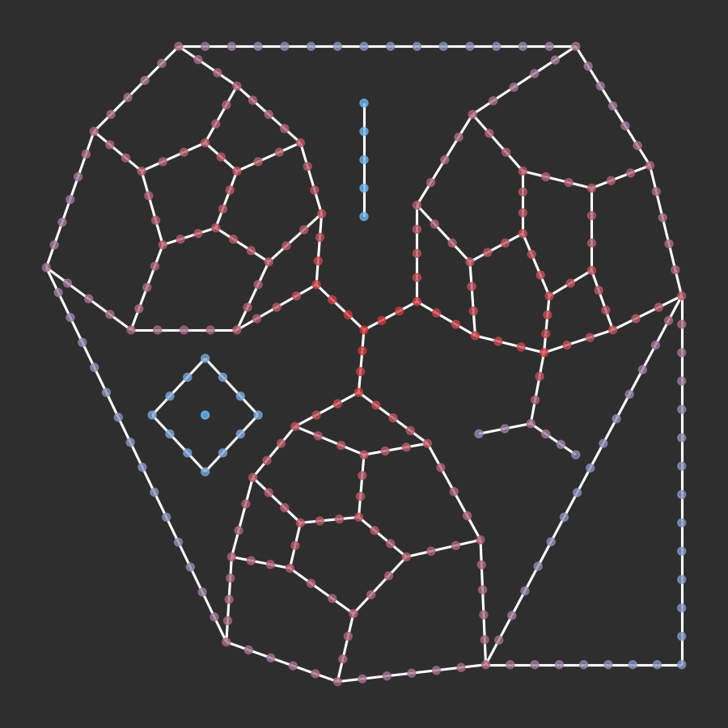
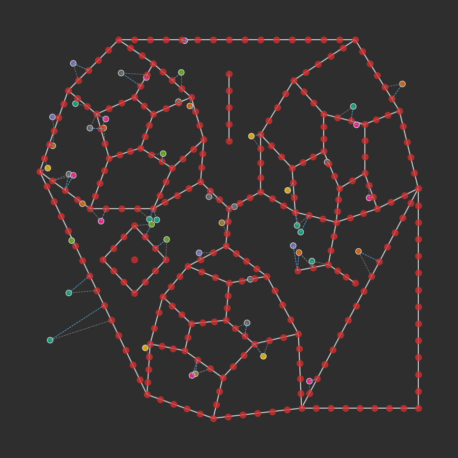

# cityseer.tools.plot

Convenience methods for plotting graphs within the cityseer API context. This module is predominately used for basic plots or visual verification of behaviour in code tests. Custom behaviour can be achieved by directly manipulating the underlying [`NetworkX`](https://networkx.github.io) and [`matplotlib`](https://matplotlib.org) figures.

## plot\_nX\_primal\_or\_dual

<FuncSignature>
<pre>
plot_nX_primal_or_dual(primal_graph=None,
                       dual_graph=None,
                       path=None,
                       labels=False,
                       primal_node_size=30,
                       primal_node_colour=None,
                       primal_edge_colour=None,
                       dual_node_size=30,
                       dual_node_colour=None,
                       dual_edge_colour=None,
                       primal_edge_width=None,
                       dual_edge_width=None,
                       plot_geoms=True,
                       x_lim=None,
                       y_lim=None,
                       ax=None,
                       figure_kwargs)
</pre>
</FuncSignature>

<FuncHeading>Parameters</FuncHeading>

<FuncElement name='primal_graph' type='nx.MultiGraph'>

An optional `NetworkX` MultiGraph to plot in the primal representation. Defaults to None.

</FuncElement>

<FuncElement name='dual_graph' type='nx.MultiGraph'>

An optional `NetworkX` MultiGraph to plot in the dual representation. Defaults to None.

</FuncElement>

<FuncElement name='path' type='str'>

An optional filepath: if provided, the image will be saved to the path instead of being displayed. Defaults to None.

</FuncElement>

<FuncElement name='labels' type='bool'>

Whether to display node labels. Defaults to False.

</FuncElement>

<FuncElement name='primal_node_size' type='int'>

The diameter for the primal graph's nodes.

</FuncElement>

<FuncElement name='primal_node_colour' type='str | tuple | list | np.ndarray'>

Primal node colour or colours. When passing an iterable of colours, the number of colours should match the order and number of nodes in the MultiGraph. The colours are passed to the underlying [`draw_networkx`](https://networkx.github.io/documentation/networkx-1.10/reference/generated/networkx.drawing.nx_pylab.draw_networkx.html#draw-networkx) method and should be formatted accordingly. Defaults to None.

</FuncElement>

<FuncElement name='primal_edge_colour' type='str'>

Primal edge colour as a `matplotlib` compatible colour string. Defaults to None.

</FuncElement>

<FuncElement name='dual_node_size' type='int'>

The diameter for the dual graph's nodes.

</FuncElement>

<FuncElement name='dual_node_colour' type='str | tuple | list | np.ndarray'>

Dual node colour or colours. When passing a list of colours, the number of colours should match the order and number of nodes in the MultiGraph. The colours are passed to the underlying [`draw_networkx`](https://networkx.github.io/documentation/networkx-1.10/reference/generated/networkx.drawing.nx_pylab.draw_networkx.html#draw-networkx) method and should be formatted accordingly. Defaults to None.

</FuncElement>

<FuncElement name='dual_edge_colour' type='str'>

Dual edge colour as a `matplotlib` compatible colour string. Defaults to None.

</FuncElement>

<FuncElement name='primal_edge_width' type='int | float'>

Linewidths for the primal edge. Defaults to None.

</FuncElement>

<FuncElement name='dual_edge_width' type='int | float'>

Linewidths for the dual edge. Defaults to None.

</FuncElement>

<FuncElement name='plot_geoms' type='bool'>

Whether to plot the edge geometries. If set to `False`, straight lines will be drawn from node-to-node to represent edges. Defaults to True.

</FuncElement>

<FuncElement name='x_lim' type='tuple | list'>

A tuple or list with the minimum and maxium `x` extents to be plotted. Defaults to None.

</FuncElement>

<FuncElement name='y_lim' type='tuple | list'>

A tuple or list with the minimum and maxium `y` extents to be plotted. Defaults to None.

</FuncElement>

<FuncElement name='ax' type='plt.axes'>

An optional `matplotlib` `ax` to which to plot. If not provided, a figure and ax will be generated.

</FuncElement>

<FuncElement name='figure_kwargs' type='None'>

`kwargs` which will be passed to the `matplotlib` figure parameters. If provided, these will override the default figure size or dpi parameters.

</FuncElement>

<FuncHeading>Notes</FuncHeading>

Plot either or both primal and dual representations of a `networkX MultiGraph`. Only call this function directly if explicitly printing both primal and dual graphs. Otherwise, use the simplified [`plot_nX`](/tools/plot/#plot_nx) method instead.

```py
from cityseer.tools import mock, graphs, plot
G = mock.mock_graph()
G_simple = graphs.nX_simple_geoms(G)
G_dual = graphs.nX_to_dual(G_simple)
plot.plot_nX_primal_or_dual(G_simple,
                            G_dual,
                            plot_geoms=False)
```


_A dual graph in blue overlaid on the source primal graph in red._

## plot\_nX

<FuncSignature>
<pre>
plot_nX(networkX_graph,
        path=None,
        labels=False,
        node_size=20,
        node_colour=None,
        edge_colour=None,
        edge_width=None,
        plot_geoms=False,
        x_lim=None,
        y_lim=None,
        ax=None,
        figure_kwargs)
</pre>
</FuncSignature>

Plot a `networkX` MultiGraph.

<FuncHeading>Parameters</FuncHeading>

<FuncElement name='networkX_graph' type='nx.MultiGraph'>

A `NetworkX` MultiGraph.

</FuncElement>

<FuncElement name='path' type='str'>

An optional filepath: if provided, the image will be saved to the path instead of being displayed. Defaults to None.

</FuncElement>

<FuncElement name='labels' type='bool'>

Whether to display node labels. Defaults to False.

</FuncElement>

<FuncElement name='node_size' type='int'>

The diameter for the graph's nodes.

</FuncElement>

<FuncElement name='node_colour' type='str | tuple | list'>

Node colour or colours. When passing an iterable of colours, the number of colours should match the order and number of nodes in the MultiGraph. The colours are passed to the underlying [`draw_networkx`](https://networkx.github.io/documentation/networkx-1.10/reference/generated/networkx.drawing.nx_pylab.draw_networkx.html#draw-networkx) method and should be formatted accordingly. Defaults to None.

</FuncElement>

<FuncElement name='edge_colour' type='str | tuple | list'>

Edges colour as a `matplotlib` compatible colour string. Defaults to None.

</FuncElement>

<FuncElement name='edge_width' type='int | float'>

Linewidths for edges. Defaults to None.

</FuncElement>

<FuncElement name='plot_geoms' type='bool'>

Whether to plot the edge geometries. If set to `False`, straight lines will be drawn from node-to-node to represent edges. Defaults to True.

</FuncElement>

<FuncElement name='x_lim' type='tuple | list'>

A tuple or list with the minimum and maxium `x` extents to be plotted. Defaults to None.

</FuncElement>

<FuncElement name='y_lim' type='tuple | list'>

A tuple or list with the minimum and maxium `y` extents to be plotted. Defaults to None.

</FuncElement>

<FuncElement name='ax' type='plt.axes'>

An optional `matplotlib` `ax` to which to plot. If not provided, a figure and ax will be generated.

</FuncElement>

<FuncElement name='figure_kwargs' type='None'>

`kwargs` which will be passed to the `matplotlib` figure parameters. If provided, these will override the default figure size or dpi parameters.

</FuncElement>

<FuncHeading>Notes</FuncHeading>

```py
from cityseer.tools import mock, graphs, plot
from cityseer.metrics import networks
from matplotlib import colors
# generate a MultiGraph and compute gravity
G = mock.mock_graph()
G = graphs.nX_simple_geoms(G)
G = graphs.nX_decompose(G, 50)
N = networks.NetworkLayerFromNX(G, distances=[800])
N.node_centrality(measures=['node_beta'])
G_after = N.to_networkX()
# let's extract and normalise the values
vals = []
for node, data in G_after.nodes(data=True):
    vals.append(data['metrics']['centrality']['node_beta'][800])
# let's create a custom colourmap using matplotlib
cmap = colors.LinearSegmentedColormap.from_list('cityseer',
                                                [(100/255, 193/255, 255/255, 255/255),
                                                (211/255, 47/255, 47/255, 1/255)])
# normalise the values
vals = colors.Normalize()(vals)
# cast against the colour map
cols = cmap(vals)
# plot
plot.plot_nX(G_after, node_colour=cols)
```


_Colour plot of 800m gravity index centrality on a 50m decomposed graph._

## plot\_assignment

<FuncSignature>
<pre>
plot_assignment(Network_Layer,
                Data_Layer,
                path=None,
                node_colour=None,
                node_labels=False,
                data_labels=None,
                figure_kwargs)
</pre>
</FuncSignature>

Plot a `NetworkLayer` and `DataLayer` for the purpose of visualising assignment of data points to respective nodes.

<FuncHeading>Parameters</FuncHeading>

<FuncElement name='Network_Layer' type='None'>

A [`NetworkLayer`](/metrics/networks/#class-networklayer).

</FuncElement>

<FuncElement name='Data_Layer' type='None'>

A [`DataLayer`](/metrics/layers/#class-datalayer).

</FuncElement>

<FuncElement name='path' type='str'>

An optional filepath: if provided, the image will be saved to the path instead of being displayed. Defaults to None.

</FuncElement>

<FuncElement name='node_colour' type='list | tuple | np.ndarray'>

Node colour or colours. When passing a list of colours, the number of colours should match the order and number of nodes in the MultiGraph. The colours are passed to the underlying [`draw_networkx`](https://networkx.github.io/documentation/networkx-1.10/reference/generated/networkx.drawing.nx_pylab.draw_networkx.html#draw-networkx) method and should be formatted accordingly. Defaults to None.

</FuncElement>

<FuncElement name='node_labels' type='bool'>

Whether to plot the node labels. Defaults to False.

</FuncElement>

<FuncElement name='data_labels' type='list | tuple | np.ndarray'>

An optional iterable of categorical data labels which will be mapped to colours. The number of labels should match the number of data points in `DataLayer`. Defaults to None.

</FuncElement>

<FuncElement name='figure_kwargs' type='None'>

`kwargs` which will be passed to the `matplotlib` figure parameters. If provided, these will override the default figure size or dpi parameters.

</FuncElement>

<FuncHeading>Notes</FuncHeading>


_An assignment plot to a 50m decomposed graph, with the data points coloured by categorical labels._

## plot\_graph\_maps

<FuncSignature>
<pre>
plot_graph_maps(node_data,
                edge_data,
                data_map=None,
                poly=None)
</pre>
</FuncSignature>

Plot a graph from raw `cityseer` data structures. Note that this function is subject to frequent revision pending short-term development requirements. It is used mainly to visually confirm the correct behaviour of particular algorithms during the software development cycle.

<FuncHeading>Parameters</FuncHeading>

<FuncElement name='node_data' type='np.ndarray'>

`cityseer` node map.

</FuncElement>

<FuncElement name='edge_data' type='np.ndarray'>

`cityseer` edge map.

</FuncElement>

<FuncElement name='data_map' type='np.ndarray'>

An optional data map. Defaults to None.

</FuncElement>

<FuncElement name='poly' type='geometry.Polygon'>

An optional polygon. Defaults to None.

</FuncElement>
