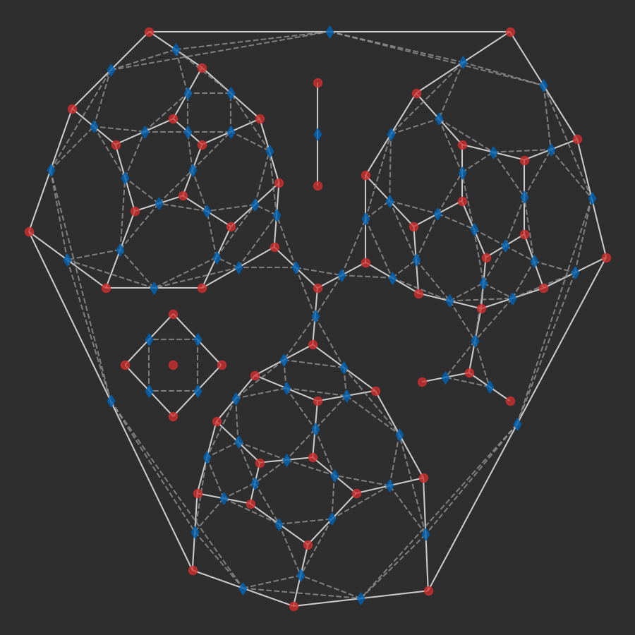
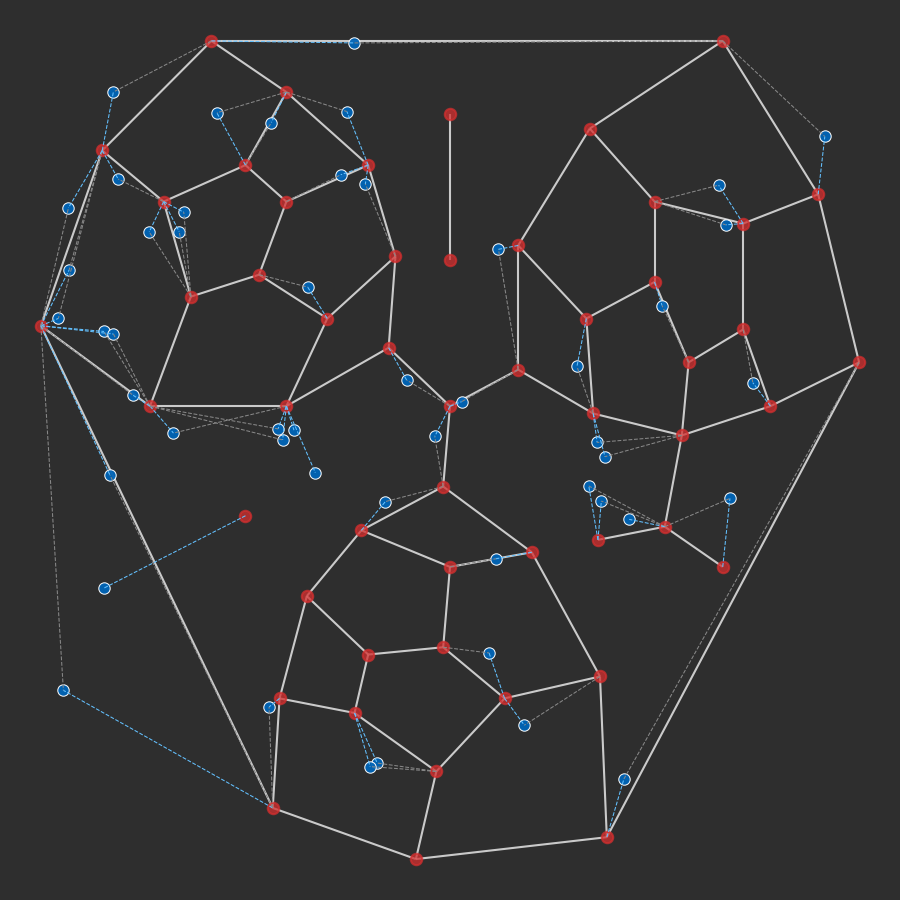
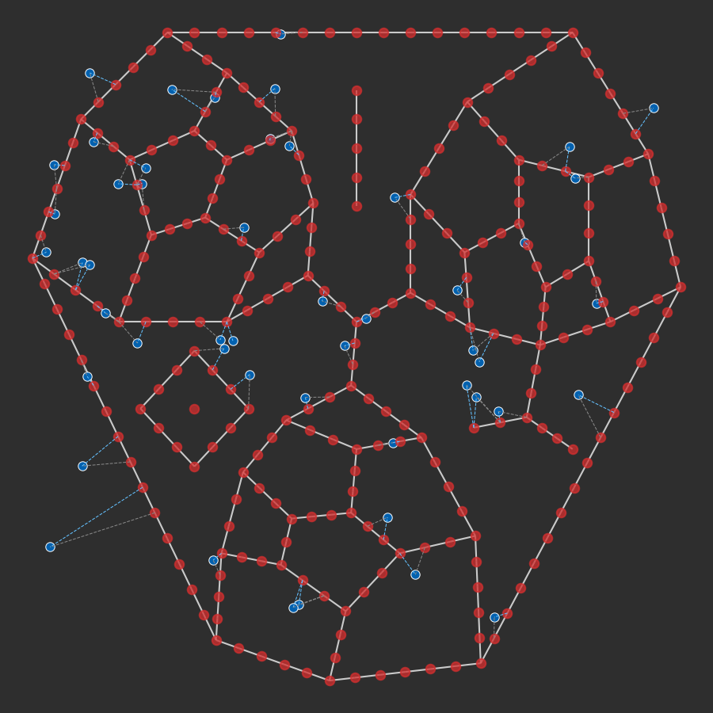
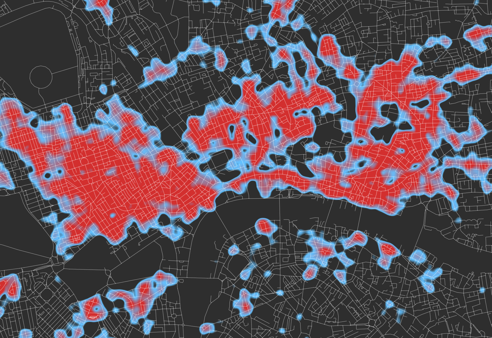
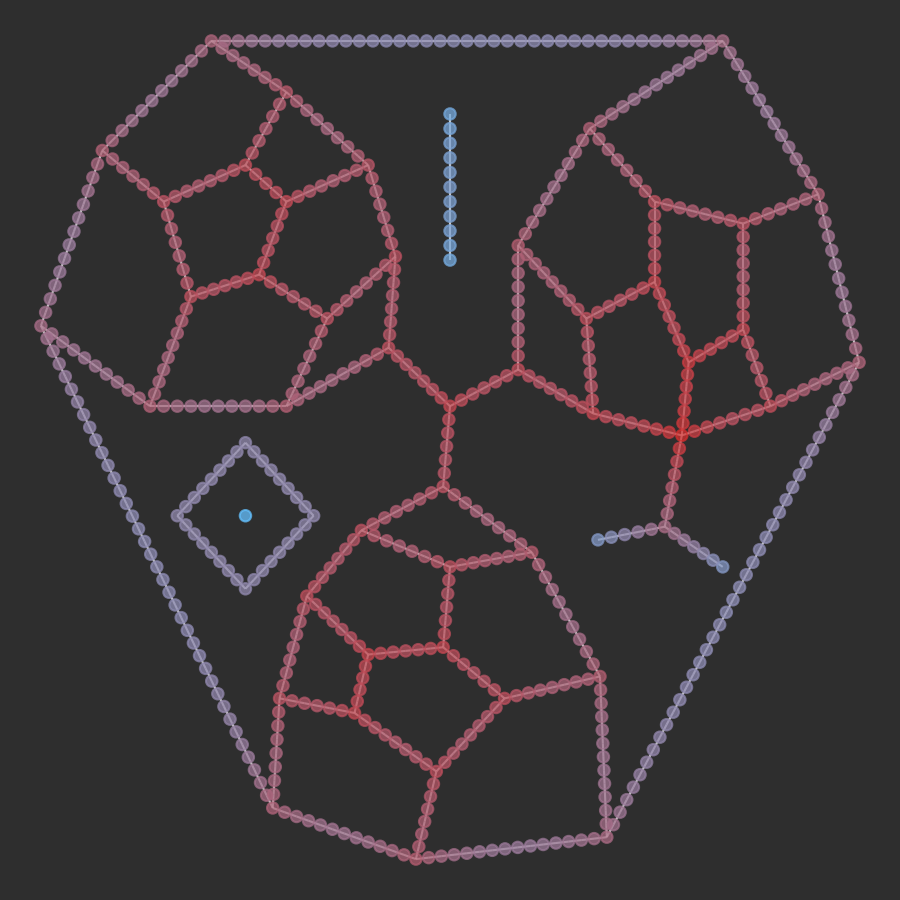
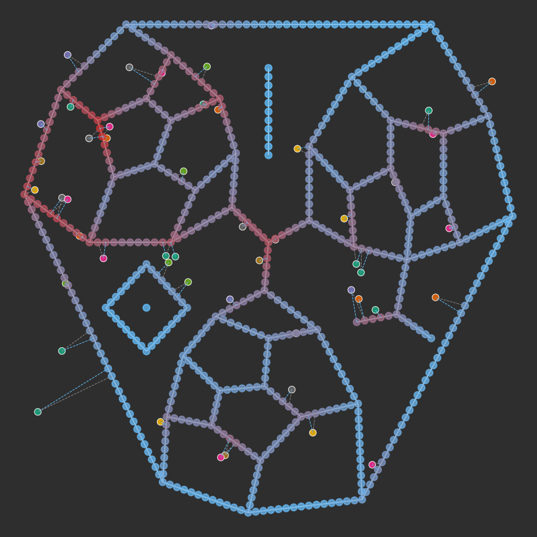

---

---

Cityseer <Chip text="beta"/>
--------

`cityseer` is a collection of computational tools for fine-grained network and land-use analysis, useful for assessing the morphological precursors to vibrant neighbourhoods. It is underpinned by rigorous network-based methods that have been developed from the ground-up specifically for hyperlocal analysis at the pedestrian scale.

The use of `python` facilitates interaction with popular tools for network, geospatial, and scientific data analysis, i.e. [`networkX`](https://networkx.github.io/), [`shapely`](https://shapely.readthedocs.io), and the [`numpy`](http://www.numpy.org/) stack. The underlying algorithms are designed for efficient large-scale urban analysis and have been implemented in [`numba`](https://numba.pydata.org/) JIT compiled code.


Installation
------------

`cityseer` is a `python` package that can be installed with `pip`:
```bash
pip install cityseer
```

Code tests are run against `python 3.7`.

[](https://travis-ci.com/cityseer/cityseer)

Quickstart
----------

`cityseer` revolves around networks (graphs). If you're comfortable with `numpy` and abstract data handling, then the underlying data structures can be created and manipulated directly. However, it is generally more convenient to sketch the graph using [`NetworkX`](https://networkx.github.io/) and to let `cityseer` take care of initialising and converting the graph for you.

```python
# any NetworkX graph with 'x' and 'y' node attributes will do
# here we'll use the cityseer mock module to generate an example networkX graph
from cityseer.util import mock
G = mock.mock_graph()

'''
import networkx as nx
print(nx.info(G))
# Name: 
# Type: Graph
# Number of nodes: 56
# Number of edges: 77
# Average degree:   2.7500
'''
# let's plot the network
from cityseer.util import plot
plot.plot_nX(G, labels=True)

# NOTE: this code block combines with the following blocks for a continuous example
```


The [`util.graphs`](/util/graphs.html) module contains a collection of convenience functions for the preparation and conversion of `networkX` graphs, including
[`nX_wgs_to_utm`](/util/graphs.html#nx-wgs-to-utm) for coordinate conversions; [`nX_remove_filler_nodes`](/util/graphs.html#nx-remove-filler-nodes) for graph cleanup; [`nX_decompose`](/util/graphs.html#nx-decompose) for generating granular graph typologies; and [`nX_to_dual`](/util/graphs.html#nx-to-dual) for casting a primal graph representation to its dual. These functions are designed to work with raw `shapely` [`Linestring`](https://shapely.readthedocs.io/en/latest/manual.html#linestrings) geometries that have been assigned to the edge (link) `geom` attributes. If working with simple graph representations — straight-line edges between nodes — then [`graphs.nX_simple_geoms`](/util/graphs.html#nx-simple-geoms) can generate these geometries for you. The benefit to the use of raw geoms is that the geometry of the network is kept distinct from the topology, and the geometries can therefore be manipulated separately from topological transformations.



_A $100m$ decomposed variant of the graph (left) and an example primal / dual transformation of the (undecomposed) graph (right)._

Before conversion to a [`Network_Layer`](/metrics/networks.html#network-layer), the `networkX` graph must first be furnished with `length` and `impedance` edge attributes. These can be generated in one of several ways:

- If decomposing the graph, then the [`nX_decompose`](/util/graphs.html#nx-decompose) function will generate the `length` and `impedance` attributes as part of the decompositional process;

- If transposing to a dual graph, then [`nX_to_dual`](/util/graphs.html#nx-to-dual) will likewise generate the attributes; in this case `impedance` will represent total angular change over the length of of an edge segment;

- If neither of the above, then use the [`graphs.nX_auto_edge_params`](/util/graphs.html#nx-auto-edge-params) function;

- The attributes can also be set manually, if that's your thing :muscle:.

```python
from cityseer.util import graphs
# provide your own shapely geometries if you need precise street lengths / angles
# else, auto-generate simple geometries from the start to end node of each network edge
G = graphs.nX_simple_geoms(G)

# auto-set edge length and impedance attributes from the geoms
G = graphs.nX_auto_edge_params(G)

# or decompose (or cast to dual), which will also auto-set the params
G = graphs.nX_decompose(G, 20)
```

Once prepared, the `networkX` graph can be transformed into a [`Network_Layer`](/metrics/networks.html#network-layer) by invoking [`Network_Layer_From_nX`](/metrics/networks.html#network-layer-from-nx). Network layers are used for network centrality computations and also provide the backbone for subsequent landuse and statistical aggregations. They must be initialised with a set of distances $d_{max}$ specifying the maximum network-distance thresholds at which the local centrality methods will terminate.

The [`@compute_centrality`](/metrics/networks.html#compute-centrality) method wraps underlying numba optimised functions that compute a range of centrality methods. These are performed simultaneously for any required combinations of measures (and distances), which can have significant speed implications. Situations requiring only a single measure can instead make use of the simpler [`@gravity`](/metrics/networks.html#gravity), [`@harmonic_closeness`](/metrics/networks.html#harmonic-closeness), [`@improved_closeness`](/metrics/networks.html#improved-closeness), [`@betweenness`](/metrics/networks.html#betweenness), or [`@weighted_betweenness`](/metrics/networks.html#betweenness-gravity) methods. 

The results of the computations will be written to the `Network_Layer` class, and can be accessed at the `Network_Layer.metrics` property. It is also possible to extract the data to a `python` dictionary through use of the [@metrics_to_dict](/metrics/networks.html#metrics-to-dict) method, or to simply convert the network — data and all — back into a `networkX` layer with the [@to_networkX](/metrics/networks.html#to-networkx) method.

```python
from cityseer.metrics import networks
# create a Network layer from the networkX graph
N = networks.Network_Layer_From_nX(G, distances=[200, 400, 800, 1600], angular=False)
# one of several easy-wrapper methods for computing centrality
N.improved_closeness()
# the full underlying method allows the computation of various centralities simultaneously, e.g.
N.compute_centrality(close_metrics=['improved', 'gravity', 'cycles'],
                     between_metrics=['betweenness_gravity'])
```


_$800m$ improved closeness centrality for inner London._

_Ordnance Survey Open Roads data \[Contains OS data © Crown copyright and database right 2019\]._

Categorical and numerical data can be assigned to the network as a [`Data_Layer`](/metrics/layers.html#data-layer). A `Data_Layer` represents the spatial locations of data points, and is used for the calculation of various mixed-use, land-use accessibility, and statistical measures. Importantly, these measures are computed directly over the street network and offer distance-weighted variants; the combination of which, makes them more contextually sensitive than methods otherwise based on crude crow-flies aggregation methods.

As with Network Layers, the underlying data structures can be created and manipulated directly. However, it is generally simpler to create a python dictionary containing the `x` and `y` node attributes for each data point, and to then use [`Data_Layer_From_Dict`](/metrics/layers.html#data-layer-from-dict) to instance a `Data_Layer` directly. After instantiation, the `Data_Layer` is then assigned to the `Network_Layer` through use of the [`@assign_to_network`](/metrics/layers.html#assign-to-network) method.

```python
from cityseer.metrics import layers
# a mock data dictionary representing the 'x', 'y' attributes for data points
data_dict = mock.mock_data_dict(G, random_seed=25)
# generate a data layer
D = layers.Data_Layer_From_Dict(data_dict)
# assign to the prior Network Layer
# max_dist represents the farthest to search for adjacent street edges
D.assign_to_network(N, max_dist=400)
```

The data points will be assigned to the two closest network nodes — one in either direction — based on the closest adjacent street edge. This enables a dynamic spatial aggregation method that more accurately describes distances over the network to data points, relative to the direction of approach.



_Data assigned to the network (left); note that assignment becomes more contextually precise on decomposed graphs (right)._

Once the data has been assigned, the [`@compute_aggregated`](/metrics/layers.html#compute-aggregated) method is used for the calculation of mixed-use, accessibility, and statistical measures. As with the `Network_Layer.compute_centrality` method, the measures are all computed simultaneously (and for all distances); however, simpler stand-alone methods are also available, including: [`@hill_diversity`](/metrics/layers.html#hill-diversity), [`@hill_branch_wt_diversity`](/metrics/layers.html#hill-branch-wt-diversity), [`@compute_accessibilities`](/metrics/layers.html#compute-accessibilities), [`compute_stats_single`](/metrics/layers.html#compute-stats-single), and [`@compute_stats_multiple`](/metrics/layers.html#compute-stats-multiple). 

```python
# landuse labels can be used to generate mixed-use and land-use accessibility measures
landuse_labels = mock.mock_categorical_data(len(data_dict), random_seed=25)
# example easy-wrapper method for computing mixed-uses
D.hill_branch_wt_diversity(landuse_labels, qs=[0, 1])
# example easy-wrapper method for computing accessibilities
D.compute_accessibilities(landuse_labels, accessibility_keys=['a', 'c'])
# or compute multiple measures at once, e.g.:
D.compute_aggregated(landuse_labels,
                     mixed_use_keys=['hill', 'shannon'],
                     accessibility_keys=['a', 'b'],
                     qs=[0, 1])

# let's generate some numerical data
mock_valuations_data = mock.mock_numerical_data(len(data_dict), random_seed=25)
# compute max, min, mean, mean-weighted, range, and range-weighted
D.compute_stats_single(stats_key='valuations', stats_data_arr=mock_valuations_data[0])
```



_$400m$ weighted mixed-uses (hill diversity) for inner London._

_Ordnance Survey Open Roads and Point of Interest data \[Contains OS data © Crown copyright and database right 2019; This material includes data licensed from PointX© Database Right/Copyright 2019\]._

The data is aggregated and computed over the street network relative to the `Network Layer` (i.e. street) nodes. The mixed-use, accessibility, and statistical aggregations can therefore be compared directly to centrality computations from the some locations, and can be correlated or otherwise compared. The outputs of the calculations are written to the corresponding node indices in the same `Network_Layer.metrics` dictionary used for centrality methods, and will be categorised by the respective keys and parameters.

```python
# access the data arrays at the respective keys, e.g.
distance_idx = 800  # any of the initialised distances
q_idx = 0  # q index: any of the invoked q parameters
node_idx = 0  # a node idx
print(N.metrics['centrality']['gravity'][distance_idx][node_idx])
# prints: 6.079301182438035
print(N.metrics['mixed_uses']['hill'][q_idx][distance_idx][node_idx])
# prints: 10.0

# the data can also be convert back to a NetworkX graph
G_metrics = N.to_networkX()

# or extracted to a dictionary:
N.metrics_to_dict()
```

The data can then be passed to data analysis or plotting methods. For example, the [`util.plot`](/util/plot.html) module could be used to plot gravity and mixed uses for the above mock data:

```python
# let's plot gravity and mixed uses
from matplotlib import colors

gravity_vals = []
mixed_uses_vals = []
for node, data in G_metrics.nodes(data=True):
    gravity_vals.append(data['metrics']['centrality']['gravity'][400])
    mixed_uses_vals.append(data['metrics']['mixed_uses']['hill_branch_wt'][0][400])

# custom colourmap
cmap = colors.LinearSegmentedColormap.from_list('cityseer', ['#64c1ff', '#d32f2f'])

# normalise the values
gravity_vals = colors.Normalize()(gravity_vals)
# cast against the colour map
gravity_cols = cmap(gravity_vals)
# plot gravity
plot.plot_nX(G_metrics, labels=False, colour=gravity_cols)

# plot distance-weighted hill mixed uses
mixed_uses_vals = colors.Normalize()(mixed_uses_vals)
mixed_uses_cols = cmap(mixed_uses_vals)
plot.plot_assignment(N, D, node_colour=mixed_uses_cols, data_labels=landuse_labels)
```



_$400m$ gravity (left) and $400m$ branch-weighted mixed-uses plot (right) on a $20m$ decomposed graph._


Issues & Contributions
----------------------

Please report issues to the [`issues`](https://github.com/cityseer/cityseer-api/issues) page of the `cityseer` `github` repo.

Feature requests, contributions, and pull requests are welcome. Please discuss significant proposals prior to implementation.
