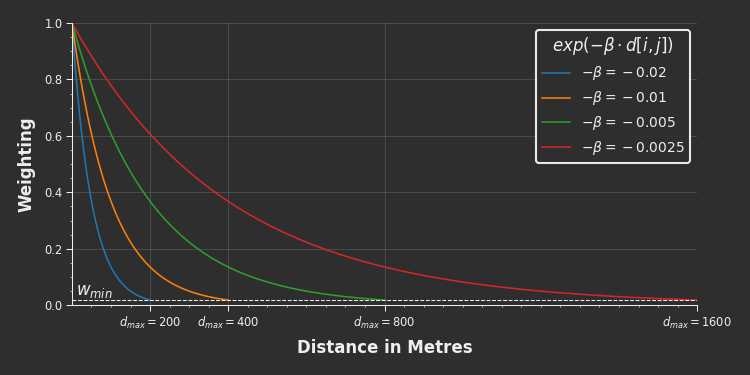
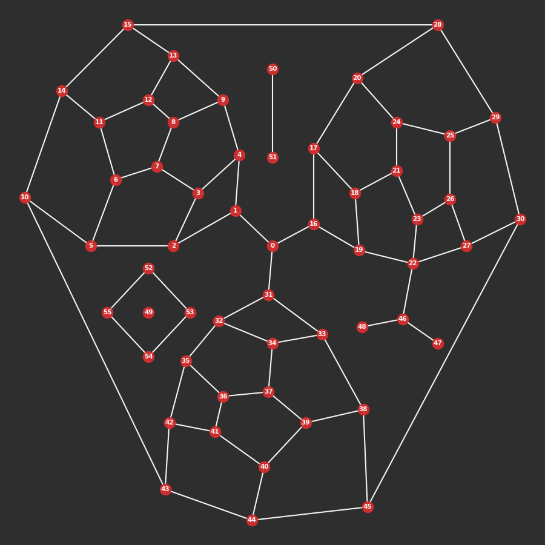
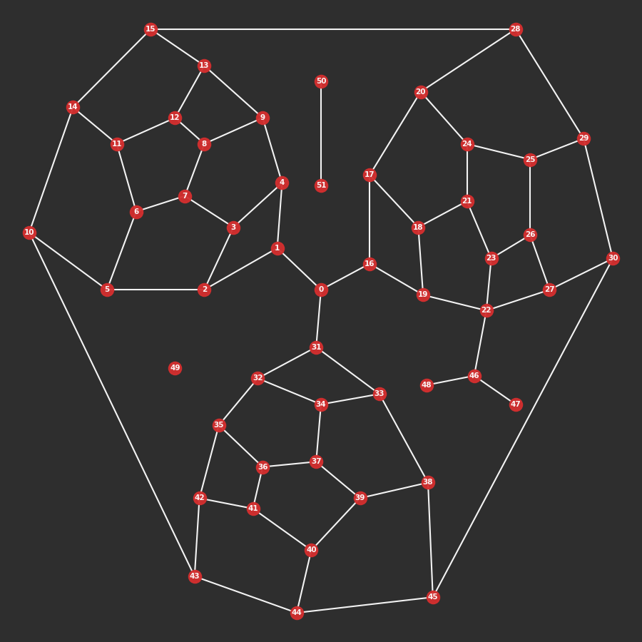

---

---

<RenderMath></RenderMath>

cityseer.metrics.centrality
===========================

distance\_from\_beta
--------------------

<FuncSignature>
<pre>
distance_from_beta(beta,
                   min_threshold_wt=0.01831563888873418)
</pre>              
</FuncSignature>

Maps decay parameters $-\beta$ to equivalent distance thresholds $d_{max}$ at the specified cutoff weight $w_{min}$.

::: warning Note
It is generally not necessary to utilise this function directly. It will be called internally, if necessary, when invoking [Network_Layer](/metrics/networks.html#network-layer) or [Network_Layer_From_nX](/metrics/networks.html#network-layer-from-nx).
:::

<FuncHeading>Parameters</FuncHeading>

<FuncElement name="beta" type="float, list[float], numpy.ndarray">

$-\beta$ value/s to convert to distance thresholds $d_{max}$.

</FuncElement>
<FuncElement name="min_threshold_wt" type="float">

The cutoff weight $w_{min}$ at which to set the distance threshold $d_{max}$.

</FuncElement>

<FuncHeading>Returns</FuncHeading>

<FuncElement name="distances" type="numpy.ndarray">

A numpy array of distance thresholds $d_{max}$.

</FuncElement>

```python

from cityseer.metrics import networks
# a list of betas
betas = [-0.01, -0.02]
# convert to distance thresholds
d_max = networks.distance_from_beta(betas)
print(d_max)  # prints: array([400., 200.])

```

Weighted measures such as gravity, weighted betweenness, and weighted land-use accessibilities are computed using a negative exponential decay function in the form of:

$$weight = exp(-\beta \cdot distance)$$

The strength of the decay is controlled by the $-\beta$ parameter, which reflects a decreasing willingness to walk correspondingly farther distances. For example, if $-\beta=0.005$ were to represent a person's willingness to walk to a bus stop, then a location $100m$ distant would be weighted at $60\%$ and a location $400m$ away would be weighted at $13.5\%$. After an initially rapid decrease, the weightings decay ever more gradually in perpetuity; thus, once a sufficiently small weight is encountered it becomes computationally expensive to consider locations any farther away. The minimum weight at which this cutoff occurs is represented by $w_{min}$, and the corresponding maximum distance threshold by $d_{max}$.



[Network_Layer](/metrics/networks.html#network-layer) and [Network_Layer_From_nX](/metrics/networks.html#network-layer-from-nx) can be invoked with either `distances` or `betas` parameters, but not both. If using the `betas` parameter, then this function will be called in order to extrapolate the distance thresholds implicitly. If using distances, then the $-\beta$ values will likewise be set automatically, using:

$$-\beta = \frac{log\Big(w_{min}\Big)}{d_{max}}$$

The default `min_threshold_wt` of $w_{min}=0.01831563888873418$ yields conveniently rounded $d_{max}$ walking thresholds, for example:

| $-\beta$ | $d_{max}$ |
|-----------|---------|
| $-0.02$ | $200m$ |
| $-0.01$ | $400m$ |
| $-0.005$ | $800m$ |
| $-0.0025$ | $1600m$ |

Overriding the default $w_{min}$ will adjust the $d_{max}$ accordingly, for example:

| $-\beta$ | $w_{min}$ | $d_{max}$ |
|----------|----------|----------|
| $-0.02$ | $0.01$ | $230m$ |
| $-0.01$ | $0.01$ | $461m$ |
| $-0.005$ | $0.01$ | $921m$ |
| $-0.0025$ | $0.01$ | $1842m$ |


Network\_Layer <Chip text="class"/>
--------------

<FuncSignature>
<pre>
Network_Layer(node_uids,
              node_map,
              edge_map,
              distances=None,
              betas=None,
              min_threshold_wt=0.01831563888873418,
              angular=False)
</pre>
</FuncSignature>

Network layers are used for network centrality computations and provide the backbone for landuse and statistical aggregations. [`Network_Layer_From_nX`](#network-layer-from-nx) should be used instead if converting from a `NetworkX` graph to a `Network_Layer`.

A `Network_Layer` requires either a set of distances $d_{max}$ or equivalent exponential decay parameters $-\beta$, but not both. The unprovided parameter will be calculated implicitly in order to keep weighted and unweighted metrics in lockstep. The `min_threshold_wt` parameter can be used to generate custom mappings from one to the other: see [distance_from_beta](#distance-from-beta) for more information. These distances and betas will be used for any subsequent centrality and land-use calculations.

```python
from cityseer.metrics import networks
from cityseer.util import mock, graphs

# prepare a mock graph
G = mock.mock_graph()
G = graphs.nX_simple_geoms(G)
G = graphs.nX_auto_edge_params(G)

# if initialised with distances: 
# betas for weighted metrics will be generated implicitly
N = networks.Network_Layer_From_nX(G, distances=[200, 400, 800, 1600])
print(N.distances)  # prints: [200, 400, 800, 1600]
print(N.betas)  # prints: [-0.02, -0.01, -0.005, -0.0025]

# if initialised with betas: 
# distances for non-weighted metrics will be generated implicitly
N = networks.Network_Layer_From_nX(G, betas=[-0.02, -0.01, -0.005, -0.0025])
print(N.distances)  # prints: [200, 400, 800, 1600]
print(N.betas)  # prints: [-0.02, -0.01, -0.005, -0.0025]
```

<FuncHeading>Parameters</FuncHeading>

<FuncElement name="node_uids" type="list, tuple">

A `list` or `tuple` of node identifiers corresponding to each nodes. This list must be in the same order and of the same length as the `node_map`.

</FuncElement>

<FuncElement name="node_map" type="np.ndarray">

A 2d `numpy` array representing the graph's nodes. The indices of the second dimension correspond as follows:

| idx | property |
|-----|:----------|
| 0 | `x` coordinate |
| 1 | `y` coordinate |
| 2 | `bool` describing whether the node is `live` |
| 3 | start `idx` for the corresponding edge map |
| 4 | `weight` applied to the node | 

</FuncElement>

<FuncElement name="edge_map" type="np.ndarray">

A 2d `numpy` array representing the graph's edges. The indices of the second dimension correspond as follows:

| idx | property |
|-----|:----------|
| 0 | start node `idx` |
| 1 | end node `idx` |
| 2 | `length` in metres for enforcing $d_{max}$ |
| 3 | `impedance` for shortest path calculations |

</FuncElement>

<FuncElement name="distances" type="int, float, list, tuple, np.ndarray">

A distance, or `list`, `tuple`, or `numpy` array of distances corresponding to the local $d_{max}$ thresholds to be used for centrality (and land-use) calculations. The $-\beta$ parameters (for distance-weighted metrics) will be determined implicitly. If the `distances` parameter is not provided, then the `beta` parameter must be provided instead. Use a distance of `np.inf` where no distance threshold should be enforced.

</FuncElement>

<FuncElement name="betas" type="float, list, tuple, np.ndarray">

A $-\beta$, or `list`, `tuple`, or `numpy` array of $-\beta$ to be used for the exponential decay function for weighted metrics. The `distance` parameters for unweighted metrics will be determined implicitly. If the `betas` parameter is not provided, then the `distance` parameter must be provided instead.

</FuncElement>

<FuncElement name="min_threshold_wt" type="float">

The default `min_threshold_wt` parameter can be overridden to generate custom mappings between the `distance` and `beta` parameters. See [distance_from_beta](#distance-from-beta) for more information.

</FuncElement>

<FuncElement name="angular" type="bool">

Set the `angular` parameter to `True` if using angular impedances. Angular impedances can sidestep sharp turn, potentially leading to misleading results. Setting `angular=True` adds a step to the shortest-path algorithm, which prevents this behaviour.

</FuncElement>

<FuncHeading>Returns</FuncHeading>

<FuncElement name="Network_Layer" type="class">

A `Network_Layer`.

</FuncElement>


### Node attributes

The `x` and `y` node attributes determine the spatial coordinates of the node, and should be in a suitable projected (flat) coordinate reference system in metres. [`nX_wgs_to_utm`](/util/graphs.html#nx-wgs-to-utm) can be used for converting a `networkX` graph from WGS84 `lng_`, `lat` geographic coordinates to the local UTM `x`, `y` projected coordinate system.

When calculating local network centralities or land-use accessibilities, it is best-practice to buffer the network by a distance equal to the maximum distance threshold to be considered. This prevents problematic results arising due to boundary roll-off effects. The `live` node attribute identifies nodes falling within the areal boundary of interest as opposed to those that fall within the surrounding buffered area. Calculations are only performed for `live=True` nodes, thus reducing frivolous computation while also cleanly identifying which nodes are in the buffered roll-off area. If some other process will be used for filtering the nodes, or if boundary roll-off is not being considered, then set all nodes to `live=True`.

The `idx` node attribute maps the current node to the starting edge-index for associated out-edges. Note that there may be more than one edge associated with any particular node. These are represented in sequential order in the `edge_map`, and therefore only the first such edge is identified by the `idx` node attribute. 

The `weight` parameter allows centrality calculations to be weighted by external considerations, e.g. adjacent edge lengths, building density, etc. Set to a default value of `1` for all nodes if weights are not to be considered.

### Edge attributes

The start and end edge `idx` attributes point to the corresponding node indices in the `node_map`.

The `length` edge attribute should always correspond to the edge lengths in metres. This is used when calculating the distances traversed by the shortest-path algorithm so that the respective $d_{max}$ maximum distance thresholds can be enforced: these distance thresholds are based on the actual network-paths traversed by the algorithm as opposed to crow-flies distances.

The `impedance` edge attribute represents the friction to movement across the network: it is used by the shortest-path algorithm when calculating the shortest-routes from each origin node $i$ to all surrounding nodes $j$ within the respective $d_{max}$ distance thresholds. For shortest-path centralities, the `impedance` attribute will generally assume the same value as the `length` attribute. This need not be the case; for example, simplest-path centralities assume an angular `impedance` attribute representing the angular change in direction across the length of a street segment (on the dual graph).

::: tip Hint

It is possible to represent unlimited $d_{max}$ distance thresholds by setting one of the specified `distance` parameter values to `np.inf`. Note that this may substantially increase the computational time required for the completion of the algorithms on large networks.

:::


@metrics\_to\_dict
-------------------

<FuncSignature>Network_Layer.metrics_to_dict()</FuncSignature>

<FuncHeading>Returns</FuncHeading>

<FuncElement name="metrics_dict" type="dict">

Unpacks all calculated metrics from the  `Network_Layer.metrics` property into a `python` dictionary. The dictionary `keys` will correspond to the node `uids`.

</FuncElement>


```python
from cityseer.metrics import networks
from cityseer.util import mock, graphs

# prepare a mock graph
G = mock.mock_graph()
G = graphs.nX_simple_geoms(G)
G = graphs.nX_auto_edge_params(G)

# generate the network layer and compute some metrics
N = networks.Network_Layer_From_nX(G, distances=[200, 400, 800, 1600])
N.harmonic_closeness()

# let's select a random node id
random_idx = 6
random_uid = N.uids[random_idx]

# the data is directly available at N.metrics
# in this case the data is stored in arrays corresponding to the node indices
print(N.metrics['centrality']['harmonic'][200][random_idx])
# prints: 0.02312025367905132

# let's convert the data to a dictionary
# the unpacked data is now stored by the uid of the node identifier
data_dict = N.metrics_to_dict()
print(data_dict[random_uid]['centrality']['harmonic'][200])
# prints: 0.02312025367905132
```


@to\_networkX
--------------

<FuncSignature>Network_Layer.to_networkX()</FuncSignature>

Transposes a `Network_Layer` into a `networkX` graph. This method calls [nX_from_graph_maps](/util/graphs.html#nx-from-graph-maps) internally.

<FuncHeading>Returns</FuncHeading>

<FuncElement name="networkX_graph" type="nx.Graph">

A `networkX` graph.

`x`, `y`, `live`, `weight` node attributes will be copied from the `node_map` to the graph nodes. `length` and `impedance` attributes will be copied from the `edge_map` to the graph edges. 

Any data from computed metrics will be copied to each of the graph's nodes.

</FuncElement>

```python
from cityseer.metrics import networks
from cityseer.util import mock, graphs

# prepare a mock graph
G = mock.mock_graph()
G = graphs.nX_simple_geoms(G)
G = graphs.nX_auto_edge_params(G)

# generate the network layer and compute some metrics
N = networks.Network_Layer_From_nX(G, distances=[200, 400, 800, 1600])
# compute some-or-other metrics
N.harmonic_closeness()
# convert back to networkX
G_post = N.to_networkX()

# let's select a random node id
random_idx = 6
random_uid = N.uids[random_idx]

print(N.metrics['centrality']['harmonic'][200][random_idx])
# prints: 0.02312025367905132

# the metrics have been copied to the new networkX graph
print(G_post.nodes[random_uid]['metrics']['centrality']['harmonic'][200])
# prints: 0.02312025367905132
```



_A `networkX` graph before conversion to a `Network_Layer` (left) and after conversion back to `networkX` (right)._


@compute\_centrality
---------------------

<FuncSignature>Network_Layer.compute_centrality(close_metrics=None, between_metrics=None)</FuncSignature>

This method wraps the underlying `numba` optimised functions for computing network centralities, and provides access to all the available centrality methods. These are computed simultaneously for any required combinations of measures (and distances), which can have significant speed implications. Situations requiring only a single measure can instead make use of the simplified [`@gravity`](#gravity), [`@harmonic_closeness`](#harmonic-closeness), [`@improved_closeness`](#improved-closeness), [`@betweenness`](#betweenness), or [`@weighted_betweenness`](#betweenness-gravity) methods.

The computed metrics will be written to a dictionary available at the `Network_Layer.metrics` property and will be categorised by the respective centrality and distance keys: 

`Network_Layer.metrics['centrality'][<<centrality key>>][<<distance key>>][<<node idx>>]`

For example, if `node_density`, `improved`, and `cycles` centrality keys are computed at $800m$ and $1600m$, then the dictionary would assume the following structure:
 
```python
# example structure
Network_Layer.metrics = {
    'centrality': {
        'node_density': {
            800: [...],
            1600: [...]
        },
        'improved': {
            800: [...],
            1600: [...]
        },
        'cycles': {
            800: [...],
            1600: [...]
        }
    }
}
```

A working example:

```python
from cityseer.metrics import networks
from cityseer.util import mock, graphs

# prepare a mock graph
G = mock.mock_graph()
G = graphs.nX_simple_geoms(G)
G = graphs.nX_auto_edge_params(G)

# generate the network layer and compute some metrics
N = networks.Network_Layer_From_nX(G, distances=[200, 400, 800, 1600])
# compute a centrality measure
# note that in this case N.harmonic_closeness() would do exactly the same
N.compute_centrality(close_metrics=['harmonic'])

# distance idx: any of the distances with which the Network_Layer was initialised
distance_idx = 200
# let's select a random node idx
random_idx = 6

# the data is available at N.metrics
# in this case we need the 'harmonic' key
print(N.metrics['centrality']['harmonic'][distance_idx][random_idx])
# prints: 0.02312025367905132
```

Note that the data can also be unpacked to a dictionary using [`@metrics_to_dict`](#metrics-to-dict), or transposed to a `networkX` graph using [`@to_networkX`](#to-networkx).

<FuncHeading>Parameters</FuncHeading>

<FuncElement name="close_metrics" type="list[str], tuple[str]">

A list of strings, containing any combination of the following `key` values:

</FuncElement>

| key | formula | notes |
|-----|---------|-------|
| node_density | $$\sum_{j\neq{i}} w_{j}$$ | The default $w=1$ reduces to a simple node count, however, this is technically a density measure because of the $d_{max}$ threshold constraint. Setting $w$ equal to adjacent street lengths converts this measure into a street density metric. |
| farness_impedance | $$\sum_{j\neq{i}} \frac{Z_{(i,j)}}{w_{j}}$$ | $w=1$ reduces to the sum of impedances $Z$ within the threshold $d_{max}$. Be cautious with weights where $w=0$ because this would return `np.inf`. |
| farness_distance | $$\sum_{j\neq{i}}d_{(i,j)}$$ | A summation of distances in metres within $d_{max}$. |
| harmonic | $$\sum_{j\neq{i}}\frac{w_{j}}{Z_{(i,j)}}$$ | Reduces to _harmonic closeness_ where $w=1$. Harmonic closeness is the appropriate form of closeness centrality for localised implementations constrained by the threshold $d_{max}$. (Conventional forms of closeness centrality should not be used in a localised context.) |
| improved | $$\frac{(N-1)\_{i}^2}{\sum_{j\neq{i}}w_{(i,j)}}$$ | A simplified variant of _"improved"_ closeness. As with harmonic closeness, this variant behaves appropriately on localised implementations. |
| gravity | $$\sum_{j\neq{i}} exp(-\beta \cdot d[i,j]) \cdot w_{j}$$ | Reduces to _gravity centrality_ where $w=1$. Gravity is differentiated from other closeness centralities by the use of an explicit $-\beta$ parameter modelling distance decays. |
| cycles | $$\sum_{j\neq{i}}^{cycles} exp(-\beta \cdot d[i, j])$$ | A summation of distance-weighted network cycles within the threshold $d_{max}$ |

<FuncElement name="between_metrics" type="list[str], tuple[str]">

A list of strings, containing any combination of the following `key` values:

</FuncElement>

| key | formula | notes |
|-----|---------|-------|
| betweenness | $$\sum_{j\neq{i}} \sum_{k\neq{j}\neq{i}} w_{(j, k)}$$ | The default $w=1$ reduces to betweenness centrality within the $d_{max}$ threshold constraint. For betweenness measures, $w$ is a blended average of the weights for any $j$, $k$ node pair passing through node $i$. | 
| betweenness_gravity | $$\sum_{j\neq{i}} \sum_{k\neq{j}\neq{i}} w_{(j, k)} \cdot exp(-\beta \cdot d[j,k])$$ | Adds a distance decay to betweenness. $d$ represents the full distance from any $j$ to $k$ node pair passing through node $i$.

::: warning Note
The closeness family of measures, i.e. `harmonic`, `improved`, and `gravity`, perform similarly in most situations. `harmonic` centrality can be problematic on graphs where nodes are mistakenly placed too close together or where impedances otherwise approach zero, as may be the case for simplest-path measures or small distance thesholds. This happens because the outcome of the division step can balloon towards $\infty$, particularly once values decrease below $1$. `improved` centrality is more robust because all reachable nodes are summed prior to the division step. `gravity` centrality is the most robust method in this regards, and also offers a graceful and tunable representation of distance decays via the negative exponential function.
:::

::: tip Hint
The following methods are simplified wrappers for some of the more commonly used forms of network centrality. Note that for cases requiring more than one form of centrality on large graphs, it may be substantially faster to compute all variants at once by using the underlying [@compute_centrality](#compute-centrality) method directly. 
:::


@harmonic\_closeness
---------------------

<FuncSignature>Network_Layer.harmonic_closeness()</FuncSignature>

Compute harmonic closeness. See [@compute_centrality](#compute-centrality) for additional information.

The data key is `harmonic`, e.g.:

`Network_Layer.metrics['centrality']['harmonic'][<<distance key>>][<<node idx>>]`


@improved\_closeness
---------------------

<FuncSignature>Network_Layer.improved_closeness()</FuncSignature>

Compute improved closeness. See [@compute_centrality](#compute-centrality) for additional information.

The data key is `improved`, e.g.:

`Network_Layer.metrics['centrality']['improved'][<<distance key>>][<<node idx>>]`


@gravity
---------

<FuncSignature>Network_Layer.gravity()</FuncSignature>

Compute gravity centrality. See [@compute_centrality](#compute-centrality) for additional information.

The data key is `gravity`, e.g.:

`Network_Layer.metrics['centrality']['gravity'][<<distance key>>][<<node idx>>]`

@betweenness
-------------

<FuncSignature>Network_Layer.betweenness()</FuncSignature>

Compute betweenness. See [@compute_centrality](#compute-centrality) for additional information.

The data key is `betweenness`, e.g.:

`Network_Layer.metrics['centrality']['betweenness'][<<distance key>>][<<node idx>>]`

@betweenness\_gravity
----------------------

<FuncSignature>Network_Layer.betweenness_gravity()</FuncSignature>

Compute gravity weighted betweenness. See [@compute_centrality](#compute-centrality) for additional information.

The data key is `betweenness_gravity`, e.g.:

`Network_Layer.metrics['centrality']['betweenness_gravity'][<<distance key>>][<<node idx>>]`


Network\_Layer\_From\_nX <Chip text="class"/>
------------------------

<FuncSignature>
<pre>
Network_Layer_From_nX(networkX_graph,
                      distances=None,
                      betas=None,
                      min_threshold_wt=0.01831563888873418,
                      angular=False)
</pre>
</FuncSignature>


Directly transposes a `networkX` graph into a `Network_Layer`. This `class` simplifies the conversion of `NetworkX` graphs by calling [`graph_maps_from_nX`](/util/graphs.html#graph-maps-from-nx) internally. Methods and properties are inherited from the parent [`Network_Layer`](#network-layer) class.

<FuncHeading>Parameters</FuncHeading>

<FuncElement name="networkX_graph" type="nx.Graph">

A `networkX` graph.

`x` and `y` node attributes are required. The `weight` node attribute is optional, and a default of `1` will be used if not present. The `live` node attribute is optional, but recommended. See [`Network_Layer`](#network-layer) for more information about what these attributes represent.

`length` and `impedance` edge attributes are required. See [`Network_Layer`](#network-layer) for more information.

</FuncElement>

<FuncElement name="distances" type="int, float, list, tuple, np.ndarray">

A distance, or `list`, `tuple`, or `numpy` array of distances corresponding to the local $d_{max}$ thresholds to be used for centrality (and land-use) calculations. The $-\beta$ parameters (for distance-weighted metrics) will be determined implicitly. If the `distances` parameter is not provided, then the `beta` parameter must be provided instead. Use a distance of `np.inf` where no distance threshold should be enforced.

</FuncElement>

<FuncElement name="betas" type="float, list, tuple, np.ndarray">

A $-\beta$, or `list`, `tuple`, or `numpy` array of $-\beta$ to be used for the exponential decay function for weighted metrics. The `distance` parameters for unweighted metrics will be determined implicitly. If the `betas` parameter is not provided, then the `distance` parameter must be provided instead.

</FuncElement>

<FuncElement name="min_threshold_wt" type="float">

The default `min_threshold_wt` parameter can be overridden to generate custom mappings between the `distance` and `beta` parameters. See [distance_from_beta](#distance-from-beta) for more information.

</FuncElement>

<FuncElement name="angular" type="bool">

Set the `angular` parameter to `True` if using angular impedances. Angular impedances can sidestep sharp turn, potentially leading to misleading results. Setting `angular=True` adds a step to the shortest-path algorithm, which prevents this behaviour.

</FuncElement>

<FuncHeading>Returns</FuncHeading>

<FuncElement name="Network_Layer" type="class">

A `Network_Layer`.

</FuncElement>