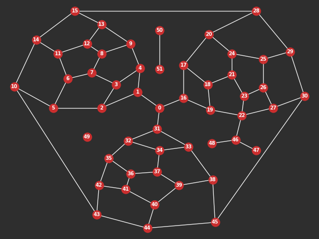

---

---

Installation
------------

`cityseer` is a python package installed via `pip`:
```bash
pip install cityseer
```

Quickstart
----------

`cityseer` revolves around networks (graphs). If you're comfortable with `numpy` and abstract data handling, then the underlying data structures can be created and manipulated directly. In most cases, however, it is more convenient to sketch the graph using [`NetworkX`](https://networkx.github.io/), and to then let `cityseer` initialise and convert the graph for you.

```python
# any NetworkX graph with 'x' and 'y' node attributes will do
# here we'll use the cityseer mock module to generate an example networkX graph
from cityseer.util import mock
G = mock.mock_graph()

'''
import networkx as nx
print(nx.info(G))
# Name:
# Type: Graph
# Number of nodes: 52
# Number of edges: 73
# Average degree:   2.8077
'''
# let's plot the network
from cityseer.util import plot
plot.plot_networkX(G)
```



Network edges require `length` and `impedance` attributes. These can be set manually, but for complicated road geometries it may be easier to assign `shapely` [`Linestring`](https://shapely.readthedocs.io/en/latest/manual.html#linestrings) geometries to the edge `geom` attributes instead, from which the `length` and `impedance` attributes can be deduced automatically by using the [`networkX_edge_params_from_geoms`]() method. If you simply need straight-line geometries spanning from node to node, then use the [`networkX_simple_geoms`]() method to generate the simple edge geometries on your behalf:

```python
from cityseer.util import graphs
# provide your own shapely geometries if you need precise street lengths / angles
# else, auto-generate simple geometries from the start to end node of each network edge
G = graphs.networkX_simple_geoms(G)

# auto-set edge length and impedance attributes from the geoms
G = graphs.networkX_edge_params_from_geoms(G)
```

`cityseer` network layers are used for network centrality computations and also provide the backbone for landuse and numerical analysis workflows. `NetworkX` graphs can be converted to `cityseer` `Network` layers through use of the [`Network_Layer_From_NetworkX`]() method. It is then possible to call a variety of network centrality methods using

```python
from cityseer.metrics import networks
# create a Network layer
N = networks.Network_Layer_From_NetworkX(G, distances=[200, 400, 800, 1600], angular=False)
# one of several easy-wrapper methods for computing centrality
N.harmonic_closeness()
# the full underlying method allows the computation of various centralities at once, e.g.
N.compute_centrality(close_metrics=['improved', 'gravity', 'cycles'],
                     between_metrics=['betweenness_gravity'])
```

Data layers represent the locations of   
```python
from cityseer.metrics import layers
# optionally, add land-uses from a dictionary with 'x', 'y' attributes
data_dict = mock.mock_data_dict(G)
# generate a data layer
D = layers.Data_Layer_From_Dict(data_dict)
# assign to the above Network Layer
D.assign_to_network(N, max_dist=400)
```

```python
# landuse labels can be used to generate mixed-use and land-use accessibility measures
landuse_labels = mock.mock_categorical_data(len(data_dict))
# example easy-wrapper method for computing mixed-uses
D.hill_branch_wt_diversity(landuse_labels, qs=[0, 1, 2])
# example easy-wrapper method for computing accessibilities
D.compute_accessibilities(landuse_labels, accessibility_labels=['a', 'c'])
# or custom, e.g.: 
D.compute_aggregated(mixed_use_metrics=['hill', 'shannon'], accessibility_labels=['a', 'b'])
```

Generate contextually sensitive statistics
```python
# statistics can be generated for numerical layers
mock_valuations_data = mock.mock_numerical_data(len(data_dict))
# compute max, min, mean, mean-weighted, range, and range-weighted using local distance thresholds
D.compute_stats_single(numerical_label='valuations', numerical_array=mock_valuations_data)
```

Compute network centrality
```python
# convert back to NetworkX
G_metrics = N.to_networkX()
# or a dictionary:
N.metrics_to_dict()
# or simply access the metrics directly from numpy arrays at N.metrics
```


Development
----------


License & Attribution
---------------------

Attribution is required.

Apache License v2.0 + Commons Clause License v1.0

Copyright © 2018-present Gareth Simons