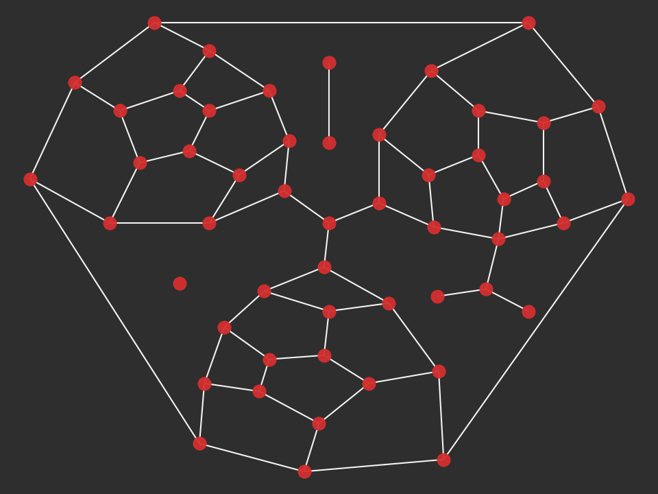
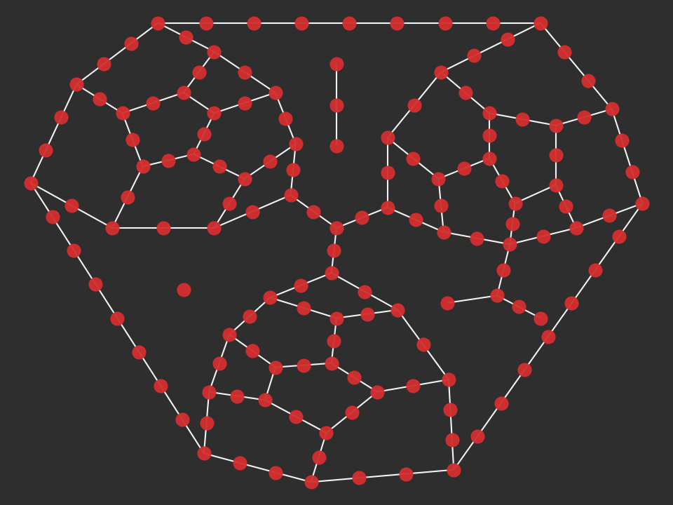

---

---

<RenderMath></RenderMath>


cityseer.util.graphs
====================

A collection of convenience functions for the preparation and conversion of [`NetworkX`](https://networkx.github.io/) graphs. Note that `cityseer`'s network data structures can be created and manipulated directly, where so desired.


nX\_simple\_geoms
-----------------

<FuncSignature>nX_simple_geoms(networkX_graph)</FuncSignature>

Generates straight-line geometries for each edge based on the the `x` and `y` coordinates of the adjacent nodes. The edge geometry will be stored to the edge `geom` attribute. The [nX_auto_edge_params](#nx-auto-edge-params) method can then be used to auto-generate edge `length` and `impedance` attributes.

<FuncHeading>Parameters</FuncHeading>

<FuncElement name="networkX_graph" type="nx.Graph">

A `networkX` graph with `x` and `y` node attributes.

</FuncElement>

<FuncHeading>Returns</FuncHeading>
<FuncElement name="graph" type="nx.Graph">

Returns a `networkX` graph with `shapely` [`Linestring`](https://shapely.readthedocs.io/en/latest/manual.html#linestrings) geometries assigned to the edge `geom` attributes.

</FuncElement>


nX\_wgs\_to\_utm
----------------

<FuncSignature>nX_wgs_to_utm(networkX_graph)</FuncSignature>

Converts `x` and `y` node coordinates from [WGS84](https://epsg.io/4326) to UTM cartesian coordinates. If edge `geom` attributes are found, the associated `LineString` geometries will also be converted.

<FuncHeading>Parameters</FuncHeading>

<FuncElement name="networkX_graph" type="nx.Graph">

A `networkX` graph with `x` and `y` node attributes in the WGS84 coordinate system. Optional `geom` edge attributes containing `LineString` geoms to be converted.

</FuncElement>

<FuncHeading>Returns</FuncHeading>
<FuncElement name="graph" type="nx.Graph">

A `networkX` graph with `x` and `y` node attributes converted to the UTM coordinate system. Edge `geom` attributes will also be converted, if found.

</FuncElement>


nX\_remove\_filler\_nodes
-------------------------

<FuncSignature>nX_remove_filler_nodes(networkX_graph)</FuncSignature>

Removes frivolous nodes where $degree=2$: such nodes represent no route-choices other than continuing-on to the next edge. The edges on either side of the deleted nodes will be removed and replaced with a single new edge, with the `geom` attributes welded together.

<FuncHeading>Parameters</FuncHeading>

<FuncElement name="networkX_graph" type="nx.Graph">

A `networkX` graph with `x` and `y` node attributes and `geom` edge attributes containing `LineString` geoms.

</FuncElement>

<FuncHeading>Returns</FuncHeading>
<FuncElement name="graph" type="nx.Graph">

A `networkX` graph with nodes of $degree=2$ removed. Adjacent edges will be combined into a single new edge with associated `geom` attributes welded together.

</FuncElement>

::: tip Hint
Frivolous nodes may be prevalent in poor quality datasets, or in situations where curved roadways have been represented through the addition of nodes to describe arced geometries. `cityseer` uses `shapely` [`Linestrings`](https://shapely.readthedocs.io/en/latest/manual.html#linestrings) to accurately describe arbitrary road geometries without the need for filler nodes. Filler nodes can therefore be removed, thus reducing potential side-effects when computing network centralities as a function of varied node intensities.
:::


nX\_decompose
-------------

<FuncSignature>nX_decompose(networkX_graph, decompose_max)</FuncSignature>

Decomposes a graph so that no edge is longer than a set maximum. Decomposition provides a more granular representation of variations along street lengths, while reducing network centrality side-effects that arise as a consequence of varied node densities.

<FuncHeading>Parameters</FuncHeading>

<FuncElement name="networkX_graph" type="nx.Graph">

A `networkX` graph with `x` and `y` node attributes and `geom` edge attributes containing `LineString` geoms. Optional `live` node attributes.

</FuncElement>
<FuncElement name="decompose_max" type="nx.Graph">

The maximum length threshold for decomposed edges.

</FuncElement>

<FuncHeading>Returns</FuncHeading>
<FuncElement name="graph" type="nx.Graph">

A decomposed `networkX` graph with no edge longer than the `decompose_max` parameter. If `live` node attributes were provided, then the `live` attribute for child-nodes will be set to `True` if either or both parent nodes were `live`. Otherwise all nodes wil be set to `live=True`.

</FuncElement>

```python
from cityseer.util import mock, graphs, plot

G = mock.mock_graph()
G_simple = graphs.nX_simple_geoms(G)
G_decomposed = graphs.nX_decompose(G_simple, 100)
```




::: warning Note
Setting the `decompose` parameter too small in relation to the size of the graph can increase the computation time unnecessarily for subsequent analysis. For larger-scale urban analysis, it is generally not necessary to go smaller $20m$, and $50m$ may already be sufficient for many cases. On the other-hand, it may be worthwhile going as small as possible for very small graphs, such as building circulation networks.
:::

nX\_to\_dual
------------

<FuncSignature>nX_to_dual(networkX_graph)</FuncSignature>

Converts a primal graph representation, where intersections are represented as nodes and streets are edges, to the dual representation, such that edges are converted to nodes and intersections become edges. This is necessary for the computation of simplest-path (angular) metrics. Primal edge `geom` attributes will be welded to adjacent edges and split into the new dual edge `geom` attributes, from which the `length` and `impedance` attributes will be derived. The angular impedances will be derived from the new dual edge `geom` attributes by summing the angular change over the length of the geometry.

<FuncHeading>Parameters</FuncHeading>

<FuncElement name="networkX_graph" type="nx.Graph">

A `networkX` graph with `x` and `y` node attributes and `geom` edge attributes containing `LineString` geoms. Optional `live` node attributes.

</FuncElement>

<FuncHeading>Returns</FuncHeading>
<FuncElement name="graph" type="nx.Graph">

A dual representation `networkX` graph. The new dual nodes will have `x` and `y` node attributes corresponding to the mid-points of the original primal edges.

If `live` node attributes were provided, then the `live` attribute for the new dual nodes will be set to `True` if either or both of the adjacent primal nodes were set to `live=True`. Otherwise all dual nodes wil be set to `live=True`.

The primal `geom` edge attributes will be split and welded to form the new dual `geom` edge attributes, from which the `length` and angular `impedance` edge attributes will also be derived. A `parent_primal_node` edge attribute will be added, and is set to match the corresponding node identifier of the primal graph.

</FuncElement>

::: warning Note
Distance-based shortest-path centralities decompose more gracefully than angular-based simplest-path centralities, and demonstrate stronger correlations to mixed-uses at pedestrian distances.
:::

nX\_auto\_edge\_params
----------------------

::: danger Caution
Do not use this method on dual graphs. Dual graphs prepared with [nX_to_dual](#nx-to-dual) will already have `length` and `impedance` edge attributes.
:::

nX\_m\_weighted\_nodes
----------------------


graph\_maps\_from\_nX
---------------------


nX\_from\_graph\_maps
---------------------