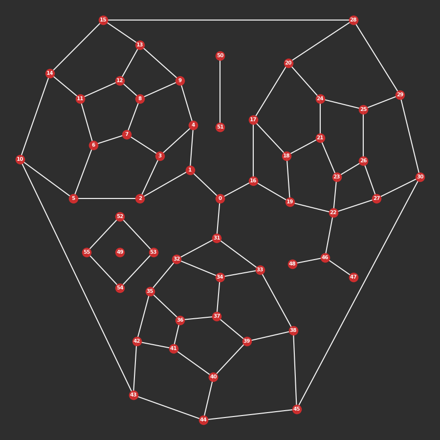

---

---

cityseer.util.mock
==================

A collection of functions for the generation of mock data. This module is predominately used for writing code tests.


mock\_graph
-----------
<FuncSignature>mock_graph(wgs84_coords=False)</FuncSignature>
Generates a `NetworkX` graph for testing or experimentation purposes.

<FuncHeading>Parameters</FuncHeading>
<FuncElement name="wgs84_coords" type="bool">

If set to `True`, the `x` and `y` attributes will be in [`WGS84`](https://epsg.io/4326) geographic coordinates instead of a projected cartesion coordinate system (default).

</FuncElement>

<FuncHeading>Returns</FuncHeading>
<FuncElement name="G" type="nx.Graph">

A `NetworkX` graph with `x` and `y` attributes.

</FuncElement>

```python
from cityseer.util import mock, graphs

G = mock.mock_graph()
```




mock\_data\_dict
----------------
<FuncSignature>mock_data_dict(G, length=50, random_seed=None)</FuncSignature>

Generates a dictionary containing mock data for testing or experimentation purposes.

<FuncHeading>Parameters</FuncHeading>

<FuncElement name="G" type="nx.Graph">

A `NetworkX` graph with `x` and `y` attributes. This is used in order to determine the spatial extents of the network. The returned data will be within these extents.

</FuncElement>

<FuncElement name="length" type="int">

The number of data elements to return in the dictionary.

</FuncElement>

<FuncElement name="random_seed" type="int">

For the use of a specified random seed.

</FuncElement>

<FuncHeading>Returns</FuncHeading>
<FuncElement name="dict" type="dict">

A dictionary where each entry consists of a `key` representing a distinct data point `uid`, and corresponding `x`, `y` and `live` values.

</FuncElement>


mock\_categorical\_data
-----------------------
<FuncSignature>mock_categorical_data(length, num_classes=10, random_seed=None)</FuncSignature>

Generates a `numpy` array containing mock categorical data for testing or experimentation purposes.

<FuncHeading>Parameters</FuncHeading>

<FuncElement name="length" type="int">

The number of categorical elements to return in the array.

</FuncElement>

<FuncElement name="num_classes" type="int">

The maximum number of unique classes to return in the randomly assigned categorical data. The classes are randomly generated from a pool of unique class labels of length `num_classes`. The number of returned unique classes will be less than or equal to `num_classes`.

</FuncElement>

<FuncElement name="random_seed" type="int">

For the use of a specified random seed.

</FuncElement>

<FuncHeading>Returns</FuncHeading>
<FuncElement name="array" type="np.array">

A `numpy` array containing categorical data elements. The number of elements will match the `length` parameter. The categorical data will consist of randomly selected letters.

</FuncElement>


mock\_numerical\_data
---------------------
<FuncSignature>mock_numerical_data(length, num_arrs=1, random_seed=None)</FuncSignature>

Generates a 2d `numpy` array containing mock numerical data for testing or experimentation purposes.

<FuncHeading>Parameters</FuncHeading>

<FuncElement name="length" type="int">

The number of categorical elements to return in the array.

</FuncElement>

<FuncElement name="num_arrs" type="int">

The number of arrays to nest in the returned 2d array.

</FuncElement>

<FuncElement name="random_seed" type="int">

For the use of a specified random seed.

</FuncElement>

<FuncHeading>Returns</FuncHeading>
<FuncElement name="array" type="np.array">

A 2d `numpy` array containing numerical data elements. The first dimension corresponds to the number of data arrays, and is set with the `num_arrs` parameter. The length of the second dimension will represents the number of data elements and will match the `length` parameter. The numerical data will consist of randomly selected integers.

</FuncElement>


mock\_species\_data
-------------------

<FuncSignature>mock_species_data(random_seed=None)</FuncSignature>

A generator function returning a series of randomly generated counts and corresponding probabilities for testing diversity measures. The data is generated in varying lengths from randomly assigned integers between 1 and 10. Matching integers are then collapsed into species "classes" with probabilities computed accordingly.

<FuncHeading>Parameters</FuncHeading>

<FuncElement name="random_seed" type="int">

For the use of a specified random seed.

</FuncElement>

<FuncHeading>Returns</FuncHeading>
<FuncElement name="counts" type="np.array">

The number of members for each species class.

</FuncElement>

<FuncElement name="probs" type="np.array">

The probability of encountering the respective species classes.

</FuncElement>

```python
from cityseer.util import mock

for counts, probs in mock.mock_species_data():
    cs = [c for c in counts]
    ps = [round(p, 3) for p in probs]
    print(cs, ps)
    
# c = [1]
# p = [1.0]

# c = [1, 1, 2, 2]
# p = [0.167, 0.167, 0.333, 0.333]

# c = [1, 4, 3, 1, 1, 1]
# p = [0.091, 0.364, 0.273, 0.091, 0.091, 0.091]

# c = [2, 1, 2, 3, 3, 2, 1, 2]
# p = [0.125, 0.062, 0.125, 0.188, 0.188, 0.125, 0.062, 0.125]

# etc.

```


mock\_osm\_data
---------------

<FuncSignature>mock_osm_data(alt=False)</FuncSignature>

Returns a `JSON` string representing a typical [`Open Street Map`](https://www.openstreetmap.org) response. Used for testing purposes.

::: tip Hint

Where the intent is to derive a graph from this data: use in combination with [`graphs.nX_from_osm`](/util/graphs.html#nx-from-osm).

:::

<FuncHeading>Parameters</FuncHeading>
<FuncElement name="alt" type="bool">

When set to `True`: provides an alternative set of OSM data.

</FuncElement>

<FuncHeading>Returns</FuncHeading>
<FuncElement name="osm_json" type="str">

A `JSON` string representing OSM `nodes` and `ways` data.

</FuncElement>