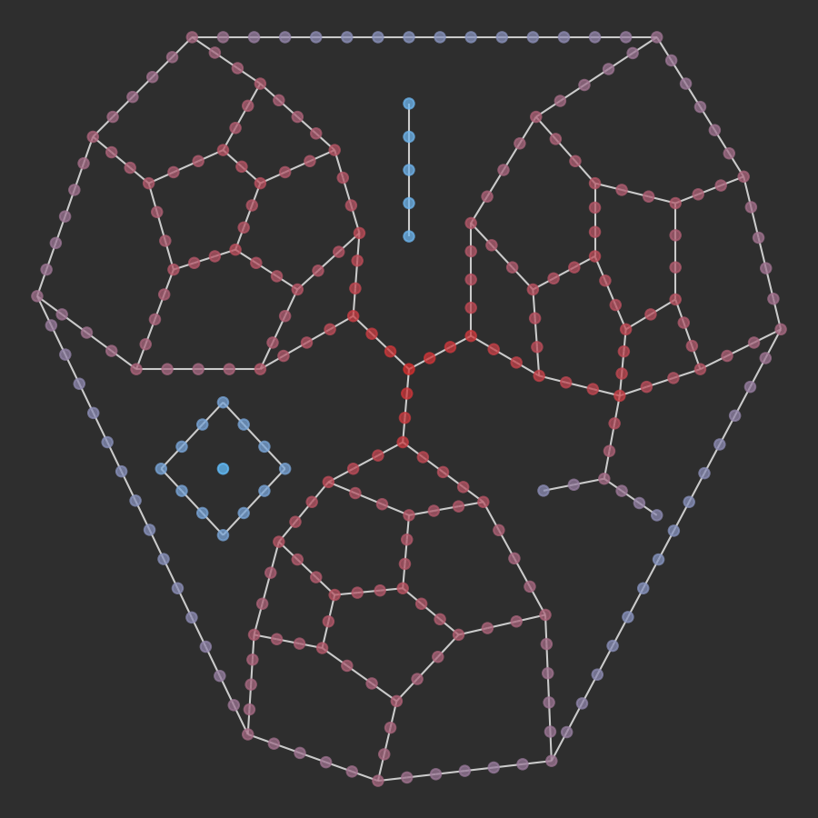

---

---

cityseer.util.plot
==================

Convenience functions for crude plotting. This module is predominately used for visual verification of behaviour in code tests.


plot\_nX\_primal\_or\_dual
--------------------------
<FuncSignature>
<pre>
plot_nX_primal_or_dual(primal=None,
                       dual=None,
                       path=None,
                       labels=False,
                       primal_colour=None,
                       dual_colour=None)
</pre>
</FuncSignature>

Plot either or both primal and dual representations of `networkX` graphs.

<FuncHeading>Parameters</FuncHeading>
<FuncElement name="primal" type="nx.Graph">

An optional `NetworkX` graph to plot in the primal representation.

</FuncElement>

<FuncElement name="dual" type="nx.Graph">

An optional `NetworkX` graph to plot in the dual representation.

</FuncElement>

<FuncElement name="path" type="str">

An optional filepath: if provided, the image will be saved to the path instead of being displayed.

</FuncElement>

<FuncElement name="labels" type="bool">

Whether to display node labels.

</FuncElement>

<FuncElement name="primal_colour" type="str, list, tuple, np.ndarray">

Primal node colour or colours. When passing a list of colours, the number of colours should match the order and number of nodes in the graph. The colours are passed to the underlying [`draw_networkx`](https://networkx.github.io/documentation/networkx-1.10/reference/generated/networkx.drawing.nx_pylab.draw_networkx.html#draw-networkx) method and should be formatted accordingly.

</FuncElement>

<FuncElement name="dual_colour" type="str, list, tuple, np.ndarray">

Dual node colour or colours. When passing a list of colours, the number of colours should match the order and number of nodes in the graph. The colours are passed to the underlying [`draw_networkx`](https://networkx.github.io/documentation/networkx-1.10/reference/generated/networkx.drawing.nx_pylab.draw_networkx.html#draw-networkx) method and should be formatted accordingly.

</FuncElement>

```python
from cityseer.util import mock, graphs, plot

G = mock.mock_graph()
G_simple = graphs.nX_simple_geoms(G)
G_dual = graphs.nX_to_dual(G_simple)
plot.plot_nX_primal_or_dual(G_simple, G_dual, labels=False)
```


_Dual graph (blue) overlaid on the source primal graph (red)._


plot\_nX
--------
<FuncSignature>plot_nX(networkX_graph, path=None, labels=False, colour=None)</FuncSignature>
Plot a `networkX` graph.

<FuncHeading>Parameters</FuncHeading>
<FuncElement name="networkX_graph" type="nx.Graph">

A `NetworkX` graph.

</FuncElement>

<FuncElement name="path" type="str">

An optional filepath: if provided, the image will be saved to the path instead of being displayed.

</FuncElement>

<FuncElement name="labels" type="bool">

Whether to display node labels.

</FuncElement>

<FuncElement name="colour" type="str, list, tuple, np.ndarray">

Node colour or colours. When passing a list of colours, the number of colours should match the order and number of nodes in the graph. The colours are passed to the underlying [`draw_networkx`](https://networkx.github.io/documentation/networkx-1.10/reference/generated/networkx.drawing.nx_pylab.draw_networkx.html#draw-networkx) method and should be formatted accordingly.

</FuncElement>

```python
import numpy as np
from cityseer.util import mock, graphs, plot
from cityseer.metrics import networks
from matplotlib.colors import LinearSegmentedColormap

# generate a graph and compute gravity
G = mock.mock_graph()
G = graphs.nX_simple_geoms(G)
G = graphs.nX_decompose(G, 50)
N = networks.Network_Layer_From_nX(G, distances=[800])
N.gravity()
G_after = N.to_networkX()

# let's extract and normalise the values
vals = []
for node, data in G_after.nodes(data=True):
    vals.append(data['metrics']['centrality']['gravity'][800])
    
# let's create a custom colourmap using matplotlib
cmap = LinearSegmentedColormap.from_list('cityseer', ['#64c1ff', '#d32f2f'])

# normalise vals and cast to colour
vals = np.array(vals)
vals = (vals - vals.min()) / (vals.max() - vals.min())
cols = cmap(vals)

# plot
plot.plot_nX(G_after, labels=False, colour=cols)
```



_Gravity colour plot._


plot\_assignment
----------------

<FuncSignature>
<pre>
plot_assignment(Network_Layer, 
                Data_Layer,
                path=None,
                labels=False)
</pre>
</FuncSignature>

Plot a `Network_Layer` and `Data_Layer` for the purpose of visualising assignment of data points to respective nodes.

<FuncHeading>Parameters</FuncHeading>
<FuncElement name="Network_Layer" type="networks.Network_Layer">

A [`Network_Layer`](/metrics/networks.html#network-layer).

</FuncElement>

<FuncElement name="Data_Layer" type="layers.Data_Layer">

A [`Data_Layer`](/metrics/layers.html#data-layer).

</FuncElement>

<FuncElement name="path" type="str">

An optional filepath: if provided, the image will be saved to the path instead of being displayed.

</FuncElement>

<FuncElement name="labels" type="bool">

Whether to display node labels.

</FuncElement>


plot\_graph\_maps <Chip text="unstable" :important="true"/>
-----------------
<FuncSignature>
<pre>
plot_graph_maps(node_uids,
                node_map,
                edge_map,
                data_map,
                poly)
</pre>
</FuncSignature>

Plot a graph from raw `cityseer` data structures. Note that this function is subject to frequent revision pending short-term development requirements. It is used mainly to visually confirm the correct behaviour of particular algorithms.

<FuncHeading>Parameters</FuncHeading>
<FuncElement name="node_uids" type="[list, tuple, np.ndarray]">

An array of node ids.

</FuncElement>

<FuncElement name="node_map" type="np.ndarray">

`cityseer` node map.

</FuncElement>

<FuncElement name="edge_map" type="np.ndarray">

`cityseer` edge map.

</FuncElement>

<FuncElement name="data_map" type="np.ndarray">

Optional: plot a data map.

</FuncElement>

<FuncElement name="poly" type="shapely.geometry.Polygon">

Optional: plot a polygon.

</FuncElement>