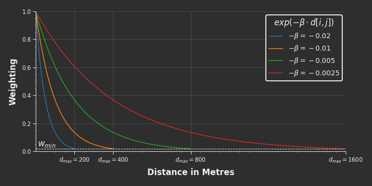

# cityseer.metrics.networks

Centrality methods

## distance\_from\_beta

<FuncSignature>
<pre>
distance_from_beta(beta,
                   min_threshold_wt=checks.def_min_thresh_wt)
                   -> np.ndarray
</pre>
</FuncSignature>

Maps decay parameters $\beta$ to equivalent distance thresholds $d_{max}$ at the specified cutoff weight $w_{min}$.

::: warning Note

It is generally not necessary to utilise this function directly. It will be called internally, if necessary, when invoking [NetworkLayer](#network-layer) or [NetworkLayerFromNX](#network-layer-from-nx).

:::

<FuncHeading>Parameters</FuncHeading>

<FuncElement name='beta' type='Union[float, list, np.ndarray]'>

$\beta$ value/s to convert to distance thresholds $d_{max}$.

</FuncElement>

<FuncElement name='min_threshold_wt' type='float'>

An optional cutoff weight $w_{min}$ at which to set the distance threshold $d_{max}$, default of 0.01831563888873418.

</FuncElement>

<FuncHeading>Returns</FuncHeading>

<FuncElement name='np.ndarray'>

A numpy array of distance thresholds $d_{max}$.

</FuncElement>

<FuncHeading>Notes</FuncHeading>

```python
from cityseer.metrics import networks
# a list of betas
betas = [-0.01, -0.02]
# convert to distance thresholds
d_max = networks.distance_from_beta(betas)
print(d_max)
# prints: array([400., 200.])
```

Weighted measures such as the gravity index, weighted betweenness, and weighted land-use accessibilities are computed using a negative exponential decay function in the form of:

$$weight = exp(\beta \cdot distance)$$

The strength of the decay is controlled by the $\beta$ parameter, which reflects a decreasing willingness to walk correspondingly farther distances. For example, if $\beta=-0.005$ were to represent a person's willingness to walk to a bus stop, then a location $100m$ distant would be weighted at $60\%$ and a location $400m$ away would be weighted at $13.5\%$. After an initially rapid decrease, the weightings decay ever more gradually in perpetuity; thus, once a sufficiently small weight is encountered it becomes computationally expensive to consider locations any farther away. The minimum weight at which this cutoff occurs is represented by $w_{min}$, and the corresponding maximum distance threshold by $d_{max}$.



[NetworkLayer](#network-layer) and [NetworkLayerFromNX](/metrics/networks.html#network-layer-from-nx) can be invoked with either `distances` or `betas` parameters, but not both. If using the `betas` parameter, then this function will be called in order to extrapolate the distance thresholds implicitly, using:

$$d_{max} = \frac{log\Big(w_{min}\Big)}{\beta}$$

The default `min_threshold_wt` of $w_{min}=0.01831563888873418$ yields conveniently rounded $d_{max}$ walking thresholds, for example:

| $\beta$ | $d_{max}$ |
|-----------|---------|
| $-0.02$ | $200m$ |
| $-0.01$ | $400m$ |
| $-0.005$ | $800m$ |
| $-0.0025$ | $1600m$ |

Overriding the default $w_{min}$ will adjust the $d_{max}$ accordingly, for example:

| $\beta$ | $w_{min}$ | $d_{max}$ |
|----------|----------|----------|
| $-0.02$ | $0.01$ | $230m$ |
| $-0.01$ | $0.01$ | $461m$ |
| $-0.005$ | $0.01$ | $921m$ |
| $-0.0025$ | $0.01$ | $1842m$ |

## beta\_from\_distance

<FuncSignature>
<pre>
beta_from_distance(distance,
                   min_threshold_wt=checks.def_min_thresh_wt)
                   -> np.ndarray
</pre>
</FuncSignature>

Maps distance thresholds $d_{max}$ to equivalent decay parameters $\beta$ at the specified cutoff weight $w_{min}$. See [distance_from_beta](#distance-from-beta) for additional discussion.

::: warning Note

It is generally not necessary to utilise this function directly. It will be called internally, if necessary, when invoking [NetworkLayer](#network-layer) or [NetworkLayerFromNX](#network-layer-from-nx).

:::

<FuncHeading>Parameters</FuncHeading>

<FuncElement name='distance' type='Union[float, list, np.ndarray]'>

$d_{max}$ value/s to convert to decay parameters $\beta$.

</FuncElement>

<FuncElement name='min_threshold_wt' type='float'>

The cutoff weight $w_{min}$ on which to model the decay parameters $\beta$, default of 0.01831563888873418.

</FuncElement>

<FuncHeading>Returns</FuncHeading>

<FuncElement name='np.ndarray'>

A numpy array of decay parameters $\beta$.

</FuncElement>

<FuncHeading>Notes</FuncHeading>

```python
from cityseer.metrics import networks
# a list of betas
distances = [400, 200]
# convert to betas
betas = networks.beta_from_distance(distances)
print(betas)  # prints: array([-0.01, -0.02])
```

[NetworkLayer](#network-layer) and [NetworkLayerFromNX](#network-layer-from-nx) can be invoked with either `distances` or `betas` parameters, but not both. If using the `distances` parameter, then this function will be called in order to extrapolate the decay parameters implicitly, using:

$$\beta = \frac{log\Big(w_{min}\Big)}{d_{max}}$$

The default `min_threshold_wt` of $w_{min}=0.01831563888873418$ yields conveniently rounded $\beta$ parameters, for example:

| $d_{max}$ | $\beta$ |
|-----------|---------|
| $200m$ | $-0.02$ |
| $400m$ | $-0.01$ |
| $800m$ | $-0.005$ |
| $1600m$ | $-0.0025$ |

## class NetworkLayer

Network layers are used for network centrality computations and provide the backbone for landuse and statistical aggregations. [`NetworkLayerFromNX`](#network-layer-from-nx) should be used instead if converting from a `NetworkX` graph to a `NetworkLayer`.

A `NetworkLayer` requires either a set of distances $d_{max}$ or equivalent exponential decay parameters $\beta$, but not both. The unprovided parameter will be calculated implicitly in order to keep weighted and unweighted metrics in lockstep. The `min_threshold_wt` parameter can be used to generate custom mappings from one to the other: see [distance_from_beta](#distance-from-beta) for more information. These distances and betas are used for any subsequent centrality and land-use calculations.

```python
from cityseer.metrics import networks
from cityseer.tools import mock, graphs

# prepare a mock graph
G = mock.mock_graph()
G = graphs.nX_simple_geoms(G)

# if initialised with distances: 
# betas for weighted metrics will be generated implicitly
N = networks.NetworkLayerFromNX(G, distances=[200, 400, 800, 1600])
print(N.distances)  # prints: [200, 400, 800, 1600]
print(N.betas)  # prints: [-0.02, -0.01, -0.005, -0.0025]

# if initialised with betas: 
# distances for non-weighted metrics will be generated implicitly
N = networks.NetworkLayerFromNX(G, betas=[-0.02, -0.01, -0.005, -0.0025])
print(N.distances)  # prints: [200, 400, 800, 1600]
print(N.betas)  # prints: [-0.02, -0.01, -0.005, -0.0025]
```

## NetworkLayer.\_\_init\_\_

<FuncSignature>
<pre>
NetworkLayer(node_uids,
             node_data,
             edge_data,
             node_edge_map,
             distances=None,
             betas=None,
             min_threshold_wt=checks.def_min_thresh_wt)
</pre>
</FuncSignature>

<FuncHeading>Parameters</FuncHeading>

<FuncElement name='node_uids' type='Union[list, tuple]'>

A `list` or `tuple` of node identifiers corresponding to each node. This list must be in the same order and of the same length as the `node_data`.

</FuncElement>

<FuncElement name='node_data' type='np.ndarray'>

A 2d `numpy` array representing the graph's nodes. The indices of the second dimension correspond as follows:

| idx | property |
|-----|:---------|
| 0 | `x` coordinate |
| 1 | `y` coordinate |
| 2 | `bool` describing whether the node is `live`. Metrics are only computed for `live` nodes. |

The `x` and `y` node attributes determine the spatial coordinates of the node, and should be in a suitable projected (flat) coordinate reference system in metres. [`nX_wgs_to_utm`](/util/graphs.html#nx-wgs-to-utm) can be used for converting a `networkX` graph from WGS84 `lng`, `lat` geographic coordinates to the local UTM `x`, `y` projected coordinate system.

When calculating local network centralities or land-use accessibilities, it is best-practice to buffer the network by a distance equal to the maximum distance threshold to be considered. This prevents problematic results arising due to boundary roll-off effects.

The `live` node attribute identifies nodes falling within the areal boundary of interest as opposed to those that fall within the surrounding buffered area. Calculations are only performed for `live=True` nodes, thus reducing frivolous computation while also cleanly identifying which nodes are in the buffered roll-off area. If some other process will be used for filtering the nodes, or if boundary roll-off is not being considered, then set all nodes to `live=True`.

</FuncElement>

<FuncElement name='edge_data' type='np.ndarray'>

A 2d `numpy` array representing the graph's edges. Each edge will be described separately for each direction of travel. The indices of the second dimension correspond as follows:
| idx | property |
|-----|:---------|
| 0 | start node `idx` |
| 1 | end node `idx` |
| 2 | the segment length in metres |
| 3 | the sum of segment's angular change |
| 4 | an 'impedance factor' which can be applied to magnify or reduce the effect of the edge's impedance on shortest-path calculations. e.g. for gradients or other such considerations. Use with caution. |
| 5 | the edge's entry angular bearing |
| 6 | the edge's exit angular bearing |

</FuncElement>

<FuncElement name='node_edge_map' type='Dict'>

A `numba` `Dict` with `node_data` indices as keys and `numba` `List` types as values containing the out-edge indices for each node.

</FuncElement>

<FuncElement name='distances' type='Union[list, tuple, np.ndarray]'>

A distance, or `list`, `tuple`, or `numpy` array of distances corresponding to the local $d_{max}$ thresholds to be used for centrality (and land-use) calculations. The $\beta$ parameters (for distance-weighted metrics) will be determined implicitly. If the `distances` parameter is not provided, then the `beta` parameter must be provided instead. Use a distance of `np.inf` where no distance threshold should be enforced.

</FuncElement>

<FuncElement name='betas' type='Union[list, tuple, np.ndarray]'>

A $\beta$, or `list`, `tuple`, or `numpy` array of $\beta$ to be used for the exponential decay function for weighted metrics. The `distance` parameters for unweighted metrics will be determined implicitly. If the `betas` parameter is not provided, then the `distance` parameter must be provided instead.

</FuncElement>

<FuncElement name='min_threshold_wt' type='float'>

The default `min_threshold_wt` parameter can be overridden to generate custom mappings between the `distance` and `beta` parameters. See [distance_from_beta](#distance-from-beta) for more information.

</FuncElement>

<FuncHeading>Returns</FuncHeading>

<FuncElement name='NetworkLayer'>

A `NetworkLayer`.

</FuncElement>

<FuncHeading>Properties</FuncHeading>

### @.uids

Node uids corresponding to each node in the graph's node_map.

### @.distances

The distance threshold/s at which the class has been initialised.

### @.betas

The distance decay $\beta$ thresholds (spatial impedance) at which the class is initialised.

### @.node\_x\_arr

### @.node\_y\_arr

### @.node\_live\_arr

### @.edge\_lengths\_arr

### @.edge\_angles\_arr

### @.edge\_impedance\_factors\_arr

### @.edge\_in\_bearings\_arr

### @.edge\_out\_bearings\_arr

### @.networkX\_multigraph

If initialised with `NetworkLayerFromNX`, the `networkX` `MultiGraph` from which the graph is derived.

## NetworkLayer.metrics\_to\_dict

<FuncSignature>
<pre>
metrics_to_dict()
</pre>
</FuncSignature>

metrics are stored in arrays, this method unpacks per uid

## NetworkLayer.to\_networkX

<FuncSignature>
<pre>
to_networkX()
</pre>
</FuncSignature>

## NetworkLayer.compute\_centrality

<FuncSignature>
<pre>
compute_centrality(**kwargs)
</pre>
</FuncSignature>

## NetworkLayer.node\_centrality

<FuncSignature>
<pre>
node_centrality(measures=None,
                angular=False)
</pre>
</FuncSignature>

## NetworkLayer.segment\_centrality

<FuncSignature>
<pre>
segment_centrality(measures=None,
                   angular=False)
</pre>
</FuncSignature>

## class NetworkLayerFromNX

## NetworkLayerFromNX.\_\_init\_\_

<FuncSignature>
<pre>
NetworkLayerFromNX(networkX_graph,
                   distances=None,
                   betas=None,
                   min_threshold_wt=checks.def_min_thresh_wt)
</pre>
</FuncSignature>
