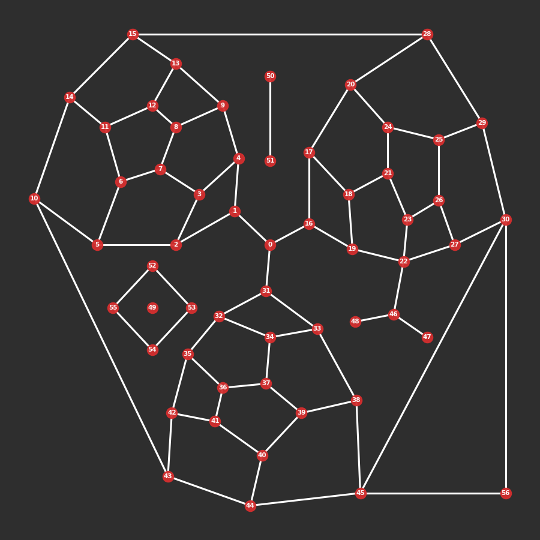

# cityseer.tools.mock

A collection of functions for the generation of mock data. This module is predominately used for writing code tests, but can otherwise be useful for demonstration and utility purposes.

### mock_graph

<FuncSignature>
<pre>
mock_graph(wgs84_coords=False)
           -> nx.MultiGraph
</pre>
</FuncSignature>

Generates a `NetworkX` `MultiGraph` for testing or experimentation purposes.

<FuncHeading>Parameters</FuncHeading>

<FuncElement name='wgs84_coords' type='bool'>

If set to `True`, the `x` and `y` attributes will be in [`WGS84`](https://epsg.io/4326) geographic coordinates instead of a projected cartesion coordinate system. By default False

</FuncElement>

<FuncHeading>Returns</FuncHeading>

<FuncElement name='nx.MultiGraph'>

A `NetworkX` `MultiGraph` with `x` and `y` node attributes.

</FuncElement>

<FuncHeading>Notes</FuncHeading>

```python
from cityseer.tools import mock, plot
networkX_multigraph = mock.mock_graph()
plot.plot_nX(networkX_multigraph)
```


_Mock graph._

### primal_graph

<FuncSignature>
<pre>
primal_graph()
             -> nx.MultiGraph
</pre>
</FuncSignature>

<FuncHeading>Returns</FuncHeading>

<FuncElement name='nx.MultiGraph'>

A primal `NetworkX` `MultiGraph` for `pytest` tests.

</FuncElement>

### dual_graph

<FuncSignature>
<pre>
dual_graph()
           -> nx.MultiGraph
</pre>
</FuncSignature>

<FuncHeading>Returns</FuncHeading>

<FuncElement name='nx.MultiGraph'>

A dual `NetworkX` `MultiGraph` for `pytest` tests.

</FuncElement>

### diamond_graph

<FuncSignature>
<pre>
diamond_graph()
              -> nx.MultiGraph
</pre>
</FuncSignature>

Generates a diamond shaped `NetworkX` `MultiGraph` for testing or experimentation purposes. For manual checks of all node and segmentised methods.

<FuncHeading>Returns</FuncHeading>

<FuncElement name='nx.MultiGraph'>

A `NetworkX` `MultiGraph` with `x` and `y` node attributes.

</FuncElement>

<FuncHeading>Notes</FuncHeading>

```python
#     3
#    / \
#   /   \
#  /  a  \
# 1-------2
#  \  |  /
#   \ |b/ c
#    \|/
#     0
# a = 100m = 2 * 50m
# b = 86.60254m
# c = 100m
# all inner angles = 60º
```

### get_graph_extents

<FuncSignature>
<pre>
get_graph_extents(networkX_multigraph)
                  -> Tuple[float, float, float, float]
</pre>
</FuncSignature>

<FuncHeading>Parameters</FuncHeading>

<FuncElement name='networkX_multigraph' type='nx.MultiGraph'>

A `NetworkX` `MultiGraph` with `x` and `y` node parameters.

</FuncElement>

<FuncHeading>Returns</FuncHeading>

<FuncElement name='Tuple'>

A tuple of `min_x`, `min_y`, `max_x`, `max_y` values.

</FuncElement>

### mock_data_dict

<FuncSignature>
<pre>
mock_data_dict(networkX_multigraph,
               length=50,
               random_seed=None)
               -> dict
</pre>
</FuncSignature>

Generates a dictionary containing mock data for testing or experimentation purposes.

<FuncHeading>Parameters</FuncHeading>

<FuncElement name='networkX_multigraph' type='nx.MultiGraph'>

A `NetworkX` graph with `x` and `y` attributes. This is used in order to determine the spatial extents of the network. The returned data will be within these extents.

</FuncElement>

<FuncElement name='length' type='int'>

The number of data elements to return in the dictionary, by default 50.

</FuncElement>

<FuncElement name='random_seed' type='int'>

An optional random seed, by default None.

</FuncElement>

<FuncHeading>Returns</FuncHeading>

<FuncElement name='dict'>

A dictionary where each entry consists of a `key` representing a distinct data point `uid`, and corresponding `x`, `y` and `live` values.

</FuncElement>

### mock_categorical_data

<FuncSignature>
<pre>
mock_categorical_data(length,
                      num_classes=10,
                      random_seed=None)
                      -> np.ndarray
</pre>
</FuncSignature>

Generates a `numpy` array containing mock categorical data for testing or experimentation purposes.

<FuncHeading>Parameters</FuncHeading>

<FuncElement name='length' type='int'>

The number of categorical elements to return in the array.

</FuncElement>

<FuncElement name='num_classes' type='int'>

The maximum number of unique classes to return in the randomly assigned categorical data. The classes are randomly generated from a pool of unique class labels of length `num_classes`. The number of returned unique classes will be less than or equal to `num_classes`. By default 10

</FuncElement>

<FuncElement name='random_seed' type='int'>

An optional random seed, by default None

</FuncElement>

<FuncHeading>Returns</FuncHeading>

<FuncElement name='np.ndarray'>

A `numpy` array containing categorical data elements. The number of elements will match the `length` parameter. The categorical data will consist of randomly selected letters.

</FuncElement>

### mock_numerical_data

<FuncSignature>
<pre>
mock_numerical_data(length,
                    min=0,
                    max=100000,
                    num_arrs=1,
                    random_seed=None)
                    -> np.ndarray
</pre>
</FuncSignature>

Generates a 2d `numpy` array containing mock numerical data for testing or experimentation purposes.

<FuncHeading>Parameters</FuncHeading>

<FuncElement name='length' type='int'>

The number of numerical elements to return in the array.

</FuncElement>

<FuncElement name='min' type='int'>

The (inclusive) minimum value in the `min`, `max` range of randomly generated integers.

</FuncElement>

<FuncElement name='max' type='int'>

The (exclusive) maximum value in the `min`, `max` range of randomly generated integers.

</FuncElement>

<FuncElement name='num_arrs' type='int'>

The number of arrays to nest in the returned 2d array.

</FuncElement>

<FuncElement name='random_seed' type='int'>

An optional random seed, by default None

</FuncElement>

<FuncHeading>Returns</FuncHeading>

<FuncElement name='np.ndarray'>

A 2d `numpy` array containing numerical data elements. The first dimension corresponds to the number of data arrays, and is set with the `num_arrs` parameter. The length of the second dimension will represents the number of data elements and will match the `length` parameter. The numerical data will consist of randomly selected integers.

</FuncElement>

### mock_species_data

<FuncSignature>
<pre>
mock_species_data(random_seed=None)
                  -> Tuple[np.ndarray, np.ndarray]
</pre>
</FuncSignature>

A generator function returning a series of randomly generated counts and corresponding probabilities for testing diversity measures. The data is generated in varying lengths from randomly assigned integers between 1 and 10. Matching integers are then collapsed into species "classes" with probabilities computed accordingly.

<FuncHeading>Parameters</FuncHeading>

<FuncElement name='random_seed' type='int'>

An optional random seed, by default None

</FuncElement>

<FuncHeading>Yields</FuncHeading>

<FuncElement name='counts'>

The number of members for each species class.

</FuncElement>

<FuncElement name='probs'>

The probability of encountering the respective species classes.

</FuncElement>

<FuncHeading>Notes</FuncHeading>

```python
from cityseer.tools import mock

for counts, probs in mock.mock_species_data():
    cs = [c for c in counts]
    print(f'c = {cs}')
    ps = [round(p, 3) for p in probs]
    print(f'p = {ps}')

# c = [1]
# p = [1.0]

# c = [1, 1, 2, 2]
# p = [0.167, 0.167, 0.333, 0.333]

# c = [3, 2, 1, 1, 1, 3]
# p = [0.273, 0.182, 0.091, 0.091, 0.091, 0.273]

# c = [3, 3, 2, 2, 1, 1, 1, 2, 1]
# p = [0.188, 0.188, 0.125, 0.125, 0.062, 0.062, 0.062, 0.125, 0.062]

# etc.
```

### fetch_osm_response

<FuncSignature>
<pre>
fetch_osm_response(geom_osm,
                   timeout=30,
                   max_tries=3)
                   -> requests.Response
</pre>
</FuncSignature>

Fetches an OSM response.

<FuncHeading>Parameters</FuncHeading>

<FuncElement name='geom_osm' type='str'>

A string representing a polygon for the request extents, formatting according to OSM conventions.

</FuncElement>

<FuncElement name='timeout' type='int'>

An optional timeout, by default 30s

</FuncElement>

<FuncElement name='max_tries' type='int'>

The number of attempts to fetch a response before raising, by default 3

</FuncElement>

<FuncHeading>Returns</FuncHeading>

<FuncElement name='requests.Response'>

An OSM API response.

</FuncElement>

### make_buffered_osm_graph

<FuncSignature>
<pre>
make_buffered_osm_graph(lng,
                        lat,
                        buffer)
                        -> nx.MultiGraph
</pre>
</FuncSignature>

Prepares a `networkX` `MultiGraph` from an OSM request for a buffered region around a given `lng` and `lat` parameter.

<FuncHeading>Parameters</FuncHeading>

<FuncElement name='lng' type='float'>

The longitude argument for the request.

</FuncElement>

<FuncElement name='lat' type='float'>

The latitude argument for the request.

</FuncElement>

<FuncElement name='buffer' type='float'>

The buffer distance.

</FuncElement>

<FuncHeading>Returns</FuncHeading>

<FuncElement name='nx.MultiGraph'>

A `networkX` `MultiGraph` with `x` and `y` node attributes that have been converted to UTM.

</FuncElement>
