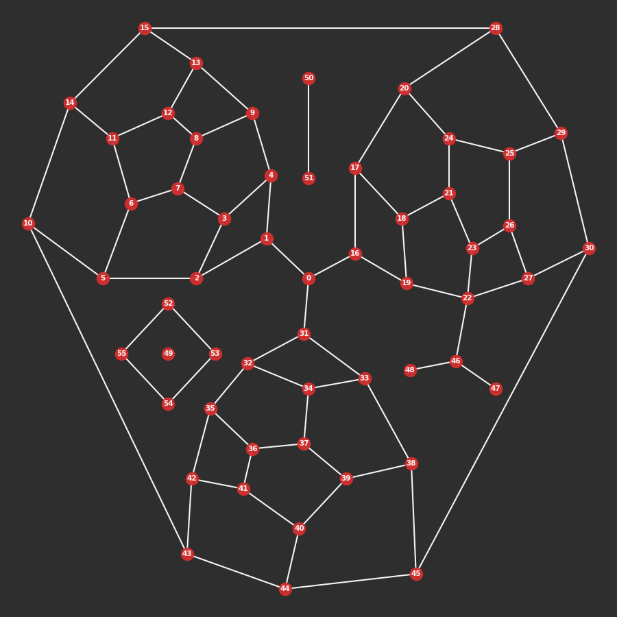

---

---

cityseer <Chip text="alpha"/>
========

`cityseer` is a collection of computational tools for fine-grained network and land-use analysis, useful for assessing the morphological precursors to vibrant neighbourhoods. It is underpinned by rigorous network-based methods that have been developed from the ground-up specifically for hyperlocal analysis at the pedestrian scale.

The use of `python` facilitates interaction with popular tools for network, geospatial, and scientific data analysis, i.e. [`networkX`](https://networkx.github.io/), [`shapely`](https://shapely.readthedocs.io), and the [`numpy`](http://www.numpy.org/) stack. The underlying algorithms are designed for efficient large-scale urban analysis and have been implemented in [`numba`](https://numba.pydata.org/) JIT compiled code.

Installation
------------

`cityseer` is a `python` package that can be installed with `pip`:
```bash
pip install cityseer
```

Code tests are run against `python 3.8`.

[](https://github.com/cityseer/cityseer/actions)

[](https://github.com/cityseer/cityseer/actions)

> A notebook of this guide can be found at [google colaboratory](https://colab.research.google.com/github/cityseer/cityseer/blob/master/demo_notebooks/getting_started.ipynb).

Quickstart
----------

`cityseer` revolves around networks (graphs). If you're comfortable with `numpy` and abstract data handling, then the underlying data structures can be created and manipulated directly. However, it is generally more convenient to sketch the graph using [`NetworkX`](https://networkx.github.io/) and to let `cityseer` take care of initialising and converting the graph for you.

```python
# any networkX graph with 'x' and 'y' node attributes will do
# here we'll use the cityseer mock module to generate an example networkX graph
from cityseer.tools import mock
G = mock.mock_graph()
'''
import networkX as nx
print(nx.info(G))
# Name: 
# Type: Graph
# Number of nodes: 56
# Number of edges: 77
# Average degree:   2.7500
'''
# let's plot the network
from cityseer.tools import plot
plot.plot_nX(G, labels=True)

# NOTE: this code block combines with the following blocks for a continuous example
```



The [`util.graphs`](/util/graphs.html) module contains a collection of convenience functions for the preparation and conversion of `networkX` graphs. These functions are designed to work with raw `shapely` [`Linestring`](https://shapely.readthedocs.io/en/latest/manual.html#linestrings) geometries that have been assigned to the edge (link) `geom` attributes. The benefit to this approach is that the geometry of the network is decoupled from the topology: the topology is consequently free from distortions which would otherwise confound centrality and other metrics.

There are generally two scenarios when creating a street network graph:

1. In the ideal case, if you have access to a high-quality street network dataset -- which keeps the topology of the network separate from the geometry of the streets -- then you would construct the network based on the topology while assigning the roadway geometries to the respective edges spanning the nodes. [OS Open Roads](https://www.ordnancesurvey.co.uk/business-and-government/products/os-open-roads.html) is a good example of this type of dataset. Assigning the geometries to an edge involves A) casting the geometry to a [`shapely`](https://shapely.readthedocs.io) `LineString`, and B) assigning this geometry to the respective edge by adding the `LineString` geometry as a `geom` attribute. i.e. `G[start_node][end_node]['geom'] = linestring_geom`.

2. In reality, most data-sources are not this refined and will represent roadway geometries by adding additional nodes to the network. For a variety of reasons, this is not ideal and you may want to follow the [`Graph Cleaning`](/guide/cleaning) guide; in these cases, the [`graphs.nX_simple_geoms`](/util/graphs.html#nx-simple-geoms) method can be used to generate the street geometries, after which several methods can be applied to remove frivolous nodes. For example, [`nX_wgs_to_utm`](/util/graphs.html#nx-wgs-to-utm) for coordinate conversions; [`nX_remove_dangling_nodes`](/util/graphs.html#nx-remove-dangling-nodes) to remove roadway stubs, [`nX_remove_filler_nodes`](/util/graphs.html#nx-remove-filler-nodes) to strip-out filler nodes, and [`nX_consolidate_parallel`](/util/graphs.html#nx-consolidate-parallel) to further simplify the network.  


_A $100m$ decomposed variant of the graph (left) and an example primal / dual transformation of the (undecomposed) graph (right). Decomposed or "ghosted" nodes provide granular snapshots at regular intervals along streetfronts._

Once the network is prepared, [`nX_decompose`](/util/graphs.html#nx-decompose) can be used for the purpose of generating granular graph representations; whereas [`nX_to_dual`](/util/graphs.html#nx-to-dual) can be used to cast a primal graph representation to its dual.

```python
from cityseer.tools import graphs
# provide your own shapely geometries if you need precise street lengths / angles
# else, auto-generate simple geometries from the start to end node of each network edge
G = graphs.nX_simple_geoms(G)

# optionally decompose (or cast to dual)
G = graphs.nX_decompose(G, 20)
```

The `networkX` graph can now be transformed into a [`Network_Layer`](/metrics/networks.html#network-layer) by invoking [`Network_Layer_From_nX`](/metrics/networks.html#network-layer-from-nx). Network layers are used for network centrality computations and also provide the backbone for subsequent landuse and statistical aggregations. They must be initialised with a set of distances $d_{max}$ specifying the maximum network-distance thresholds at which the local centrality methods will terminate.

The [`Network_Layer.compute_node_centrality`](/metrics/networks.html#compute-node-centrality) and [`Network_Layer.compute_segment_centrality`](/metrics/networks.html#compute-segment-centrality) methods wrap underlying numba optimised functions that compute a range of centrality methods. All selected measures and distance thresholds are computed simultaneously to reduce the amount of time required for multi-variable and multi-scalar workflows. The results of the computations will be written to the `Network_Layer` class, and can be accessed at the `Network_Layer.metrics` property. It is also possible to extract the data to a `python` dictionary through use of the [`Network_Layer.metrics_to_dict`](/metrics/networks.html#metrics-to-dict) method, or to simply convert the network — data and all — back into a `networkX` layer with the [`Network_Layer.to_networkX`](/metrics/networks.html#to-networkx) method.

```python
from cityseer.metrics import networks
# create a Network layer from the networkX graph
N = networks.Network_Layer_From_nX(G, distances=[200, 400, 800, 1600])
# the underlying method allows the computation of various centralities simultaneously, e.g.
N.compute_segment_centrality(measures=['segment_harmonic', 'segment_betweenness'])
```

Categorical and numerical data can be assigned to the network as a [`Data_Layer`](/metrics/layers.html#data-layer). A `Data_Layer` represents the spatial locations of data points, and is used for the calculation of various mixed-use, land-use accessibility, and statistical measures. These measures are computed directly over the street network and offer distance-weighted variants. This makes them more contextually sensitive than methods based on simple crow-flies aggregation.

As with Network Layers, the underlying data structures can be created and manipulated directly. However, it is generally simpler to create a python dictionary containing the `x` and `y` node attributes for each data point, and to then use [`Data_Layer_From_Dict`](/metrics/layers.html#data-layer-from-dict) to instance a `Data_Layer` directly. After instantiation, the `Data_Layer` is then assigned to the `Network_Layer` through use of the [`Data_Layer.assign_to_network`](/metrics/layers.html#assign-to-network) method.

```python
from cityseer.metrics import layers
# a mock data dictionary representing the 'x', 'y' attributes for data points
data_dict = mock.mock_data_dict(G, random_seed=25)
# generate a data layer
D = layers.Data_Layer_From_Dict(data_dict)
# assign to the prior Network Layer
# max_dist represents the farthest to search for adjacent street edges
D.assign_to_network(N, max_dist=400)
```

The data points will be assigned to the two closest network nodes — one in either direction — based on the closest adjacent street edge. This enables a dynamic spatial aggregation method that more accurately describes distances over the network to data points, relative to the direction of approach.


_Data assigned to the network (left); note that assignment becomes more contextually precise on decomposed graphs (right)._

Once the data has been assigned, the [`Data_Layer.compute_aggregated`](/metrics/layers.html#compute-aggregated) method is used for the calculation of mixed-use, accessibility, and statistical measures. As with the centrality methods, the measures are all computed simultaneously (and for all distances); however, simpler stand-alone methods are also available, including: [`Data_Layer.hill_diversity`](/metrics/layers.html#hill-diversity), [`Data_Layer.hill_branch_wt_diversity`](/metrics/layers.html#hill-branch-wt-diversity), [`Data_Layer.compute_accessibilities`](/metrics/layers.html#compute-accessibilities), [`Data_Layer.compute_stats_single`](/metrics/layers.html#compute-stats-single), and [`Data_Layer.compute_stats_multiple`](/metrics/layers.html#compute-stats-multiple). 

```python
# landuse labels can be used to generate mixed-use and land-use accessibility measures
# for demonstration purposes, lets create mock landuse labels for the points in our data dictionary
landuse_labels = mock.mock_categorical_data(len(data_dict), random_seed=25)
# example easy-wrapper method for computing mixed-uses
# the hill q paramater controls the emphasis on unique land-uses vs. balanced preponderances thereof
D.hill_branch_wt_diversity(landuse_labels, qs=[0, 1, 2])
# example easy-wrapper method for computing accessibilities
# the keys correspond to keys present in the landuse data for which accessibilities will be computed
D.compute_accessibilities(landuse_labels, accessibility_keys=['a', 'c'])
# or compute multiple measures at once, e.g.:
D.compute_aggregated(landuse_labels,
                     mixed_use_keys=['hill', 'hill_branch_wt', 'shannon'],
                     accessibility_keys=['a', 'c'],
                     qs=[0, 1, 2])

# let's generate some mock numerical data for the points in our data dictionary
mock_valuations_data = mock.mock_numerical_data(len(data_dict), random_seed=25)
# compute max, min, mean, mean-weighted, variance, and variance-weighted
D.compute_stats_single(stats_key='valuations', stats_data_arr=mock_valuations_data[0])
```

The data is aggregated and computed over the street network relative to the `Network_Layer` (i.e. street) nodes. The mixed-use, accessibility, and statistical aggregations can therefore be compared directly to centrality computations from the same locations, and can be correlated or otherwise compared. The outputs of the calculations are written to the corresponding node indices in the same `Network_Layer.metrics` dictionary used for centrality methods, and will be categorised by the respective keys and parameters.

```python
# access the data arrays at the respective keys, e.g.
distance_idx = 800  # any of the initialised distances
q_idx = 0  # q index: any of the invoked q parameters
node_idx = 0  # a node idx
print('centrality keys:', list(N.metrics['centrality'].keys()))
# prints: centrality keys: ['segment_harmonic', 'segment_betweenness']
print('distance keys:', list(N.metrics['centrality']['segment_harmonic'].keys()))
# prints: distance keys: [200, 400, 800, 1600]
print(N.metrics['centrality']['segment_harmonic'][distance_idx][:4])
# prints: [36.46092  34.097134 29.37572  28.52696 ]

print('mixed-use keys:', list(N.metrics['mixed_uses'].keys()))
# prints: mixed-use keys: ['hill_branch_wt', 'hill', 'shannon']
print(N.metrics['mixed_uses']['hill_branch_wt'][q_idx][distance_idx][:4])
# prints: [3.71650513 3.37621501 3.67013477 2.66319178]

# statistical keys can be retrieved the same way:
print('stats keys:', list(N.metrics['stats'].keys()))
# prints: stats keys: ['valuations']
print('valuations keys:', list(N.metrics['stats']['valuations'].keys()))
# prints: valuations keys: ['max', 'min', 'sum', 'sum_weighted', 'mean', 'mean_weighted', 'variance', 'variance_weighted']
print('valuations weighted by 1600m decay:', N.metrics['stats']['valuations']['mean_weighted'][1600][:4])
# prints: valuations weighted by 1600m decay: [54241.13370171 52637.06525419 49104.04636187 52314.00371644]


# the data can also be convert back to a NetworkX graph
import networkx as nx
G_metrics = N.to_networkX()
print(nx.info(G_metrics))
# the data arrays are unpacked accordingly
print(G_metrics.nodes[0]['metrics']['centrality']['segment_betweenness'][200])
# prints: 1022.12555

# the data can also be extracted to a dictionary:
G_dict = N.metrics_to_dict()
print(G_dict[0]['centrality']['segment_betweenness'][200])
# prints: 1022.12555
```

The data can then be passed to data analysis or plotting methods. For example, the [`util.plot`](/util/plot.html) module can be used to plot the segmentised harmonic closeness centrality and mixed uses for the above mock data:

```python
# plot centrality
from matplotlib import colors

segment_harmonic_vals = []
mixed_uses_vals = []
for node, data in G_metrics.nodes(data=True):
    segment_harmonic_vals.append(data['metrics']['centrality']['segment_harmonic'][800])
    mixed_uses_vals.append(data['metrics']['mixed_uses']['hill_branch_wt'][0][400])

# custom colourmap
cmap = colors.LinearSegmentedColormap.from_list('cityseer', ['#64c1ff', '#d32f2f'])

# normalise the values
segment_harmonic_vals = colors.Normalize()(segment_harmonic_vals)
# cast against the colour map
segment_harmonic_cols = cmap(segment_harmonic_vals)
# plot segment_harmonic
plot.plot_nX(G_metrics, labels=False, colour=segment_harmonic_cols)

# plot distance-weighted hill mixed uses
mixed_uses_vals = colors.Normalize()(mixed_uses_vals)
mixed_uses_cols = cmap(mixed_uses_vals)
plot.plot_assignment(N, D, node_colour=mixed_uses_cols, data_labels=landuse_labels)
```


_$800m$ segmentised harmonic closeness centrality (left) and $400m$ branch-weighted mixed-uses (right) plots on a $20m$ decomposed graph._


Issues & Contributions
----------------------

Please report issues to the [`issues`](https://github.com/cityseer/cityseer-api/issues) page of the `cityseer` `github` repo.

Feature requests and contributions are welcome, and will be considered if within the remit of the package.
